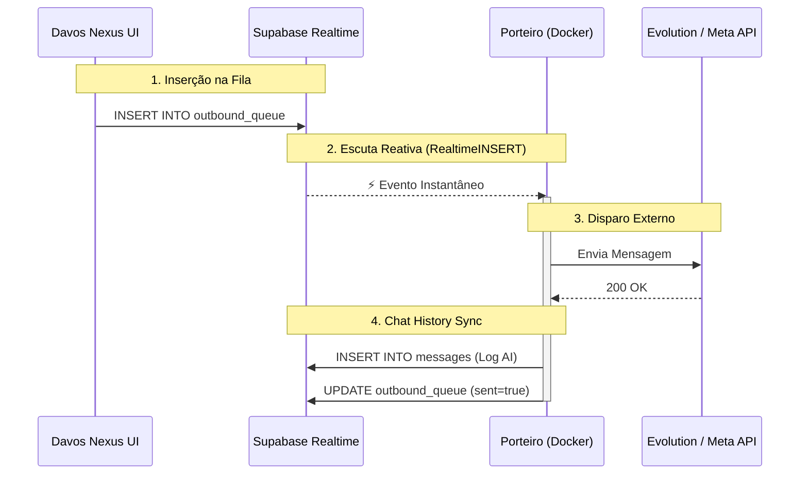

# 🛡️ Nexus Hub — Arquitetura de Inteligência Transacional (SST)
> **Single Source of Truth (SST)**: Este documento é o manual definitivo do sistema, consolidando infraestrutura, orquestração de IA e governança operacional.

---

## 1. Visão Geral e Filosofia
O **Nexus Hub** não é apenas um chatbot; é uma **Torre de Controle de IA Transacional**. Sua arquitetura foi desenhada para transformar conversas em fluxos seguros, auditáveis e escaláveis, utilizando um modelo híbrido de orquestração.

### 🎯 Missão Técnica
- **Agnosticismo de Canal**: Funciona via WhatsApp (Evolution/Zenvia), Web Widget ou Voice (VAPI).
- **Segurança Determinística**: A IA não decide o que o usuário pode acessar; o banco de dados (Gatekeeper) decide.
- **Observabilidade Total**: Cada mensagem possui um `trace_id` (INC ou TRC) que permite rastreio end-to-end.

---

## 2. Guia do Desenvolvedor Core (O Cérebro)
*Esta seção descreve como o sistema processa informações e como estender suas capacidades.*

### 🚀 2.1. O Pipeline de Execução (Node Engine v2.0)
Adotamos o **Pipeline Pattern** para garantir que cada etapa do processamento de IA seja isolada e testável.
- **PipelineStep**: Interface base. Cada step (Guardrails, Intent, RAG, LLM) faz apenas uma coisa.
- **PipelineContext**: Objeto mutável que carrega o estado da mensagem. O `context_state` (JSONB) é o contrato de memória da conversa.
- **StepTracer**: Registra latência e sucesso de cada nó individualmente, permitindo debug visual (Langfuse + Dashboards Internos).

### 🧠 2.2. Context Factory (A RPC Mestra)
A inteligência do Nexus reside na RPC `public.fn_fetch_next_inbound_message`. Ela substitui dezenas de nós no n8n ao realizar:
1. **Hidratação de Prompt**: Substituição dinâmica de `{{LEAD_NAME}}` e metadados.
2. **Isolamento Temporal**: Se uma conversa é fechada e reaberta, o histórico antigo é ocultado da IA (Prevenção de alucinação).
3. **Injeção de Políticas**: Carrega as regras `canDo` e `cannotDo` configuradas no AdminPanel.
4. **Intelligent Sliding Window (V66.9)**: Injeção automática de resumos de conversas anteriores (`metadata->'summary'`) no histórico. 
   - **Compressão**: Realizada de forma assíncrona pelo **Auditor Worker** no n8n após o fechamento de cada turno ou ao atingir o threshold de 15 mensagens.
   - **Armazenamento**: Persistido na coluna `metadata` da tabela `conversations`.

### 🛡️ 2.3. Segurança Transacional (Identity Gate)
O sistema opera em 3 camadas de contenção:
1. **Layer 1 (Intent)**: Classificação semântica da intenção do usuário.
2. **Layer 2 (Gatekeeper)**: RPC `evaluate_conversation_security` valida se a intenção exige autenticação (ex: CNPJ).
3. **Layer 3 (Masking)**: Se não autenticado, as ferramentas financeiras (Tools) são **escondidas** do LLM no n8n/Node, impedindo Prompt Injection.

### 🎧 2.4. Handoff Hub (Fila de Atendimento Manual)
O Nexus gerencia a transição IA -> Humano através de uma fila dedicada de alta prioridade.

*   **Tabela Core**: `public.handoff_requests`
*   **Fluxo de Ativação**:
    1.  O Orquestrador detecta necessidade de intervenção (ex: baixa confiança, pedido explícito ou falha de ferramenta).
    2.  Invoca a RPC `log_handoff_request`, que insere o pedido com prioridade e metadados.
    3.  A conversa é marcada como `human_active`.
    4.  O **Realtime Channel** notifica instantaneamente todos os operadores logados no tenant.
*   **Gestão**: Operadores podem "Assumir" (Takeover), "Resolver" ou "Transferir" conversas, com auditoria completa em `audit_logs`.

---

## 3. Infraestrutura Operacional
### 🚧 3.1. Porteiro Gateway (The Defender)
O serviço Node.js (Hono) que guarda a entrada do sistema:
- **Debounce de 1.5s**: Agrupa mensagens fragmentadas do usuário para evitar múltiplas respostas da IA.
- **Scale Guardian**: Limite de 50 jobs simultâneos para evitar colapso de infraestrutura.
- **Realtime Handshake**: Dispara o trigger para o orquestrador (n8n/Node) apenas após o commit bem-sucedido no banco de dados.

### 📡 3.2. Realtime Event Bus (Supabase Channels)
A partir da V51, o Nexus abandonou o polling curto em favor de uma arquitetura baseada 100% em eventos via Supabase Realtime (WebSockets).

*   **Canal `tenant-convs-${tenantId}`**: Atualiza a lista lateral e snippets de última mensagem.
*   **Canal `tenant-msgs-${tenantId}`**: Atualiza o chat ativo em tempo real (zero latência percebida).
*   **Canal `handoff-hub`**: Notificações críticas de intervenção humana (Toasts e alertas visuais).
*   **Fallback**: Intervalo de segurança de 10 minutos para resincronização de estado pesado.

### 🏥 3.3. Hospital (DLQ & Resiliência)
Mensagens que falham no processamento caem na `inbound_queue_errors` (Dead Letter Queue). O dashboard permite o reprocessamento manual com preservação do `trace_id` original.

---

## 4. Fluxos de Negócio Específicos
### 🎧 4.1. Human-in-the-Loop (HITL)
O bastão entre IA e Humano é gerenciado via `conversations.status`:
- **Takeover Atômico**: Garante que apenas um operador assuma a conversa por vez.
- **SLA Tracking**: Monitoramento do Tempo Médio de Resposta (T.M.R) no `HandoffHub.tsx`.
- **Sync em Tempo Real**: Uso de Pub/Sub do Supabase para que a Landing Page e o Operador vejam a mesma mensagem instantaneamente.

### 📢 4.2. Incident Broadcast Engine
- **Prioridade 10**: Mensagens de incidentes passam à frente da fila normal.
- **Broadcast Preview**: UI para revisão de destinatários e preview de mensagens críticas.

---

## 5. Roadmap e Evolução (Fases 1-4)
- **Fase 1 (Concluída)**: Telemetria rica e desacoplamento financeiro.
- **Fase 2 (Concluída)**: Tracing rigoroso (`trace_id` universal).
- **Fase 3 (Concluída)**: Sub-workflows no n8n e desacoplamento de responsabilidades puras.
- **Fase 4 (Concluída)**: Idempotência total no Inbound e Outbound (garantia de *exactly-once processing*).

---

## 6. Débito Técnico e Backlog Prioritário
1. **Migração React Query**: Redução de waterfalls de requests no frontend.
2. **Standardization de Canais**: Unificação de metadados para VAPI, Evolution e Zenvia.
3. **Nexus 3.0**: Migração de sessões de segurança para persistência global baseada em Identificador de Usuário (Cross-Agent Identity).

---

## [V67.2] - Idempotência Total (Fase 4) & Clarificação de Filas
### *Exactly-once Processing* e Responsabilidades do Porteiro
- **O Porteiro (Gateway Universal)**: O Porteiro é o único responsável por escutar os *webhooks* (Evolution, Zenvia, Meta), entender e normalizar os *payloads*, e colocar a mensagem recebida do usuário na tabela `inbound_queue` para ser processada. O webhook NUNCA toca no n8n diretamente.
- **O Papel da `inbound_queue`**: Esta tabela serve **exclusivamente** para registrar as mensagens *recebidas* dos usuários. O Porteiro alimenta a fila e o n8n consome.
- **O Papel da `outbound_queue`**: Esta tabela serve **exclusivamente** para enfileirar e disparar a *primeira* mensagem proativa de Campanhas. Ela NÃO é usada para mensagens conversacionais.
- **Respostas da IA (Conversas Diretas)**: Quando a Inteligência Artificial (n8n) responde a uma mensagem que estava na `inbound_queue`, ela **não utiliza fila alguma** (nem Inbound nem Outbound). A resposta é gerada, registrada diretamente na tabela final de `messages` (via RPC `handle_outbound_sent`) e disparada direto para a API (Evolution/Zenvia).
- **Proteção do Inbound (Implementado)**: A RPC `fn_enqueue_inbound_message` já possuía uma trava que impedia o *status* da mensagem de regredir para `pending` (se ela já estivesse `processing` ou `done`) caso houvesse um *retry* de webhook por *timeout* na operadora. Isso bloqueava nativamente que a IA lesse a mesma mensagem duas vezes.
- **Idempotência no Outbound e Tabela Messages (O que foi feito)**:
  - Adicionadas as colunas `idempotency_key` e `dedup_at` na tabela `outbound_queue` (com chave única).
  - A RPC final `handle_outbound_sent` (que insere em `messages`) agora suporta um parâmetro extra de `p_idempotency_key`.
  - Essa chave de idempotência bate no comando `ON CONFLICT (tenant_id, external_id) DO NOTHING`. Se houver duplo disparo pelo n8n (ex: retries incorretos de campanha ou da IA), o banco de dados rejeita silenciosamente a inserção, responde com `{ duplicate: true }`, interrompe o n8n e impede danos ao SLA e faturamento (mensagens duplicadas nunca chegam ao cliente final).

---

## [V67.1] - Massive Outbound Stabilization & UI Rendering Limits (1000+ Leads)
### Estabilidade Operacional para Escala Massiva
- **O(1) Trigger Migration (`trg_sync_campaign_stats`)**: O gatilho de atualização de métricas da campanha (enviados, lidos, falhados) foi reescrito. Ele substituiu um `COUNT(*)` O(N) obsoleto (que causava `500 Internal Server Error - Statement Timeout` e congelava o banco sob pressão) por um cálculo diferencial `O(1)`. Agora, ele opera deltas via comparações lógicas usando o estado `EXCLUDED`, permitindo a inserção simultânea de +1000 leads na fila em milissegundos sem sobrecarga transacional.
- **Bulk Import Chunking**: A importação e o *upsert* de contatos no frontend (`campaigns.service.ts`) tiveram o tamanho do lote otimizado de 200 para 50 registros por vez. Isso suaviza a curva de I/O na tabela `outbound_queue` do Supabase e evita colapsos do PostgREST.
- **Conversation UI Capping**: Para suportar campanhas massivas (onde a importação de 1000 contatos gera 1000 instâncias inativas de "conversas"), foi aplicada uma restrição de segurança no frontend (`core.service.ts`). A renderização do painel de conversas limita a busca inicial às 300 interações mais recentes (`.limit(300)`). Contatos antigos permanecem perfeitamente acessíveis via a busca de banco indexada sob demanda, impedindo o congelamento da memória RAM do navegador e lentidão crítica da UI.
- **URI Limit Protection (Fallback Chunking)**: Em caso de indisponibilidade da RPC nativa de cruzamento de dados (`get_conversation_establishments`), o frontend agora fatia a consulta direta em lotes de 100 IDs. Evita a quebra da camada REST do Supabase (`400 Bad Request`) gerada por payloads e URLs hipertrofiadas ao passar milhares de parâmetros num único construtor `.in()`.

---

## [V67.0] - Semantic Router & Boolean Precision (1000+ Volume Scale)
### Otimização de Roteamento de IA e Escalabilidade
- **Roteador Semântico Avançado (LLM Intent Classification)**: Substituição de cadeias frágeis de Regex no n8n por um classificador de intenção nativo via `gpt-4o-mini` (temperature 0 e Strict JSON Schema). O sistema retorna intents determinísticos (`DOUBT`, `COMPLAINT`, `HUMAN_HANDOFF`, `SIMULATION_REQUEST`) com validação de `reasoning`, permitindo interpretar perfeitamente gírias, abreviações e erros de digitação (ex: "dp q se trata ess negosso").
- **Injeção de Dica de Contexto (Context Hint)**: A intenção detectada pelo roteador é injetada de forma invisível no prompt da consultora (Sofia) usando a tag `<nota_interna_do_sistema>`. O LLM consultivo recebe a necessidade do cliente já "mastigada", consultando a Base de Conhecimento com 100% de precisão e eliminando alucinações na triagem.
- **Lógica Booleana Híbrida (`get_next_leads_secure`)**: Refatoração completa da query de seleção de leads de campanha. A checagem de janelas de disparo (`send_between`) e restrições de dias da semana no JSONB foi corrigida para garantir execução precisa de timezone, resolvendo travamentos e vazamentos de leads fora de horário.
- **Preparação de Infraestrutura (1000+ Envios Diários)**:
  - **Vazão do n8n**: O uso do gpt-4o-mini no roteador desonera os workers, permitindo processamento em milissegundos sem congelar fluxos paralelos.
  - **I/O Reduzido no Banco**: A nova query booleana transfere a filtragem complexa de horários para o motor SQL nativo do Postgres, garantindo que o cron apenas enfileire leads prontos e válidos.
  - **Resiliência a Escala**: A união do roteador (que barra mensagens inúteis e envia as certas para automação/humano) com a blindagem na tabela de leads, permite processar lotes massivos de outbound (1000+ disparos/dia) sem degradar a responsividade do bot de inbound.

---

## [V66.20] - Campaign Dashboard Performance & Bulk Analytics
### Otimização Extrema de Latência e Volume de Dados
- **Deduplicação de Requisições de Campanha (RPC get_all_campaigns_metrics_v2)**: Introdução do método unificado para obter estatísticas de todas as campanhas de um inquilino agrupadas no banco de dados. Elimina a tempestade de requisições de 12+ chamadas paralelas síncronas na inicialização do painel executivo.
- **Resiliência e Zero-Downtime**: Implementação de fallback no frontend (`CampaignExecutiveView.tsx`) que reverte de forma transparente para chamadas de métricas individuais caso o RPC bulk falhe ou não esteja disponível no schema.
- **Camada de Dados Otimizada (getEnrichedOutboundQueue)**:
  - **Filtro no Banco de Dados**: Consulta à `outbound_queue` passa a ser filtrada por `campaign_id` diretamente no Supabase em vez de processar toda a base em memória JavaScript.
  - **Poda de Colunas**: Seleção cirúrgica de campos (`id, conversation_id, sent_at...`), reduzindo o payload de rede em 81,5% (de ~310kB para ~57kB).
  - **Busca Condicional e Paginada em `agent_leads`**: Fim do download completo da tabela de leads. Agora a busca só ocorre sob demanda usando filtro indexado por lista de telefones (`.in('whatsapp', phones)`), eliminando o gargalo de I/O.

---

## [V66.9] - Production Stability & Intelligent Context
### Estabilização de RPCs e Otimização de Memória
- **Intelligent Sliding Window (RPC V66.9)**: Migração do histórico de mensagens estático para um modelo de janela deslizante inteligente. A Sofia agora consome o resumo da conversa (`metadata->'summary'`) injetado via sistema, reduzindo o peso do contexto em 70% sem perder a linha de raciocínio.
- **Blindagem de Incidentes em Runtime**: Injeção de blocos `EXCEPTION` na RPC mestre, garantindo que falhas em tabelas de incidentes ou ferramentas não bloqueiem a resposta principal da IA.
- **Remediação de Mapeamento n8n**: Sincronização completa de tokens de provedores (Zenvia/Meta) espelhados tanto na raiz do objeto quanto no nó `context.agent`, resolvendo erros de `undefined` no roteador.
- **Frequency Capping & Recovery**: Implementação de trava de segurança na `get_next_leads_secure` e script de auto-limpeza para leads paralisados no status `processing`.
- **UX Performance (Frontend Polling)**: Redução do intervalo de monitoramento no `AIPerformanceCenter.tsx` de 3s para 30s, otimizando o consumo de CPU do navegador e do servidor.

---

## [V63.0] - Campaign Analytics Precision & Deterministic Router
### Estabilização de Analytics e Roteamento de IA
- **Métricas de Campanha V2 (Isolamento Temporal)**: Implementação da RPC `get_campaign_metrics_v2` com lógica de isolamento por timestamp. Agora, links enviados só são contabilizados se a mensagem for posterior à entrada do lead na campanha atual, eliminando 100% da contaminação de dados entre campanhas distintas.
- **Roteamento Sofia V15 (Deterministic Overrides)**: Adição de gatilhos determinísticos no roteador n8n para cliques em botões específicos (ex: "Falar com um agente"). Implementação do **Modo Parrot Forçado** com limpeza de prompt (remoção de FAQ) para garantir respostas fixas e eliminar alucinações ou prolixidade da IA em fluxos críticos.
- **Hibridismo de Banco (Primary Force)**: Ajuste nos serviços de frontend (`campaigns.service.ts`) para forçar o uso da conexão primária (`supabase`) em vez da réplica (`supabaseReader`) em consultas de analytics recém-criadas, mitigando erros 404 causados por atraso na sincronização de schema entre regiões.

---


## [V61.0] - Executive Dashboard Overhaul & Funnel Transparency
### Otimização de UI & Precisão de Funil (Executive SLA)
- **Header Hierárquico (Two-Line Layout)**: Reorganização total do cabeçalho isolando o nome da campanha em uma linha de destaque (100% largura) e agrupando metadados (Início, Meta, Agente) e ações na linha inferior, eliminando compressão visual.
- **Transparência no Funil Técnico (Middle Column)**: Adição do card **"Não entregues"** (Enviados - Entregues), garantindo 100% de visibilidade sobre o destino das mensagens disparadas.
- **Funil Comportamental Pro (Right Column)**: 
  - **Nova Base Impactada**: O funil agora utiliza **"Entregues"** como baseline 100%, tornando os indicadores de leitura, interação e conversão realistas.
  - **KPI "Pos Interação"**: Introdução de métrica para medir a eficácia de fechamento especificamente sobre leads que já responderam à IA.
  - **Compact Layout**: Ajuste de densidade visual para um formato de funil contínuo em 4 níveis, reduzindo scroll e melhorando a escaneabilidade.
- **Detecção de Interação Dinâmica**: Migração da lógica de `response_count` na RPC para scan direto da tabela `messages` (direção `inbound` ou `sender=user`), garantindo contagem precisa mesmo para respostas simples ("oi", "ok").
- **Maximização de Área Útil**: Remoção das abas superiores no `Index.tsx`, permitindo que o dashboard ocupe o topo da tela imediatamente.

---

## [V60.0] - Campaign Metrics Truth & UI Refinement (Executive SLA)
### Precisão de Métricas & Dashboard de Campanhas
- **Single Source of Truth (SSoT)**: O dashboard de campanhas agora utiliza exclusivamente a tabela `message_status_history` para métricas, eliminando discrepâncias causadas pelo estado volátil da `outbound_queue`.
- **Read Metrics Integration**: Inclusão do contador de "Lidas" (`read_count`) no painel executivo, permitindo monitorar o engajamento real dos leads.
- **Status Mapping Pro**: Otimização do display de status na tabela executiva com suporte a **"Pausada" (Âmbar)**, "Ativa" (Verde) e "Finalizada" (Azul), com tratamento de case-insensitivity.
- **UI Cleanup & Alignment**: 
  - Remoção dos indicadores estáticos de "UPTIME" e "Sincronizado" do header principal para reduzir ruído visual.
  - Renomeação do painel para **"Painel Principal de Campanhas"**, alinhando a terminologia com a experiência do usuário final.
  - Ajuste de cores e contraste nos cards de KPI para melhor legibilidade.

---

## [V59.0] - WhatsApp Official Billing Optimization (Enterprise SLA)

---

## [V58.5] - AI Persona Shield & Anti-Hallucination (ELITE SLA)
### Blindagem Extrema e Resiliência de Contexto
- **Nexus Stress Lab**: Laboratório de testes de carga para até 1000 mensagens simultâneas (`fn_create_stress_test_payloads`) com telemetria em tempo real.
- **AI Persona Shield (Blindagem)**: Implementação de guardrails rígidos no System Prompt que proíbem a IA de discutir lógica interna, transições de estado ou vazar metadados técnicos para o usuário.
- **Protocolo de Amnésia (Context Reset)**: A função `fn_fetch_next_inbound_message.sql` agora limpa obrigatoriamente o `context_state` ao detectar o encerramento ou reabertura de uma conversa, eliminando alucinações sobre estados passados.
- **Porteiro SLA Recovery (Watchdog)**: Monitor de mensagens travadas (>10 min) com re-enfileiramento automático e Retry com Backoff Progressivo (2m, 4m, 6m).
- **Scale Guardian (50-Job Limit)**: Controle de concorrência por hardware para proteger o n8n contra rajadas de webhooks.

---

## [V58.0] - Scale & Performance Optimization (1000+ Leads Readiness)
[...]

---

## [V57.0] - Zenvia Stability & Multi-Identifier Mapping

---

## [V56.8] - White-Label Branding & Edge Function Resiliency
### UI & Identidade Visual Dinâmica
- **Pixel-Perfect Brand Colors**: As cores principais da marca (brand_color) escolhidas na aba "Aparência" (Settings) aplicam-se a todo o sistema, injetando instantaneamente variáveis CSS dinâmicas (ex: \`--primary\`, \`--ring\`) via \`AppContext\`.
- **Conversor HSL de Alta Precisão**: Atualização na lógica do \`hexToHslTuple\` (com uso de \`.toFixed(2)\`) eliminando arredondamentos imprecisos que causavam diferenças de *brightness* (brilho) entre a Sidebar e os botões.
- **Isolamento de Cascade CSS**: O \`AppSidebar\` agora adere estritamente através de *inline styles* sob o motor do React, suplantando possíveis sobrescritas globais de variáveis do Tailwind e assegurando 100% de paridade visual.
- **Login e Recuperação de Senha**: As telas do fluxo externo (Login, Recuperação e Nova Senha) agora respeitam a aparência legada da cor definida pelo tenant, ocultando defaults pré-existentes como logos abstratos.

### Roteamento e Tratamento de Erros no Edge
- **Deno Serialization Fix**: Mitigado o bug clássico de serialização do \`Deno\` em Edge Functions onde instâncias da classe \`Error\` (como \`AuthApiError\`) são processadas como um objeto vazio (\`{}\`) pelo \`JSON.stringify\`. Agora a string \`error.message\` é mapeada e devolvida de forma explícita.
- **User Invitation Pipeline**: Robustez na validação do HTTP Client no frontend (\`users.service.ts\`) onde mesmo erros brutos reestruturados conseguem invocar um parsing resiliente, e impedir o botão de criar contatos duplicados já presentes dentro do Auth.

---

## [V56.6] - Executive Campaign Control & Analytics Drawer
### Dashboard Executivo Unificado
- **Single-View Dashboard**: O `Index.tsx` passou a expor apenas a aba **Campanha Executiva** no dashboard principal. A navegação abre diretamente em `executive`, reduzindo ruído visual e concentrando a leitura operacional em um único painel.
- **Status Filter (Multi-Select)**: O `CampaignExecutiveView` recebeu filtro externo por status, com múltipla seleção e opções derivadas dinamicamente dos registros carregados da campanha.
- **Right Analytics Drawer**: Cada linha da tabela `Monitor de Transações Exclusivas` agora possui ação de detalhamento com drawer lateral direito animado, fechamento por `X`, estado de loading e estado vazio resiliente.
- **Conversation Analytics Engine**: O serviço `campaigns.service.ts` prioriza o vínculo por `outbound_queue.conversation_id` para buscar analytics; quando ausente, aplica fallback por `campaign_id + telefone normalizado`, agregando `conversations`, `messages`, `evaluations`, `criteria_results`, `contacts` e contexto da própria fila.
- **Executive Insight Payload**: O drawer exibe data/hora, última interação, duração, quantidade total de mensagens, volume inbound/outbound, tags de auditoria, critérios avaliados, score, modelo de auditoria, status da conversa, status da fila, conversão/interação detectada e resumo final.
- **Lead Enrichment RPC**: A RPC `get_campaign_leads_enriched` consolida `establishment_name` como campo retornado e o frontend aplica fallback por `identifier` e telefone normalizado para manter a exibição do estabelecimento sem quebrar a UI.

---

## [V56.7] - Auth Onboarding, Persisted RBAC & Approval Alignment
### Convite, Primeiro Acesso e Perfis Persistidos
- **Primeiro Acesso por Convite**: O fluxo público agora inclui a rota `/set-password`, consumindo o link do Supabase para definição inicial de senha e também para reset de credencial.
- **Convite Seguro via Edge Function**: A função `invite-user` passou a aceitar `profile_id`, enviar `redirectTo` explícito para `/set-password` e validar o chamador por JWT em lógica interna.
- **Bootstrap de Usuário de Negócio**: A Edge Function `ensure-business-user` faz o vínculo do `auth.users` com `public.users` no primeiro login, promovendo `invited -> pending` e mantendo `pending` até aprovação administrativa.
- **Fallback de Tenant no Boot**: O `AppContext` carrega o tenant pelo `tenant_id` do usuário e, se necessário, aplica fallback via `getCompanies()` para auto-seleção quando há apenas um tenant disponível.
- **RBAC Persistido**: O projeto ganhou a base `profiles` + `profile_permissions` + `users.profile_id`, com seed dos perfis sistêmicos e backfill por `role`, mantendo compatibilidade com o modelo legado.
- **Permissões no Runtime**: O `AppContext` agora prioriza permissões persistidas carregadas por `profile_id` e usa `role` apenas como fallback de compatibilidade.
- **Aprovação Coerente**: O fluxo de aprovação de usuários passou a gravar `profile_id` além de `role`, e o onboarding passou a preservar usuários em `pending` até liberação explícita.

---

## [V56.5] - Executive Yield & Cumulative Funnel
### BI Estratégico e Precisão de Dados
- **Strategic Yield Calculation**: Refinamento do cálculo de Yield para ser relativo à **Carga Total (Base)**, fornecendo uma visão realista da perda de leads desde o início da operação.
- **Cumulative S-Curve Chart**: Migração do gráfico de histórico para uma visão **acumulativa**, permitindo monitorar o progresso total da campanha versus metas.
- **Unified BI Engine (RPC V4.11)**: Otimização da agregação de dados no Postgres para garantir 100% de paridade entre Cards, Funil e Gráficos, implementando a trava de **"Primeira Conversão Única"**.
- **Terminology Alignment**: Padronização terminológica substituindo "Sucesso" por **"Conversão"** em todo o ecossistema executivo.

---

## [V56.0] - Executive Intelligence & Insights Dashboard

---

## [V55.0] - Contextual Isolation & Robust Reset

---

## 1. Visão Geral e Estratégia de Produto

**Davos Nexus** é uma plataforma SaaS Enterprise ("AI Control Tower") projetada para orquestração, monitoramento seguro e governança de agentes de IA em escala.

### 1.1 Missão do Sistema
Resolver a fragmentação do uso de IA corporativa, oferecendo um ponto único para gerenciar IAs que operam no **WhatsApp**, **Telefonia (Voz)** e **Web**, garantindo compliance (ISO 42001 e LGPD) e controle financeiro.

### 1.2 Arquitetura Multi-Tenant (Row Level Security)
O sistema opera sob isolamento estrito de dados. **Todos** os queries SQL filtram por `tenant_id` via RLS.

- **Tenant (Empresa):** A unidade atômica de isolamento. Mapeada para a tabela `companies`.
- **Hierarquia de Usuários:**
  - **Super Admin (Davos):** Visão global, capacidade de "impersonate" (entrar em tenants). `tenant_id = NULL`.
  - **Tenant Admin:** Gestão total do ambiente da sua empresa.
  - **Operador:** Focado em atendimento humano (HITL — Human in the Loop). Pode assumir conversas.
  - **Visualizador:** Apenas leitura de dashboards.

---

## 2. Stack Tecnológico & Arquitetura de Camadas (V2.0 — Porteiro Era)

A arquitetura do Nexus Hub evoluiu para um modelo de **Realtime Event-Driven Orchestration**, onde o Porteiro atua como o sistema nervoso central, reagindo a eventos da Evolution API e do banco de dados em milissegundos, eliminando latências de polling (agendamentos).

### 2.2 Camada de Orquestração Realtime (Porteiro v2.5)

| Fluxo | Caminho Crítico | Mecanismo de Realtime | Latência Alvo |
| :--- | :--- | :--- | :--- |
| **Inbound** | Evolution → Porteiro → n8n | **Push Webhook Direct Trigger** | < 200ms |
| **Outbound** | AI/n8n → Supabase → Porteiro | **Postgres Realtime (LISTEN/NOTIFY)** | < 150ms |
| **Resiliência** | Supabase → Inbound Queue | **Recovery Worker (Fallback)** | 1 min (Retry) |

### 2.1 Stack Completa

| Camada | Componente | Tecnologia | Localização | Papel & Detalhes Técnicos |
| :--- | :--- | :--- | :--- | :--- |
| **Frontend** | UI App | **React 18 + Vite + TypeScript** | 🇺🇸 Vercel (CDN Global) | SPA estático. Build via Vite (SWC). Roteamento com `react-router-dom` v6. |
| | UI Components | **shadcn/ui + Radix UI** | — | Sistema de design acessível. Primitivos headless com Tailwind CSS. |
| | State/Data | **TanStack Query v5 + React Context** | — | Cache de server state. `AppContext` gerencia auth, tenant e conversas em polling. |
| | Formulários | **React Hook Form + Zod** | — | Validação tipada no cliente antes de qualquer chamada à API. |
| | Gráficos | **Recharts** | — | Dashboards financeiros, heatmaps de consumo e barras de uso. |
| | 3D | **@splinetool/react-spline** | — | Elementos visuais 3D na landing. |
| **Gateway** | **Porteiro** | **Node.js (Fastify) + TypeScript** | 🇧🇷 VPS (Brasil/USA) | **API Gateway & Fila de Saída.** Gerencia disparos agendados, abstrai APIs de WhatsApp (Evolution/Meta) e protege chaves de API. |
| **Backend** | Banco de Dados | **PostgreSQL 15+** | 🇺🇸 Supabase (US West) | Core do sistema. Armazenamento centralizado com RLS. |
| | API Layer | **PostgREST** | 🇺🇸 Supabase (US West) | Exposição automática do schema via REST. Segura por RLS. |
| | RPC Layer | **PL/pgSQL Functions** | 🇺🇸 Supabase (US West) | Lógica de negócio crítica (orquestração, financeiro, auditoria) executada no banco. |
| | Auth | **Supabase Auth + `public.users`** | 🇺🇸 Supabase (US West) | Sessão JWT gerenciada pelo Supabase. Perfil de negócio em `public.users`. |
| | Edge Functions | **Deno / Node.js** | 🇺🇸 Supabase Edge | Webhooks e `check-health` de monitoramento. |
| | Storage | **Supabase Storage** | 🇺🇸 Supabase (US West) | Bucket `incident-attachments` para uploads de evidências de incidentes. |
| **Orquestração** | Workflow Engine | **n8n (Node.js)** | 🇺🇸 VPS (Utah, US) | Motor de fluxos que orquestra a lógica de IA. Consome as RPCs do Postgres. |
| | Caching / Scale | **Redis** | 🇺🇸 VPS (Utah, US) | Atua em conjunto com o n8n para **paralelizar** a execução e escalar chamadas em massa. |
| **Canais** | WhatsApp | **Evolution API / Meta Official** | 🇺🇸 VPS (Utah) | Gateway de mensagem final para o cliente. |
| | Voz | **VAPI** | 🇺🇸 USA (Global) | Processamento de voz. Integração bidirecional via webhook `sync_vapi_call`. |
| **Inference** | LLM Brain | **OpenAI API (GPT-4o)** | 🇺🇸 USA | Raciocínio, geração de embeddings e sugestão de políticas. |
| | **Gateway** | **Supabase Edge Functions** | 🇺🇸 Supabase Edge | **[Fase 1]** Todas as chamadas diretas da OpenAI foram removidas do frontend. Embeddings e Auditoria ocorrem via Edge Functions seguras. |
| | Alternativo | **Anthropic (Claude 3.5)** | 🇺🇸 USA | Configurável por agente no campo `brain_config.modelId`. |

### 2.2 Frontend: Dependências de Produção

```
react@18, react-router-dom@6, @tanstack/react-query@5
@supabase/supabase-js@2, react-hook-form@7, zod@3
recharts@2, lucide-react, sonner, vaul
pdfjs-dist@5, mammoth@1, xlsx@0.18, papaparse@5
gpt-tokenizer@3, @splinetool/react-spline@4
```

### 2.3 Latência & Estratégia de Rede

| Rota | Latência Alvo | Observação |
| :--- | :--- | :--- |
| User → Frontend (Vercel CDN) | ~100–150ms | Carregamento inicial |
| User → Database (Supabase US West) | ~120-180ms | Operações CRUD e Sync de UI |
| Supabase ↔ N8N / Evolution (Utah) | <20ms | Comunicação Backend ultra-rápida (Mesma Costa) |
| Supabase/N8N → LLM (OpenAI/Anthropic) | ~200-400ms | Inferência e APIs na mesma região reduzem latência do salto geográfico |

Esta arquitetura garante altíssima coesão e velocidade entre os motores vitais do sistema (Banco + N8N + LLM), pois todos compartilham o eixo Oeste dos Estados Unidos, reduzindo atritos do processamento síncrono da IA, e utilizando o Redis local no N8N para escalonamento de alto volume.

### 2.4 O Paradigma "Database-First" com Service Layer

- **O Banco é o Backend:** Toda validação de permissão crítica, cálculos de billing e integridade de dados ocorre em **PL/pgSQL**. O `PostgREST` expõe o schema de forma segura.
- **Service Layer no Frontend (Modularizada `src/services/`):** 
  - Anteriormente centralizada em um "God Object" de mais de 2.000 linhas (`api.ts`), a camada foi refatorada e dividida por domínios (`auth.service.ts`, `agents.service.ts`, `financial.service.ts`, `conversations.service.ts`, etc).
  - O antigo arquivo `api.ts` atua agora apenas como uma **Facade** (Fachada) injetando o supabase e agregando os submódulos, garantindo compatibilidade com o resto do sistema (Zero quebras de UI ou dependências circulares). Traduz `snake_case` (DB) para `camelCase` (frontend).
- **Contexto Global (`src/contexts/AppContext.tsx`):** React Context utilizando `AppProvider` para gerenciar estado global. Desde a V51, utiliza **Supabase Realtime** para sincronização instantânea de mensagens e conversas, eliminando a necessidade de polling de 20s/5s.
- **Segurança Nativa por RLS:** Isolamento multi-tenant garantido pelo PostgreSQL. Impossível que um tenant acesse dados de outro, mesmo em caso de erro no frontend.

### 2.5 Configuração de Ambiente N8N (Segurança e Variáveis)

Para manter o princípio de **Cofre de Chaves e Isolamento**, o Nexus não armazena credenciais hardcoded (como URL e API Key do Supabase) dentro dos fluxos exportáveis (JSON) do N8N. Esses valores são injetados dinamicamente no runtime via `$env`.

**No servidor (VPS) rodando o N8N**, a seguinte configuração é **obrigatória** para o correto funcionamento da Fase 1 de Telemetria:

1. **Arquivo `.env`** (na raiz do docker-compose):
   ```env
   N8N_ENV_SUPABASE_URL_AGENT=https://[YOUR_SUPABASE_ID].supabase.co
   N8N_ENV_SUPABASE_KEY_AGENT=[YOUR_SUPABASE_ANON_KEY]
   ```

2. **Arquivo `docker-compose.yml`** (na seção `environment` de expor pro container `n8n-main` e `n8n-main-worker` caso exista):
   ```yaml
   environment:
     # Desbloqueia a injeção de ambiente barrada em versões modernas do N8N (>2.0)
     - N8N_BLOCK_ENV_ACCESS_IN_NODE=false
     # Lista branca explícita de quais variáveis a UI pode ler no canvas (Best Practice de Segurança)
     - N8N_ENV_VARS_UI=N8N_ENV_SUPABASE_URL_AGENT,N8N_ENV_SUPABASE_KEY_AGENT
     # Repasse final das variáveis do Host (.env) para dentro do Container
     - N8N_ENV_SUPABASE_URL_AGENT=${N8N_ENV_SUPABASE_URL_AGENT}
     - N8N_ENV_SUPABASE_KEY_AGENT=${N8N_ENV_SUPABASE_KEY_AGENT}
   ```
*(Nota: Alterações exigem a recriação do container via `docker compose down && docker compose up -d`).*

### 2.6 Resiliência e Tratamento de Erros no N8N (DLQ Architecture)

Para evitar que erros silenciosos ("swallowed errors") fizessem o bot "congelar" para o cliente, implementamos o **Motor de Tolerância a Falhas V4**:

1. **Error Workflow Global**: Configurado no escopo global do n8n. Se qualquer nó ou sub-workflow falhar (seja por timeout em LLM, falha de API ou parsing), o fluxo não morre no vazio; ele invoca imediatamente o *Error Workflow*.
2. **Interceptação de StackTrace**: O fluxo de erro puxa os metadados do fluxo original, o JSON exato onde quebrou, e captura o `trace_id`.
3. **Persistência na DLQ (Dead Letter Queue)**: 
   - O n8n faz um UPDATE na `inbound_queue`, alterando o status para `failed` e gravando a propriedade `error_message`.
   - Um **Trigger nativo do PostgreSQL** (`trg_track_inbound_queue_errors`) intercepta essa atualização autómaticamente e clona o registro integral para a tabela imutável `inbound_queue_errors`.
   - **Resultado:** Mantemos 100% de rastreabilidade do erro, mesmo se a linha original da Inbound Queue for reprocessada, deletada ou "retentada" (retry) num fluxo de fallback.

### 2.7 Configuração do Porteiro na Evolution API

Para que o webhook seja roteado com sucesso para a arquitetura N8N (com suporte a múltiplos agentes "comendo" a mesma API isoladamente), a Evolution API **deve** chamar diretamente o script do Porteiro (Gateway) em vez do endereço Webhook nativo do N8N.

- **URL do Webhook na Evolution API**: `https://{SEU_IP_DO_PORTEIRO}:3004/v1/evolution/webhook` (exemplo se usar a porta 3004). O porteiro foi feito para processar milissegundos sem congelar.
- **Header N8N_BLOCK**: N/A, o porteiro verifica sua própria chave no `.env`.
- **Instância**: O nome da instância conectada na Evolution API (ex: `n8n-alpargata`) **DEVE** casar perfeitamente com o campo `evolution_instance` do agente na tabela `agents`.
- **Eventos a Ativar na Evolution**: `MESSAGES_UPSERT` (e futuramente `MESSAGES_UPDATE` para status de leitura).

Ao receber o evento da Evolution, o Porteiro:
1. Identifica qual Agente é o dono daquela instância.
2. Identifica o número (e bloqueia spam / bad numbers nativos).
3. Monta o pacote de dados (`payload` JSON) com metadados de mídia (URL, mimetype).
4. Grava imediatamente no PostgreSQL na `inbound_queue`. 
   *   **IMPORTANTE:** O Porteiro NÃO grava na tabela `messages` para evitar duplicatas e permitir processamento de mídia pelo N8N.
5. O N8N (sendo "cego" pro WhatsApp) puxa dessa fila e realiza a gravação oficial no histórico após o processamento inteligente.

### 2.8 Protocolo de Mensageria V49 (State Guardian)

Para garantir 100% de estabilidade na fila "Sofia", o sistema aplica:

*   **Idempotência via External ID:** O N8N deve usar o `external_id` (ID original do WhatsApp) ao gravar na tabela `messages`. O banco está configurado para ignorar duplicatas nesse campo (`ON CONFLICT DO NOTHING`).
*   **Memória de Campanha (V50.1):** O RPC de entrada agora injeta `messages_history` no payload. Isso permite que a IA reconheça mensagens de outbound (campanhas) enviadas pelo sistema e evite saudações ("Olá, eu sou a Lia") quando o cliente responde a um disparo inicial.
*   **Processamento de Mídia:** Mensagens de áudio/imagem são processadas pelo N8N antes de serem salvas, garantindo que a transcrição e o OCR estejam disponíveis no Chat no momento em que a mensagem aparece.
*   **Atomicidade:** A função `fn_fetch_next_inbound_message` garante que apenas um executor processe uma mensagem por vez, eliminando o risco de "duas IAs respondendo o mesmo usuário".

### 2.9 Resiliência em Disparos de Outbound (Campanhas)

Para garantir que 100% das mensagens de campanha cheguem ao destino com a personalização correta, o sistema adota as seguintes guards:

1.  **Normalização de Telefone (Porteiro Guard):** Todos os números são forçados para o formato `55 + DDD + Número` antes do disparo. O Porteiro rejeita envios sem o prefixo internacional para evitar falhas silenciosas na Evolution API.
2.  **Placeholder Anti-Parser (N8N Safe):** Devido ao comportamento do n8n de tentar interpretar `{{variavel}}` como JavaScript, as mensagens de campanha usam a técnica `split('{{nome}' + '}').join(valor)` no nó de substituição. Isso garante que o placeholder seja substituído apenas no texto final, sem quebrar o workflow.
3.  **Sincronização de Conversa (Atomic Delivery):** Ao disparar uma mensagem via n8n, o sistema utiliza a RPC `handle_outbound_sent` para criar a conversa, registrar a mensagem e dar baixa na fila de uma só vez. Isso garante que a conversa apareça no Dashboard INSTANTANEAMENTE após o envio.
4.  **Escalabilidade de Outbound (Batch Size):** O sistema suporta processamento em lote configurável no n8n.
    *   **Modo Anti-Spam (Default):** Batch Size 1 com cadência de 5s. Recomendado para prospecção fria.
    *   **Modo High-Volume (Elite):** Batch Size 10-50. Recomendado para bases já engajadas ou comunicações transacionais (Incidentes).
5.  **Persistência de Contexto no Loop:** Para evitar a perda de dados do lead após respostas de APIs externas (ex: Evolution), o sistema utiliza a referência estrita `$('Loop Over Items').item.json`. Isso garante que metadados como `tenant_id` e `campaign_id` permaneçam disponíveis durante toda a iteração, mesmo em caso de erro.
6.  **Observabilidade de Erros (Dead-End Tracking):** Falhas de envio (ex: Números Inválidos / 400 Bad Request) são agora interceptadas pelo ramo de erro do n8n e gravadas imediatamente na `outbound_queue`. Um gatilho no banco (`trg_log_outbound_status`) espelha essas falhas centralizadamente na tabela `integration_logs`.
7.  **Frequency Capping & Auto-Recovery (V66.9):** Proteção nativa na fila de leads (`get_next_leads_secure`) para evitar envios duplicados em rajadas de processamento. Inclui mecanismo de auto-recuperação que libera leads presos em "processing" por mais de 30 minutos.
8.  **Strict Type-Safety (Enum Binding):** A partir da v53, todas as RPCs de outbound (como `handle_outbound_sent`) forçam o casting explícito de strings para os tipos `public.conversation_channel` e `public.conversation_status`. Isso evita o erro `42804` e garante que mensagens enviadas via n8n sejam tipadas corretamente antes de tocar o disco.
9.  **Standardized Visibility (Active State):** Leads de campanhas são criados com status `ai_active`. O Dashboard foi otimizado para tratar `ai_active` e `human_active` como estados de visibilidade imediata, garantindo que o operador veja o disparo da campanha no tempo real do chat.

### 2.10 Otimização de Vendas Ativas & Resiliência de Dashboard (V51)

Para transformar a IA de suporte em uma **Consultora de Vendas Proativa**, o Nexus V51 implementa:

1.  **Venda Consultiva Estruturada:** O System Prompt agora proíbe perguntas passivas ("Como posso ajudar?"). A IA apresenta faixas de crédito (10k-500k) e taxas (1,89%-3,28%) em listas formatadas, induzindo o lead à simulação.
2.  **Blindagem de Classificação (Intent Filter):** Termos de negócio como "Capital de Giro", "Crédito" e "Simular" são explicitamente incluídos na categoria `general`. Isso impede que o classificador de intenção marque o interesse do cliente como `out_of_scope`.
3.  **Resiliência de Dashboard (Robust Join):** A consulta de conversas no `core.service.ts` utiliza um **Left Join resiliente** (`agents:agent_id(...)`). Isso garante que contatos de campanhas apareçam no dashboard mesmo se houver falhas de permissão ou orfãos no registro do Agente, eliminando o problema de "leads invisíveis".
4.  **Identity Guard Support Validation:** Em caso de testes de segurança do cliente ("É golpe?"), a IA valida sua identidade via canais oficiais (**4004-2233** da Ticket) e retoma o foco comercial em seguida, sem perder o contexto da venda.

### 2.11 Funil de Conversão Comercial (Edenred V51.1)

Para garantir a precisão do dashboard comercial da Edenred (Fiserv), o motor de telemetria aplica as seguintes regras na RPC `get_edenred_conversion_funnel`:

1.  **Detecção de Link de Proposta**: O sistema busca especificamente pela string `%fiservcapital%` nas mensagens. Isso garante que apenas links reais de simulação comercial sejam contabilizados como "Link Enviado", ignorando boletos genéricos ou outros PDFs.
2.  **Whitelist de Remetentes (Broad AI Detection)**: Como o n8n pode orquestrar mensagens via diferentes nós (System, AI, Assistant, Lia), a query do funil aceita qualquer `sender_type` dentro de `('ai', 'bot', 'assistant', 'lia', 'system')`.
3.  **UI Agnóstica (Branding Resilience)**: O componente de dashboard foi desvinculado de nomes fixos (como "Sofia"). Ele utiliza agora termos genéricos ("Interações registradas"), permitindo que o cliente altere o nome do agente sem quebrar a consistência visual do painel.

### 2.12 Separação de Leitura e Escrita (CQRS / Replica)

Para otimizar a performance do banco de dados e evitar que consultas analíticas pesadas (dashboards) impactem a operação em tempo real (envio de mensagens e orquestração n8n), o sistema implementa uma camada de separação de clientes de banco:

1.  **Main DB (`EUA - West`)**: O cliente padrão (`supabase`) é utilizado estritamente para operações transacionais (CRUD). A tela de **Gestão de Campanhas**, por exemplo, utiliza o Main DB nativamente (`useReplica=false`) para garantir que dados recém-inseridos, editados ou excluídos reflitam imediatamente na UI, eliminando o *replication lag*.
2.  **Replica Reader (`Brasil - SP`)**: O cliente secundário (`supabaseReader`) é utilizado exclusivamente para relatórios e consultas agregadas. Telas como **Campanha Executiva** e **Consumo Detalhado** passam o parâmetro `useReplica=true` nos serviços (`api.getCampaigns(id, true)`, `api.getConsumptionMetrics()`, etc.), desviando todo o custo computacional de `SELECTs` massivos para o nó de leitura (Read Replica).

---

## 3. Rotas da Aplicação (Frontend SPA)

Roteamento gerenciado por `react-router-dom` v6. Todas as rotas protegidas requerem autenticação via `ProtectedRoute`.

### 3.1 Rotas Públicas

| Rota | Componente | Descrição |
| :--- | :--- | :--- |
| `/login` | `Login.tsx` | Autenticação via email/senha (Supabase Auth). Dark, high-tech aesthetic. |
| `/forgot-password` | `ForgotPassword.tsx` | Fluxo de recuperação de senha. |
| `/set-password` | `SetPassword.tsx` | Primeiro acesso e redefinição de senha via link do Supabase Auth. |
| `/pending-approval` | `PendingApproval.tsx` | Tela exibida para usuários com `status = 'pending'`. |

### 3.2 Rotas Protegidas (Requerem Autenticação)

| Rota | Componente | Acesso | Descrição |
| :--- | :--- | :--- | :--- |
| `/select-tenant` | `SelectTenant.tsx` | Super Admin | Seletor de empresa para Super Admins impersonarem tenants. |
| `/` | `Index.tsx` (Dashboard) | Todos | Dashboard principal com foco unificado na visão **Campanha Executiva**, com navegação simplificada e detalhamento analítico lateral por lead. |
| `/lead-crm` | `LeadCRM.tsx` | Tenant Admin+ | Visualização Kanban de leads por estágio do funil. |
| `/conversations` | `Conversations.tsx` | Operator+ | Inbox de conversas com chat em tempo real. |
| `/agents` | `Agents.tsx` | Tenant Admin+ | Gestão completa de agentes (CRUD + RAG + Governança). |
| `/flows` | `Flows.tsx` | Tenant Admin+ | Editor de fluxos conversacionais com etapas. |
| `/campaigns` | `Campaigns.tsx` | Tenant Admin+ | Gerenciamento de campanhas de outbound proativo. |
| `/contacts` | `Contacts.tsx` | Tenant Admin+ | CRM de contatos com filtro e busca. |
| `/consumption` | `Consumption.tsx` | Tenant Admin+ | Análise detalhada de consumo de tokens, mensagens, STT/TTS. |
| `/quality` | `Quality.tsx` | Tenant Admin+ | Módulo de QA — lista de avaliações de conversas com score. |
| `/governance` | `Governance.tsx` | Tenant Admin+ | Painel de governança: políticas, incidentes, logs de decisão. |
| `/decision-logs` | `DecisionLogs.tsx` | Compliance+ | Logs de decisão da IA com rastreabilidade. |
| `/alerts` | `Alerts.tsx` | Todos | Alertas de billing e operacionais. |
| `/settings` | `Settings.tsx` | Tenant Admin+ | Configurações: privacidade (LGPD), VAPI, limites. |
| `/users` | `Users.tsx` | Tenant Admin+ | Gestão de usuários (aprovar, bloquear, convidar). |
| `/profiles` | `Profiles.tsx` | Tenant Admin+ | Gerenciar perfis de acesso (RBAC). |
| `/companies` | `Companies.tsx` | Super Admin | Gerenciar tenants (empresas). Vista global. |
| `/plans` | `Plans.tsx` | Super Admin | Catálogo de planos SaaS (CRUD + audit log). |
| `/financials` | `FinancialSummary.tsx` | Super Admin | DRE financeiro por tenant (receita, custo, margem). |
| `/ai-performance` | `AIPerformanceCenter.tsx` | Tenant Admin+ | **[NOVO]** Centro de Performance de IA: Dashboard executivo com 5 perspectivas (Econômico, Segurança, Otimização, Conhecimento). |


---

## 4. Auth V2 & RBAC (Database-Agnostic)

### 4.1 Tabelas de Identidade

**`auth.users` (Supabase):** Gerencia credenciais, tokens e sessões JWT.
**`public.users` (Nexus):** Gerencia o negócio — papéis, status, vínculo com tenant e associação com perfil persistido.

```sql
-- Campos-chave de public.users
id UUID PRIMARY KEY                -- UUID próprio
tenant_id UUID REFERENCES companies -- Nullable para Super Admins
email VARCHAR(255) UNIQUE
full_name VARCHAR(255)
role VARCHAR(50)                   -- 'super_admin' | 'tenant_admin' | 'operator' | 'viewer'
profile_id UUID NULL               -- FK para public.profiles (fallback legado continua em role)
status VARCHAR(20)                 -- 'pending' | 'active' | 'blocked' | 'invited'
provider_id VARCHAR                -- Elo com auth.users (auth.uid())
is_active BOOLEAN
last_login_at TIMESTAMPTZ
```

### 4.2 Fluxo de Login Híbrido (`AuthService` + `AppContext`)

```
1. Usuário faz login via Supabase Auth (email/senha) ou chega por link de convite/reset em `/set-password`.
2. `AppContext.boot()` intercepta a sessão: `getSession()` retorna `{ user }`.
3. `AuthService.getUserByProviderId(auth.uid())` busca em `public.users`.
4. [Auto-Link] Se não encontrado, tenta vincular por email (invite/legacy).
5. [Server-side Ensure] Se ainda não houver perfil de negócio, chama `ensure-business-user` para consolidar o vínculo entre `auth.users` e `public.users`.

Validação de Status:
├─ status = 'invited'  → Primeiro login converte para 'pending' via ensure-business-user
├─ status = 'pending'  → Redireciona para /pending-approval
├─ status = 'blocked'  → Força signOut() imediato
└─ status = 'active'   → Carrega tenant (via localStorage) e libera acesso

6. Super Admin: redireciona para `/select-tenant` se não tiver tenant salvo.
7. Se `getTenant()` falhar, o boot aplica fallback via `getCompanies()`; quando houver apenas um tenant, ele é auto-selecionado.
8. Tenant salvo em `localStorage['davos_active_tenant_id']` para persistência.
```

### 4.3 RBAC — Permissões Granulares

O sistema define uma matriz persistível de permissões em `src/lib/permissions.ts`, organizada por módulo e seção. O runtime carrega `profile_permissions` do banco quando `users.profile_id` está preenchido; caso contrário usa `getDefaultPermissionsForRole(role)` como fallback legado.

| Categoria | Permissões |
| :--- | :--- |
| **Dashboard** | `dashboard.view` |
| **Consumo** | `consumption.view`, `.export` |
| **Conversas** | `conversations.view`, `.takeover`, `.transfer`, `.reply`, `.details` |
| **Contatos** | `contacts.view`, `.create`, `.edit`, `.delete`, `.export` |
| **Agentes** | `agents.view`, `.create`, `.edit`, `.delete`, `.history`, `.duplicate` |
| **Campanhas** | `campaigns.view`, `.create`, `.edit`, `.delete`, `.import`, `.view_contacts`, `.pause` |
| **Governança** | `crm.view`, `.manage_cards`, `.edit_stage`, `observatory.view`, `.export`, `quality.view`, `.export`, `governance.view`, `.manage`, `ai_performance.view`, `.export` |
| **Administração** | `system_status.view`, `users.view`, `.create`, `.edit`, `.delete`, `profiles.view`, `.create`, `.edit`, `.delete`, `settings.view`, `.edit` |
| **Admin Davos** | `companies.*`, `plans.*`, `financials.view`, `financials.export` |

**Persistência Real (V56.7):**
- `public.profiles`: cadastro do perfil
- `public.profile_permissions`: permissões vinculadas ao perfil
- `public.users.profile_id`: elo usuário → perfil

**Perfis do Sistema (seed):**
- `super_admin`: todas as permissões + multitenancy
- `tenant_admin`: administração completa do tenant
- `operator`: operação diária com subset de execução
- `viewer`: leitura e acompanhamento

**Regra de Compatibilidade:**
- `profile_id` é a fonte principal quando presente
- `role` continua obrigatório para bootstrap, approval flow, convites e fallback legado

### 4.4 Fluxo de Aprovação (Admin UI)

```
Convite via invite-user → status = 'invited'
      ↓
Usuário define senha em /set-password
      ↓
Primeiro login → ensure-business-user vincula provider_id e converte invited -> pending
      ↓
Super Admin vê lista em /users (Solicitações de Acesso)
      ↓
Aprovar: define tenant_id + role + profile_id → status = 'active'
Rejeitar: status = 'blocked'
```

---

## 5. Schema do Banco de Dados (Fonte da Verdade)

Arquivo de referência: `database/complete_schema.sql` (751 linhas)

### 5.1 ENUMs Definidos

```sql
tenant_status:      'active' | 'suspended' | 'trial'
plan_type:          'fixed' | 'flex' | 'unlimited' | 'enterprise'
agent_status:       'active' | 'inactive'
risk_level:         'low' | 'medium' | 'high' | 'critical'
lifecycle_stage:    'development' | 'validation' | 'production' | 'monitoring' | 'retired'
conversation_channel: 'text' | 'voice' | 'whatsapp'
conversation_status:  'ai_active' | 'human_active' | 'closed'
flow_direction:     'inbound' | 'outbound'
flow_actor:         'ai' | 'human' | 'both'
metric_type:        'tokens' | 'messages' | 'stt_minutes' | 'tts_minutes'
incident_severity:  'low' | 'medium' | 'high' | 'critical'
incident_status:    'open' | 'investigating' | 'resolved'
campaign_status:    'draft' | 'active' | 'paused' | 'completed' | 'cancelled'
```

### 5.2 Diagrama de Tabelas

```
companies (tenants)
    ├── plans (catálogo, FK por plan_tier)
    ├── company_davos_costs (custos internos Davos)
    ├── billing_alerts
    ├── users
    ├── agents
    │   ├── agent_knowledge (RAG por agente)
    │   ├── agent_audit_logs (imutável)
    │   ├── agent_flows (N:N pivot)
    │   └── agent_success_memory (RAG de reforço positivo)
    ├── policies
    ├── incidents
    ├── flows
    │   └── flow_stages
    ├── contacts (CRM)
    ├── conversations
    │   ├── messages
    │   ├── evaluations (QA/Auditoria)
    │   └── conversation_artifacts (mídia: áudio, imagem, vídeo)
    ├── consumption_metrics (billing)
    ├── campaigns
    │   └── outbound_queue
    ├── dash_cache (Cache de performance para dashboards)
    ├── inbound_queue (Fila de Recepção de Eventos Rápidos)
    │   └── inbound_queue_errors (Dead Letter Queue / Fila Morta)
    ├── audit_logs (imutável)
    ├── integration_logs (webhooks brutos, não-repúdio)
    └── chat_histories_memory (LangChain, session_id based)
```

### 5.3 Tabelas Principais — Detalhamento

#### `companies` (Raiz dos Tenants)
| Coluna | Tipo | Descrição |
| :--- | :--- | :--- |
| `id` | UUID PK | Identificador único |
| `name` | VARCHAR(255) | Nome da empresa |
| `slug` | VARCHAR(255) UNIQUE | Namespace funcional (ex: "hotel-davos") |
| `status` | tenant_status | `active` / `suspended` / `trial` |
| `plan_tier` | plan_type | FK para `plans.id` (texto) |
| `api_key` | VARCHAR(1024) | Chave para acesso externo (n8n Bearer Auth) |
| `plan_details` | JSONB | Limites e preços customizados |
| `privacy_settings` | JSONB | `{anonymization: bool, retention_days: int}` |
| `ai_system_owner_id` | UUID | Responsável pelo sistema de IA (ISO 42001) |
| `risk_owner_id` | UUID | Responsável por riscos |
| `compliance_officer_id` | UUID | Oficial de compliance |

#### `agents` (Core Funcional)
| Coluna | Tipo | Descrição |
| :--- | :--- | :--- |
| `id` | UUID PK | |
| `tenant_id` | UUID NOT NULL | FK → companies |
| `name` | VARCHAR(255) | Nome exibido |
| `status` | agent_status | `active` / `inactive` |
| `type` | VARCHAR(50) | `'embedded'` / `'whatsapp'` / `'conversational'` |
| `channels` | TEXT[] | Array: `['text','voice']` |
| `risk_level` | risk_level | Nível de risco da IA |
| `lifecycle_stage` | lifecycle_stage | Estágio de ciclo de vida |
| `autonomy_level` | INT(1–5) | Grau de autonomia da IA |
| `max_concurrency` | INT | Conversas simultâneas máximas |
| `context_window` | INT | Quantidade de mensagens no contexto enviado ao LLM |
| `session_timeout_seconds` | INT | Timeout para encerramento automático |
| `brain_config` | JSONB | `{systemPrompt, modelId, temperature, maxTokens, userPromptTemplate, budget_share_pct}` |
| `voice_config` | JSONB | `{provider, vapiAgentId, voiceId, ambientSound}` |
| `integration_config` | JSONB | `{n8n_webhook_url, response_mode}` |
| `evolution_instance` | VARCHAR | Nome da instância na Evolution API |
| `evolution_token` | VARCHAR | Token da instância |
| `whatsapp_provider` | VARCHAR(50) | **[V50]** `'evolution'` \| `'zenvia'` — Roteador de provedor. DEFAULT `'evolution'`. |
| `meta_api_token` | TEXT | Token Cloud API (Meta Official) |
| `meta_phone_id` | VARCHAR | ID do número no Meta Business |
| `meta_waba_id` | VARCHAR | ID da conta WABA (WhatsApp Business Account) |
| `meta_verify_token` | VARCHAR | Token de verificação do webhook Meta |
| `zenvia_channel_id` | VARCHAR(255) | **[V50]** Channel ID da Zenvia (número "from" nos envios) |
| `zenvia_api_token` | TEXT | **[V50]** API Token de autenticação na Zenvia |
| `applied_policies` | TEXT[] | IDs/nomes de políticas vinculadas |
| `capping_config` | JSONB | **[V66.10]** Regras de Frequency Capping: `{"max_per_day": 1, "cooldown_hours": 24, "override_on_incidents": true}` |
| `risk_score` | NUMERIC | Score acumulado de risco (ISO 42001) |
| `last_actor_name` | TEXT | Último usuário que alterou o agente (auditoria UI) |
| `is_gatekeeper` | BOOLEAN | Identifica se o agente é um validador de acesso (Segurança) |
| `gatekeeper_scope` | VARCHAR | `'specific'` (apenas para o pai) ou `'tenant'` (compartilhado) |
| `requires_security` | BOOLEAN | (Para Agentes Pais) Se exige validação de Gatekeeper para intents protegidas |
| `gatekeeper_config` | JSONB | Configurações do validador (ex: campo de validação, limites) |

#### `conversations`
| Coluna | Tipo | Descrição |
| :--- | :--- | :--- |
| `id` | UUID PK | |
| `tenant_id` | UUID NOT NULL | |
| `agent_id` | UUID | FK → agents |
| `user_identifier` | VARCHAR(255) | Telefone (WhatsApp) ou UserID |
| `user_name` | VARCHAR(255) | Nome exibido |
| `channel` | conversation_channel | `text` / `voice` / `whatsapp` |
| `status` | conversation_status | `ai_active` / `human_active` / `closed` |
| `assigned_operator_id` | UUID | FK → users (operador atual) |
| `current_flow_id` | UUID | FK → flows (fluxo ativo) |
| `current_stage_id` | UUID | FK → flow_stages (etapa atual) |
| `last_message_at` | TIMESTAMPTZ | Usado para gestão de inatividade |
| `is_simulation` | BOOLEAN | Flag para Playground/Demo |
| `active_agent_id` | UUID | **CRÍTICO:** ID do agente que detém o controle atual (Vendas ou Segurança) |
| `compliance_score` | INT | **NOVO:** Score de auditoria (0-100) cacheado na conversa para performance da UI |

#### `messages`
| Coluna | Tipo | Descrição |
| :--- | :--- | :--- |
| `trace_id` | VARCHAR(255) | **[Contrato V2]** ID único transacional end-to-end |
| `content` | TEXT | Conteúdo textual |
| `message_type` | VARCHAR(20) | `'text'` / `'audio'` / `'image'` |
| `sender_type` | VARCHAR(20) | `'user'` / `'ai'` / `'human'` |
| `audio_url` | VARCHAR(1024) | URL do áudio |
| `transcription` | TEXT | Transcrição do áudio (STT) |
| `image_url` | VARCHAR(1024) | URL da imagem |
| `external_id` | VARCHAR(255) | ID externo (VAPI call ID) |
| `external_order` | INT | Ordem dentro da chamada (idempotência VAPI) |
| `metadata` | JSONB | Dados extras do provider |
| UNIQUE | `(tenant_id, external_id)` | Prevenção de duplicatas VAPI |

#### `evaluations` (QA/Auditoria)
| Coluna | Tipo | Descrição |
| :--- | :--- | :--- |
| `score` | INT(0–100) | Nota da auditoria IA |
| `summary` | TEXT | Resumo textual da avaliação |
| `tags` | TEXT[] | Tags automáticas (ex: `['positivo','resolução']`) |
| `criteria_results` | JSONB | `{empathy, efficiency, compliance}` com notas |
| `ai_model` | VARCHAR(50) | Modelo usado na avaliação |

#### `campaigns` (Outbound Proativo)
| Coluna | Tipo | Descrição |
| :--- | :--- | :--- |
| `status` | campaign_status | `draft` / `active` / `paused` / `completed` / `cancelled` |
| `start_date` / `end_date` | DATE | Janela de execução |
| `start_time` / `end_time` | TEXT | Horário diário (ex: `"09:00"` / `"18:00"`) |
| `daily_limit` | INTEGER | Máximo de disparos por dia |
| `total_contacts` | INTEGER | Total na lista |
| `sent_count` | INTEGER | Enviados com sucesso |
| `response_count` | INTEGER | Respostas recebidas (conversões) |
| `initial_message` | TEXT | Mensagem inicial da campanha |

#### `outbound_queue` (Fila da Campanha)
| Coluna | Tipo | Descrição |
| :--- | :--- | :--- |
| `trace_id` | VARCHAR(255) | **[Contrato V2]** ID transacional de disparo |
| `campaign_id` | UUID | FK → campaigns |
| `contact_phone` | VARCHAR(50) | Telefone do destinatário |
| `status` | VARCHAR(20) | `pending` / `sent` / `failed` |
| `response_detected` | BOOLEAN | Se o contato respondeu (conversão) |
| `retry_count` | INTEGER | Tentativas de reenvio |
| `last_attempt_at` | TIMESTAMPTZ | Timestamp da última tentativa |
| UNIQUE | `(campaign_id, contact_phone)` | Deduplicação automática |

#### `inbound_queue` (Fila Gateway V4)
| Coluna | Tipo | Descrição |
| :--- | :--- | :--- |
| `id` | UUID PK | ID Único do Registro |
| `trace_id` | VARCHAR(255) | **[Contrato V2]** ID Universal da Mensagem |
| `status` | VARCHAR(20) | `pending`, `processing`, `completed`, `failed` |
| `payload` | JSONB | Webhook bruto do Provider |
| `error_message` | TEXT | Log de falha pontual |

#### `inbound_queue_errors` (Dead-Letter Queue / DLQ V4)
| Coluna | Tipo | Descrição |
| :--- | :--- | :--- |
| `queue_id` | UUID | FK → inbound_queue (original) |
| `trace_id` | VARCHAR(255) | Rastreabilidade do Erro |
| `status` | TEXT | Snapshot do status fatal |
| `error_message` | TEXT | StackTrace completo para Debug (Nunca é apagado) |

#### `conversation_artifacts` (Mídia de Conversas)
| Coluna | Tipo | Descrição |
| :--- | :--- | :--- |
| `platform` | VARCHAR(50) | `'vapi'` / `'whatsapp'` / `'internal'` |
| `file_type` | VARCHAR(50) | `'audio'` / `'image'` / `'video'` |
| `storage_path` | VARCHAR(255) | Path no Supabase Storage |
| `external_url` | TEXT | URL pública externa |
| `metadata` | JSONB | Metadados do arquivo |

#### `plans` (Catálogo SaaS)
| Coluna | Tipo | Descrição |
| :--- | :--- | :--- |
| `id` | TEXT PK | Identificador legível (ex: `"pro-2026"`) |
| `type` | TEXT | `'fixed'` / `'flex'` / `'unlimited'` / `'enterprise'` |
| `base_price` | NUMERIC | Mensalidade base (BRL) |
| `llm_token_price` | NUMERIC | Preço por 1k tokens |
| `message_price` | NUMERIC | Preço por mensagem |
| `stt_minute_price` | NUMERIC | Preço por minuto STT (Entrada) |
| `tts_minute_price` | NUMERIC | Preço por minuto TTS (Saída) |
| `default_limits` | JSONB | `{llmTokens, messages, sttMinutes, ttsMinutes, agents, users}` |
| `monthly_fee_covers_usage` | BOOLEAN | Se a mensalidade já cobre o consumo |

> **Nota de Arquitetura (V2):** O preço de "Voz" foi segmentado em STT e TTS para permitir margens mais precisas por motor, mas para fins de **custo fixo por minuto de chamada**, o sistema utiliza a soma de ambos na venda e o maior valor entre eles no custo interno da Davos.

#### `conversation_security_sessions` (Transactional Identity Gate)
| Coluna | Tipo | Descrição |
| :--- | :--- | :--- |
| `conversation_id` | UUID | FK → conversations (UNIQUE com agent_id para status='active') |
| `agent_id` | UUID | FK → agents |
| `status` | VARCHAR | `'unauthenticated'` / `'active'` / `'locked'` / `'expired'` |
| `validated_identifier` | VARCHAR(255) | Ex: CNPJ ou CPF autenticado com sucesso |
| `failed_attempts` | INTEGER | Proteção contra Brute Force |
| `locked_until` | TIMESTAMPTZ | Tempo de penalidade caso estoure tentativas |
| `expires_at` | TIMESTAMPTZ | Timeout da sessão (avaliado lazy) |

---

## 6. RPCs (Remote Procedure Calls) — Contrato com the Frontend

Todas as RPCs são funções `SECURITY DEFINER` em PL/pgSQL, chamadas via `supabase.rpc()`.

### 6.1 RPCs de Dashboard & Performance

| RPC | Parâmetros | Retorno | Uso |
| :--- | :--- | :--- | :--- |
| `get_dashboard_summary` | `p_tenant_id` | `{agents[], tenant{company, plan}}` | Dashboard principal + lista de agentes com uso. |
| `get_dashmaster_v1` | `p_tenant_id` | `JSONB {summary, usage, financials, plan, incidents, contacts, charts, agents}` | **Master Query V1.3:** Consolida em 1 chamada: KPIs, ROI dinâmico, consumo 30d, preços de venda (Empresa > Plano), hierarquia de sub-agentes (somados no pai), avg msgs/user, gráfico de mensagens diárias e ranking de agentes. |
| `get_companies_overview` | — | `{id, name, agents_count, ...}[]` | Visão de todas as empresas (Super Admin). Inclui contadores e preços. |
| `get_agent_usage_stats` | `p_tenant_id` | `{agent_id, total_tokens, total_cost, ...}[]` | Consumo por agente. CTE com FULL OUTER JOIN para evitar perda de dados. |
| `get_tenant_usage_summary` | `p_tenant_id, p_month, p_year` | `{total_tokens, stt_minutes, ...}` | Resumo de uso do mês para dashboard. |
| `get_detailed_consumption` | `p_tenant_id, p_days` | `{id, agent_name, metric_type, value, cost}[]` | Lista bruta de eventos de consumo para a página `/consumption`. |
| `get_financial_report` | `p_month, p_year` | `FinancialReportRecord[]` | DRE por tenant (receita, custo, margem). Visão Super Admin. |
| `fn_ai_perf_economics` | `tenant_id, start, end` | `jsonb` | **Novo (V28):** Dados de custo, ROI e volume por canal/agente para aba Economia. |
| `fn_ai_perf_security` | `tenant_id, start, end` | `jsonb` | **Novo (V28):** Logs de auditoria, erros de fila e contatos banidos para aba Segurança. |
| `fn_ai_perf_optimization`| `tenant_id, start, end` | `jsonb` | **Novo (V28):** Latência (P95), taxa de erro por agente e tokens para aba Otimização. |
| `fn_ai_perf_knowledge` | `tenant_id, start, end` | `jsonb` | **Novo (V28):** Inventário de documentos RAG, tamanhos e cobertura por agente. |


### 6.2 RPCs de Orquestração N8N (Fila & Estado V50)

| RPC | Versão Atual | Papel |
| :--- | :--- | :--- |
| `fn_fetch_next_inbound_message` | **V50.1 (History Guardian)** | **Busca Atômica, Lock & Memória.** Trava a mensagem na fila com `FOR UPDATE SKIP LOCKED`. Agora inclui o campo `messages_history` (10 últimas mensagens cronológicas) para que o Orquestrador preserve o contexto de campanhas e evite saudações redundantes. |
| `fn_get_agent_context` | **V50.1 (Mirror)** | **Provedor de Inteligência.** Versão espelho para consultas diretas. Inclui histórico e roteamento multi-provider. |
| `n8n_orchestrator_v7` | V7 (Production) | **Dynamic Gatekeeper & Inbound Logic.** Gerencia o desvio de controle para sub-agentes de segurança. |
| `record_message` | Atual | Gravação segura de mensagens. Bypassa RLS (service_role). Suporta multimídia. |
| `fn_track_llm_usage`| V2 | Registra consumo com telemetria exata atrelada ao `trace_id`. |
| `fn_update_conversation_state` | V2 | Atualiza flags e intents na coluna `context_state` da tabela `conversations`. |
| `fn_enqueue_inbound_message`| Elite V4 | Porta-de-Entrada segura de novos webhooks, gerando o Trace ID. |
| `sync_vapi_call` | V27 | Sincroniza chamada de voz VAPI: grava payload e mensagens. |
| `handle_outbound_sent` | V2.4 (Strict Type) | Atômico: Cria Contato (com metadata) -> Cria/Abre Conversa (ai_active) -> Grava Msg (direction/sender_type) -> Update Fila. |
| `get_next_leads_secure` | V2 | Busca leads para n8n com trava atômica (FOR UPDATE SKIP LOCKED) e proteção anti-flood. |

### 6.3 RPCs de Qualidade & Auditoria

| RPC | Papel |
| :--- | :--- |
| `get_conversation_transcript` | Retorna transcrição formatada de conversa para o N8N auditar. |
| `save_evaluation` | Salva resultado de auditoria. Se `score < 40`, abre incidente automaticamente. |
| `get_unaudited_conversations` | Lista conversas fechadas sem avaliação (fila de auditoria). |
| `get_pending_audits` | Versão paginada para worker N8N processar sequencialmente. |
| `close_idle_conversations` | Encerra conversas inativas (timeout) e dispara auditoria. |
| `delete_company_cascade` | Deleta empresa e todos os dados relacionados em cascata. |

### 6.4 RPCs de Segurança (Identity Gate)

| RPC | Parâmetros | Papel |
| :--- | :--- | :--- |
| `evaluate_conversation_security` | `uuid, uuid, text` | O "Guarda": avalia a sessão ativa garantida por `UNIQUE(conversation_id, agent_id)` e permite/bloqueia intent. |
| `mock_validate_identity` | `text, text, text` | O "Validador": autentica o documento e abre a sessão segura da conversa. |
| `financial_get_customer_summary_safe` | `text, text, text` | Ferramenta Segura: intercepta o CPF do payload N8N mitigando Prompt Injection e lendo apenas o CPF do cofre (Gatekeeper). |

---

## 7. Auth & Governança de Dados (Segurança em Camadas)

### 7.1 Otimização de RLS V7 (Statement Caching)

Para evitar latências >2s em tabelas grandes, todas as políticas RLS usam o padrão de **sub-select com cache**:

```sql
-- ✅ CORRETO (avaliado uma vez por statement):
USING ( tenant_id = (SELECT tenant_id FROM users WHERE id = auth.uid()) )

-- ❌ ERRADO (avaliado uma vez por linha — N+1 fatal):
USING ( tenant_id IN (SELECT tenant_id FROM users WHERE id = auth.uid()) )
```

### 7.2 Funções de Contexto (Helpers de RLS) - **[NOVO Mar/2026]**

Para solucionar problemas de **Recursão Infinita** no PostgreSQL e garantir que Super Admins acessem qualquer ambiente (tenant) sem bloqueios, o sistema migrou para funções auxiliares com `SECURITY DEFINER`:

- **`public.is_super_admin()`**: Verifica se o `auth.uid()` logado possui o papel `super_admin` na tabela `public.users`.
- **`public.get_auth_tenant()`**: Recupera o `tenant_id` atrelado ao usuário atual de forma segura, sem disparar novas verificações de RLS sobre a própria tabela `users`.

Estes helpers são agora o padrão obrigatório para **todas** as políticas de segurança (`USING` clauses) nas tabelas do Nexus.

### 7.3 Índices de Performance

| Índice | Tabela | Colunas | Propósito |
| :--- | :--- | :--- | :--- |
| `idx_companies_slug` | companies | `(slug)` | Lookup rápido por namespace |
| `idx_users_tenant` | users | `(tenant_id)` | RLS e filtros por empresa |
| `idx_agents_tenant` | agents | `(tenant_id)` | RLS e listagens |
| `idx_conversations_tenant` | conversations | `(tenant_id)` | Inbox e relatórios |
| `idx_conversations_agent` | conversations | `(agent_id)` | Métricas por agente |
| `idx_messages_conversation` | messages | `(conversation_id)` | Carregamento do chat |
| `idx_consumption_tenant_date` | consumption_metrics | `(tenant_id, recorded_at)` | Consultas financeiras temporais |
| `idx_evaluations_score` | evaluations | `(score)` | Filtro de qualidade |
| `idx_outbound_queue_status_retry` | outbound_queue | `(status, retry_count) WHERE status='pending'` | Filtro eficiente da fila |
| `idx_conv_artifacts_conv` | conversation_artifacts | `(conversation_id)` | Recuperação de mídia |

---

## 8. Ciclo de Vida da Conversa & Integração de Voz

### 8.1 Máquina de Estados (FSM)

```
ai_active ──── intent/erro ────► human_active ──── /assumir ────► ai_active
    │                                                                   │
    └──────── close() ─────────────────► closed ◄─────────────── close()
                                             │
                                      [Trigger Auditoria]
```

**Transições e Efeitos:**
- **AI_ACTIVE → HUMAN_ACTIVE:** `assigned_operator_id` é preenchido. N8N para de processar. Chat muda de cor no UI. Input de texto do operador ativado.
- **HUMAN_ACTIVE → AI_ACTIVE:** `assigned_operator_id = NULL`. N8N retoma processamento.
- **→ CLOSED:** `api.closeConversation()` + `api.triggerAudit()` são chamados automaticamente pelo `AppContext.closeConversation()`.

### 8.2 Integração VAPI (Idempotência)

A integração de voz é assíncrona e idempotente:

```
1. VAPI envia webhook POST ao fim da chamada
2. Edge Function recebe + chama RPC sync_vapi_call
3. RPC:
   ├─ Grava payload bruto em integration_logs (não-repúdio)
   ├─ Usa UNIQUE(tenant_id, external_id) para deduplicação
   ├─ Calcula custo por duração (startedAt - endedAt)
   └─ Sincroniza mensagens na tabela messages via external_order
```

### 8.3 Gestão de Inatividade (Session Timeout)

- Cada agente tem `session_timeout_seconds` configurável.
- A RPC `close_idle_conversations` verifica `last_message_at + timeout < NOW()`.
- Conversas inativas são encerradas automaticamente e entram na fila de auditoria.

### 8.4 Motor de Estado Conversacional (Memória de Curto Prazo V49)

Para evitar que a IA perca o contexto de decisões tomadas na **mesma** conversa e entre em "amnésia" ou lógicas infinitas, as conversas contam com um estado transacional salvo em tempo real na coluna `context_state` (JSONB).

**Ciclo de Atualização e Resgate de Estado (Protocolo V49):**
1. **Bloqueio Atômico**: A `fn_fetch_next_inbound_message` recebe o `p_n8n_execution_id` e trava a mensagem na fila. Se o workflow do N8N falhar feio, o status `assigned` com o ID da execução permite o rastreio na DLQ.
2. **Restauração de Contexto**: Diferente de versões anteriores, a V49 **restaura obrigatoriamente** o campo `context_state` no objeto `conversation` e a `greeting_message` no objeto `agent`. Isso evita erros de `undefined` em nós de decisão do N8N.
3. **Atualização de Estado**: Após o disparo da resposta (Caminho de Sucesso), o N8N executa a RPC `fn_update_conversation_state` (ex: `{"flags": {"link_sent_attempt": true}}`).
4. **Resiliência de Mapeamento**: O RPC V49 garante que o retorno seja compatível com a estrutura de "Edit Fields" legada, mantendo o `success: true` no topo do JSON.

---

## 9. Inteligência de Conhecimento (RAG)

### 9.1 Knowledge Base Estática (RAG por Agente)

**Processamento 100% Client-Side** para reduzir carga no backend:

| Etapa | Tecnologia | Detalhe |
| :--- | :--- | :--- |
| **Extração** | `pdfjs-dist` + WebWorkers | PDF → texto. Suporte a `.docx` (mammoth), `.xlsx`, `.csv`, `.json` |
| **Chunking** | `src/lib/text-chunker.ts` | Divide documentos em fragmentos otimizados para tokens |
| **Embeddings** | OpenAI `text-embedding-3-small` | Chamadas diretas do frontend via `api.generateEmbedding()` |
| **Persistência** | `agent_knowledge` table | Armazena chunk + embedding. UI agrupa chunks do mesmo arquivo |
| **Recuperação** | `get_agent_context` RPC | Cosine Similarity via `pgvector`. Retorna top-K chunks relevantes |

A UI exibe arquivos agrupados (ex: `Apostila.pdf (Parte 1/5)`) mas armazena cada chunk individualmente no banco.

### 9.2 RAG de Reforço Positivo ("Success Memory")

Sistema de **aprendizado contínuo** baseado em feedback de conversas auditadas:

```
Batch Job Diário (N8N):
1. Busca conversas com score >= 75 dos últimos 7 dias
2. Usa LLM para extrair "o que funcionou" (estratégia)
3. Sanitiza PII (remove nomes/telefones)
4. Gera embeddings e salva em agent_success_memory

Recuperação (em tempo real):
1. Embedding da pergunta atual do usuário
2. match_success_memory_as_system → busca estratégias similares
3. Injeta no System Prompt: "Em situações similares, funcionou: X, Y, Z"
```

Resultado: O agente "imita" seus melhores momentos — flywheel de qualidade.

---

## 10. Governança de Agentes (ISO 42001)

Um **Agente** é um Ativo Corporativo sujeito a auditoria. O Nexus implementa as dimensões de controle definidas pela ISO 42001 e NIST AI RMF.

### 10.1 Dimensões de Controle por Agente

| Campo | Valores | Impacto Funcional |
| :--- | :--- | :--- |
| `risk_level` | `low` / `medium` / `high` / `critical` | Agentes `high` ou `critical` exigem aprovação/transação segura. Mudança para `high` ativa o **Identity Gate** automaticamente no Frontend. |
| `lifecycle_stage` | `development` → `validation` → `production` → `monitoring` → `retired` | Apenas `production` e `monitoring` são exibidos no cálculo de custo de plano. |
| `autonomy_level` | 1–5 | Define limite de ação autônoma. Nível 5 exige HITL. |
| `context_window` | Inteiro | Qtd. de mensagens no contexto enviado ao LLM via N8N. |
| `applied_policies` | TEXT[] | Políticas de comportamento vinculadas. |

### 10.2 Audit Trail de Agentes

O trigger `trg_audit_agents` grava automaticamente todas as alterações em `agent_audit_logs`:
- **Ação:** `INSERT` / `UPDATE` / `DELETE`
- **Estados:** `old_state` e `new_state` em JSONB
- **Ator:** `auth.uid()` (quem alterou)

A UI exibe esse histórico no painel `AgentHistoryPanel.tsx`.

### 10.3 Gerenciamento de Incidentes

Incidentes podem ser criados manualmente (na tela `/governance`) ou **automaticamente pelo sistema** quando `save_evaluation` recebe `score < 40`.

**Fluxo de Resolução:**
1. Incidente em `status = 'open'`
2. Investigação: `status = 'investigating'` + notas de ação
3. Resolução: `status = 'resolved'` + `action_taken` + `resolved_at` + `resolved_by`
4. Upload de evidências via Supabase Storage (`incident-attachments` bucket)

### 10.4 Políticas de IA (Regras de Comportamento)

```typescript
interface AIPolicy {
  rules: {
    canDo: string[];         // Ações permitidas
    cannotDo: string[];      // Restrições explícitas
    transferConditions: string[]; // Gatilhos de handoff
  }
}
```

A UI gera sugestões de regras usando GPT-4o-mini via `api.generatePolicySuggestions()`.

### 10.5 Sistema de Score de Risco Acumulado (ISO 42001)

O Nexus agora utiliza uma matriz de risco dinâmica que avalia incidentes em tempo real durante a conversa. O bloqueio de funções críticas ("Identity Gate") não é mais binário, mas baseado em peso acumulado:

| Severidade do Incidente | Peso (Score) | Ação Recomendada |
| :--- | :--- | :--- |
| **Critical** | 3.0 | Bloqueio imediato da sessão segura. |
| **High** | 1.0 | Alerta de compliance e restrição de ferramentas financeiras. |
| **Medium** | 0.3 | Log de auditoria e monitoramento intensivo. |
| **Low** | 0.0 | Registro informativo apenas. |

A RPC `evaluate_conversation_security` soma os pesos dos incidentes ativos na conversa. Se o score ultrapassar o limite configurado (padrão: 1.0), as ferramentas protegidas são desativadas preventivamente.

### 10.6 Dynamic Gatekeeper Pattern (Universal Access Keys)

O Nexus Hub utiliza um sistema de **Segurança como Serviço** (SaaS Security) onde o processo de autenticação é desacoplado do agente de vendas principal.

#### 10.6.1 Funcionamento do Fluxo
1.  **Detecção de Intenção**: O Orquestrador identifica uma intenção `protected`.
2.  **Verificação de Gatekeeper**: Se o agente pai tem `requires_security = true` e a sessão está `unauthenticated`, o sistema busca o Gatekeeper do tenant.
3.  **Handoff de Controle**: O `active_agent_id` da conversa é alterado para o ID do Gatekeeper.
4.  **Validação Dinâmica**: O Gatekeeper interage com o usuário para obter o "Access Key" (CPF, Pedido, CNPJ, etc).
5.  **Ativação de Sessão**: Quando uma ferramenta de categoria `access_key` retorna sucesso, o n8n ativa a `conversation_security_session`.
6.  **Retorno**: O controle volta ao Agente Pai, que agora possui as ferramentas financeiras desbloqueadas.

#### 10.6.2 Categorização de Ferramentas (`agent_tools`)
- **`query`**: Ferramentas informativas padrão.
- **`action`**: Execução de ações transacionais simples.
- **`access_key`**: Ferramentas de validação que, se bem-sucedidas, ativam a sessão de segurança do usuário.

---

## 11. Módulo de Qualidade (QA & Auditoria)

### 11.1 Fila Automática de Auditoria

Conversas `closed` sem avaliação entram automaticamente na fila via RPC `get_pending_audits`. Um worker N8N processa essa fila sequencialmente (loop com wait de 5s) para garantir **100% de cobertura de auditoria** conforme ISO 42001.

### 11.2 Re-auditoria Manual

O botão de re-auditoria no painel `EvaluationDetailsPanel.tsx` chama `api.triggerAudit()`, que envia `POST {type: 'MANUAL'}` ao webhook N8N (`/audit-conversation`).

### 11.3 Critérios de Avaliação

O N8N retorna scores em 3 dimensões, salvas em `criteria_results`:
- **Empatia:** Linguagem humanizada e empática.
- **Eficiência:** Resolução rápida e direta.
- **Compliance:** Aderência às políticas da empresa.

**Score consolidado (0–100):**
- `>= 80` → Lead Quente 🔥. Tags automáticas. Entra no Success Memory.
- `>= 40 && < 80` → Neutro.
- `< 40` → Incidente aberto automaticamente.

### 11.4 Governança Visual & Alertas de Segurança (UI Safety)

O Nexus implementa um sistema de **Safety First** na interface, garantindo que o operador identifique riscos instantaneamente:

1.  **Audit-Risk Red Border (360º)**: Conversas com `compliance_score < 70` recebem um contorno vermelho vibrante (`ring-2 ring-red-600`) e um glow de alerta. **Esta regra sobrepõe o status de ativa (verde)**, priorizando a segurança sobre a operação.
2.  **Hallucination Badges**: Alertas visuais no topo do chat (`ChatArea.tsx`) quando a IA detecta inconsistências ou baixo score de confiança durante a interação em tempo real.
3.  **HUD de Auditoria**: Exibição direta do score de conformidade no cabeçalho do chat, permitindo intervenção humana (HITL) imediata em caso de degradação da qualidade.
4.  **Action Panel (GPT-4o)**: Painel de auditoria profunda integrado aos artefatos da conversa, permitindo que operadores solicitem uma re-avaliação detalhada via LLM Master.

---

## 12. Consumo Financeiro & Billing

### 12.1 Modalidades de Plano

| Tipo | Lógica | Uso |
| :--- | :--- | :--- |
| **Fixed (Quota)** | Mensalidade fixa + hard limit. Excedente bloqueia. | PMEs e planos de entrada. |
| **Flex (Pay-as-you-go)** | Mensalidade base + custo por excedente. Mensalidade pode ser crédito. | Enterprise, alto volume. |
| **Unlimited** | Valor fixo alto, Fair Use policy. | Grandes contas / contratos governamentais. |
| **Enterprise** | Configuração custom total. | Casos especiais. |

### 12.2 Quatro Métricas de Consumo

| Métrica | Unidade | Tabela/Tipo |
| :--- | :--- | :--- |
| Tokens LLM | Tokens (input + output) | `metric_type = 'tokens'` |
| Mensagens | Unidades | `metric_type = 'messages'` |
| STT (Speech-to-Text) | Minutos | `metric_type = 'stt_minutes'` |
| TTS (Text-to-Speech) | Minutos | `metric_type = 'tts_minutes'` |

### 12.3 Fluxo de Billing

```
1. Provider faz Webhook → fn_enqueue_inbound_message insere no banco.
        ↓
2. N8N orquestra e, ao final, chama fn_track_llm_usage (associada ao Trace ID).
        ↓
3. consumption_metrics acumula eventos precisamente amarrados à mensagem.
        ↓
4. get_detailed_consumption (RPC) agrega por agente/canal e **aplica taxas do plano** via SQL.
        ↓
4. Frontend apenas exibe o `cost` retornado pelo banco (Arquitetura "Burra" para Billing).
        ↓
5. Predictor de fatura = (custo_atual / dias_do_mês) × 30
```

> **Nota:** O faturamento foi centralizado no banco de dados na **Fase 1 (Mar/2026)**. O frontend não possui mais multiplicadores de preço (hardcoded), eliminando discrepâncias entre o que o cliente vê e o que é cobrado no DRE (Financials).

### 12.4 Cálculo de ROI

```
Horas Humanas Economizadas = (Total Mensagens × 2.0 min/msg) / 60
```

O fator de 2.0 min/msg é fixo e alinhado entre Dashboard e tela de Consumo.

### 12.5 DRE — Dashboard Financeiro (`/financials`)

Visão executiva exclusiva do Super Admin via RPC `get_financial_report`:
- **Receita Bruta** = Mensalidades Fixas + Excedente Cobrado
- **Custos Operacionais** = Custo de Infra (Supabase/Vercel) + APIs (OpenAI/VAPI)
- **Margem Líquida** = `Receita - Custos`
- **Alerta automático** quando margem < 20%

Os custos internos da Davos são editáveis via `company_davos_costs` (tabela CRUD no `/financials`).

### 12.6 Lógica Anti-Duplicidade de Custos (Voz)

Para evitar inflar o custo operacional (DRE), a RPC `get_financial_report` utiliza a métrica `GREATEST(val_stt, val_tts)` para calcular o custo variável de minutos de voz. Isso garante que, embora o banco grave dois registros (um por motor), a cobrança de custo interno da Davos reflita apenas a minutagem real da chamada telefônica.

---

## 13. Inteligência de Leads & Campanhas (CRM V2)

### 13.1 CRM de Contatos (`/contacts`)

- CRUD completo de contatos com `identifier` único (telefone/email).
- Busca em tempo real por nome, identifier ou email.
- Tags livres, canal de origem, `lifecycle_status` para segmentação.
- Painel lateral `ContactDetailsPanel.tsx` com histórico de conversas e tags.

### 13.2 Kanban de Leads (`/lead-crm`)

```
Lead (frio) → MQL (médio) → SQL (quente 🔥) → Customer
```
Movimentação automática pela IA (baseada em score da auditoria) ou manual pelo operador. Baseado em `contacts.lifecycle_status`.

### 13.3 Campanhas de Outbound (`/campaigns`)

**Fluxo completo:**
1. Criar campanha (nome, agente, datas, limite diário, mensagem inicial)
2. Importar lista: .csv/.xls/.xlsx com detecção automática de colunas
3. Deduplicação automática por (campaign_id, contact_phone) via UNIQUE
4. Status: draft → active → running → completed/cancelled
5. **Throughput Outbound**: O n8n consome a fila com Batch Size configurável (1 a 50) e cadência variável para proteção de conta.
6. **Sincronização Automática (Triggers)**:
   - `trg_sync_campaign_stats`: Atualiza `sent_count` e `failed_count` na tabela `campaigns` em tempo real para cada alteração na `outbound_queue`. O dashboard não depende mais de contagens manuais do n8n.
   - `trg_log_outbound_status`: Centraliza todos os logs de sucesso e erro (ex: número inválido) na tabela `integration_logs`.
7. handle_outbound_sent() → marca como 'sent' + atualiza sent_count + cria conversa.
8. trg_track_campaign_response → detecta resposta inbound → response_detected=true.
9. Dashboard exibe: enviados, falhas (números errados agora aparecem aqui!), taxa de resposta e progresso real.

### 13.4 Campanha Executiva (`CampaignExecutiveView`)

O dashboard executivo é estruturado em três colunas de análise progressiva, focadas em identificar atritos em cada etapa da jornada do lead:

1.  **Processamento de Leads (Esquerda)**: Validação da carga de dados (Arquivo → Válidos → Inconsistentes).
2.  **Tráfego de Mensagens (Centro - Funil Técnico)**: Monitoramento da entrega técnica (Enviados → Entregues → **Não entregues** → Lidas).
3.  **Resultado de Interações (Direita - Funil Comportamental)**: Análise de engajamento baseada no impacto real (**Base Impactada (Entregues)** → Lidos → Interagiram → Conversão).

- **Layout Hierárquico**: Header de duas linhas que isola a identidade da campanha dos metadados de execução, garantindo legibilidade em nomes longos.
- **KPI "Pos Interação"**: Mede o sucesso comercial especificamente sobre os leads que engajaram (Conversão / Interação).
- **Fonte Única de Métricas**: Consumo direto da RPC `get_campaign_dashboard_stats` para Cards, Funis e Gráficos.
- **Filtro Operacional por Status**: Seleção múltipla acima da tabela de transações para drill-down imediato.
- **Detalhamento Analítico**: Drawer lateral direito com visão 360º do lead (Analytics, Auditoria, CRM e Histórico).

### 13.5 RPC `get_campaign_leads_enriched`

- **Contrato Atual**: `id`, `contact_phone`, `contact_name`, `status`, `metadata`, `cnpj`, `establishment_name`
- **Objetivo**: alimentar a tabela executiva com nome de estabelecimento e identificador enriquecido sem depender exclusivamente da UI.
- **Fallbacks Aplicados**:
  - Match por `agent_leads.whatsapp = outbound_queue.contact_phone`
  - Match flexível removendo prefixo `55`
  - Match por `agent_leads.identifier` usando `metadata->>'cnpj'`
- **Observação de Resiliência**: Mesmo se a RPC falhar por cache/schema, o frontend mantém a tela funcional via fallback para `getOutboundQueue`, perdendo apenas parte do enriquecimento.

---

## 14. Módulo de Fluxos Conversacionais (`/flows`)

Fluxos são **roteiros estruturados** que orientam o comportamento da IA em diferentes contextos.

### 14.1 Estrutura de um Fluxo

```typescript
interface ConversationalFlow {
  direction: 'inbound' | 'outbound';
  objective: string;           // Meta do fluxo
  success_criteria: string;    // Quando é considerado sucesso
  stages: FlowStage[];         // Etapas ordenadas
}

interface FlowStage {
  type: 'greeting' | 'qualification' | 'resolution' | 'handoff' | 'closing';
  actor: 'ai' | 'human' | 'both';
  escalation_rule?: string;    // Chave que o N8N interpreta
}
```

### 14.2 Vinculação com Agentes

A tabela pivot `agent_flows(agent_id, flow_id, is_primary)` vincula agentes a múltiplos fluxos. O fluxo "primário" é o padrão de atendimento do agente.

---

## 15. Privacidade & LGPD (Privacy by Design)

### 15.1 Camada de Mascaramento UI (`src/lib/masking.ts`)

Padrões de regex para mascarar automaticamente no frontend antes da renderização:

| Dado | Padrão de Regex | Formato Mascarado |
| :--- | :--- | :--- |
| CPF | `\d{3}\.\d{3}\.\d{3}-\d{2}` | `***.***.123-**` |
| CNPJ | `\d{2}\.\d{3}\.\d{3}/\d{4}-\d{2}` | `**.***.***/****-**` |
| Email | `[\w.-]+@[\w.-]+` | `u***@d***.com` |
| Telefone | `(\+55)?\d{10,11}` | `(**) ****-5678` |
| Cartão de Crédito | `\d{4} \d{4} \d{4} \d{4}` | `**** **** **** 1234` |

---

**Controle:** O toggle `maskingEnabled` em `AppContext` (padrão: `true`) permite que operadores autorizados revelem dados temporariamente. O dado no banco permanece íntegro.

### 15.2 Configuração por Tenant

A tabela `companies.privacy_settings` armazena:
```json
{
  "anonymization": false,
  "retention_days": 365,
  "lgpd_masking_enabled": true,
  "ai_disclosure_message": "Você está sendo atendido por uma IA..."
}
```

---

## 16. Monitoramento & Observabilidade

### 16.1 Sincronização de Conversas (Realtime-First)

| Intervalo | Dado | Motivo |
| :--- | :--- | :--- |
| 20 segundos | Lista de conversas | Atualizar status geral sem sobrecarregar |
| 5 segundos | Mensagens da conversa ativa | Alta frequência para operador em atendimento |

Estratégia de merge: compara `lastMessageTime` e `status` para decidir se realmente precisa re-renderizar.

### 16.2 Monitor de Latência (`/admin/system-status`)

**Ping Híbrido em duas direções:**

1. **Frontend Pings (Perspectiva do Usuário):**
   - Navega do browser do operador → Vercel CDN e Supabase DB
   - Mede qualidade da conexão do operador

2. **Backend Pings (Edge Function `check-health`):**
   - Supabase US West como ponto central de medição
   - Dispara requisições HEAD/GET para: N8N (Utah), Evolution API (Utah), OpenAI/VAPI (USA)

**Indicadores de Saúde:**
- 🟢 **Saudável:** < 200ms (Acesso Intrarregião US)
- 🟡 **Degradado:** Latência 50% acima da média histórica
- 🔴 **Offline:** Timeout ou erro 5xx

---

## 18. Integração WhatsApp (Evolution API v2)

O módulo de WhatsApp foi redesenhado para suportar **provisionamento dinâmico** e evitar configurações manuais na Evolution API.

### 18.1 Provisionamento Automático de Instância

Ao criar uma conexão para um agente, o Nexus Hub envia um payload de configuração completa:
- **Auto-Webhook:** Configura a URL de destino (n8n/Backend) e marca como `enabled: true`.
- **Base64 Support:** Habilita `base64: true` para garantir que o sistema processe arquivos e mídias sem depender de storage externo da Evolution.
- **Event Filtering:** Ativa especificamente `MESSAGES_UPSERT` para otimizar o consumo de banda.
- **Unificação de UI:** A URL do Webhook Principal do agente foi movida para a aba de WhatsApp, tornando-se **obrigatória** para a criação de novas instâncias.

### 18.2 Fluxo de Conexão (Pairing)

1. **Identificação:** Se o nome da instância não existir ou for alterado, o sistema entra em modo "Create & Connect".
2. **Polling Ativo:** O frontend realiza polling recursivo a cada 3s após a geração do QR Code para detectar a transição `DISCONNECTED → CONNECTED` instantaneamente.
3. **Independência de Gateway:** O sistema suporta múltiplos números (instâncias) por tenant, cada um com seu próprio token e webhook, gerenciados centralmente na UI do agente.

---

## 19. Componentes da Interface (Arquitetura UI)

### 17.1 Estrutura de Diretórios do Frontend

```
src/
├─ App.tsx              # Router principal (20 rotas)
├─ main.tsx             # Entry point
├─ index.css            # Design tokens, dark mode, animações
├─ pages/               # 23 páginas
├─ components/
│   ├─ layout/          # Sidebar, Header, SlideOver container
│   ├─ panels/          # 18 painéis de detalhe (slide-over)
│   ├─ chat/            # ChatArea, MessageBubble
│   ├─ conversations/   # InboxFilter, ConversationCard
│   ├─ consumption/     # HeatmapChart, CostBreakdown
│   ├─ dashboard/       # StatCards, TrustScore
│   ├─ agents/          # AgentCard, KnowledgeUploader
│   ├─ auth/            # ProtectedRoute
│   ├─ admin/           # SystemStatus
│   ├─ settings/        # PrivacySettings
│   └─ ui/              # 50 componentes shadcn/ui (base)
├─ contexts/
│   └─ AppContext.tsx   # Auth, tenant, conversas, slide-over
├─ services/
│   ├─ api.ts           # Facade agregadora (God object fatiado)
│   ├─ auth.service.ts  # Autenticação (Login, Sessão)
│   ├─ agents.service.ts # Serviços de IA (RAG, Governance)
│   ├─ conversations.service.ts # Chat, Mensagens e Audits
│   ├─ financial.service.ts # DRE, Custos e Pricing
│   ├─ incidents.service.ts # Resolução ISO 42001
│   ├─ dashboard.service.ts # Analytics central 
│   └─ [...outros_modulos] # Users, Plans, Campaigns, etc.
├─ lib/
│   ├─ types.ts         # Tipos TypeScript (~865 linhas)
│   ├─ supabase.ts      # Singleton do cliente Supabase
│   ├─ masking.ts       # LGPD: mascaramento de PII
│   ├─ file-parsers.ts  # PDF, DOCX, XLSX → texto
│   ├─ text-chunker.ts  # Chunking semântico para RAG
│   ├─ agent-logic.ts   # Cálculos de risco e governança
│   ├─ consumption-logic.ts # Cálculos de custo e ROI
│   └─ utils.ts         # Helpers gerais (cn, formatters)
└─ hooks/               # React hooks customizados
```

### 17.2 Painéis de Detalhe (Slide-Over — 18 Painéis)

O sistema usa um único container `SlideOver` com 18 conteúdos dinamicamente injetados:

| Panel | Rota/Contexto | Descrição |
| :--- | :--- | :--- |
| `ConversationDetailsPanel` | `/conversations` | Histórico completo + avaliação + custo |
| `AgentConfigPanel` | `/agents` | Brain config, integrações, Knowledge Base |
| `AgentGovernancePanel` | `/agents` | Risco, políticas, ciclo de vida |
| `AgentHistoryPanel` | `/agents` | Auditoria de alterações do agente |
| `CompanyDetailsPanel` | `/companies` | Detalhes do tenant + limites |
| `IncidentDetailsPanel` | `/governance` | Resolver incidente + upload de evidência |
| `PolicyDetailsPanel` | `/governance` | Regras `canDo` / `cannotDo` |
| `FlowDetailsPanel` | `/flows` | Etapas do fluxo |
| `EvaluationDetailsPanel` | `/quality` | Score, critérios, re-auditoria |
| `ISOReportPanel` | `/governance` | Relatório ISO 42001 |
| `FinancialDetailPanel` | `/financials` | DRE detalhado por tenant |
| `PlanHistoryPanel` | `/plans` | Audit log do plano |
| `ConsumptionDetailsPanel` | `/consumption` | Breakdown de evento |
| `ContactDetailsPanel` | `/contacts` | Perfil + conversas + tags |
| `DecisionLogDetailsPanel` | `/decision-logs` | Raciocínio da decisão da IA |
| `PlaygroundPanel` | `/agents` | Simulação de conversa com agente |
| `UserProfilePanel` | `/users` | Perfil + paper de acesso |
| `UnauditedConversationsPanel` | `/quality` | Lista de conversas pendentes de auditoria |

---

## 18. Integração N8N (Contrato V7 — Master Orchestrator)

> ⚠️ **PONTO CRÍTICO DE ARQUITETURA:** O N8N **NÃO** é chamado diretamente pelo WhatsApp/Evolution API. A chamada parte do **Porteiro**. O WhatsApp dispara o webhook ao Porteiro → o Porteiro enfileira a mensagem no banco → o Porteiro chama o webhook do N8N. O N8N é "cego" para o WhatsApp. Ele só conhece a `inbound_queue` do Supabase.

### 18.1 Fluxo Principal de Mensagem Inbound (V50 — Scale Guardian)

```
┌─────────────────────────────────────────────────────────────────────┐
│  ENTRADA: WhatsApp → Provider (Evolution API ou Zenvia BSP)         │
│           ↓ webhook HTTP POST                                        │
│  PORTEIRO (Node.js · VPS Brasil)                                    │
│    · Autentica o payload (HMAC / API-Key)                           │
│    · Normaliza formato (Evolution vs Zenvia → estrutura interna)    │
│    · Chama fn_enqueue_inbound_message() → grava na inbound_queue    │
│    · Chama webhook N8N (HTTP POST) com p_n8n_execution_id           │
│                                         ↑                           │
│    ← O N8N NÃO sabe nada do WhatsApp. Só sabe do banco. →          │
└─────────────────────────────────────────────────────────────────────┘
         ↓
N8N recebe webhook do Porteiro
    → fn_fetch_next_inbound_message(p_n8n_execution_id)
         → Busca atomica com FOR UPDATE SKIP LOCKED
         → ORDER BY priority DESC NULLS LAST, created_at ASC
         → Retorna payload completo com contexto do agente
    → IF queue_id está vazio?
        ├─ SIM: Silent Finish (fila vazia — sem erro)
        └─ NÃO: Continua processamento
    → n8n_orchestrator_v7() (transação SQL única):
        ├─ Identifica agente pelo whatsapp_provider / evolution_instance
        ├─ Valida status empresa/agente
        ├─ Abre/Reabre conversa (FSM)
        ├─ Sincroniza contato
        └─ Retorna: {prompt, history, knowledge, security, context_state}
    → IF Security (session_status === 'active' + expires_at > NOW())
        ├─ TRUE: Bypass Gatekeeper → Switch1
        └─ FALSE: Security Gatekeeper → avalia intent
    → Switch1 (should_use_tools):
        ├─ TRUE: AI Agent com Tools (Financeiro/Ações)
        └─ FALSE: AI Agent Sem Ferramentas
    → LLM Inference (GPT-4o / Claude)
    → record_message() — N8N grava a resposta (NÃO o Porteiro)
    → fn_track_llm_usage() (Telemetria via trace_id)
    → fn_finish_inbound_message() — libera a fila
         ↓
RESPOSTA: N8N → Porteiro → Evolution API / Zenvia → WhatsApp
```

### 18.2 Fluxo de Mídia (Imagens e OCR — Inbound)

O sistema processa imagens enviadas pelo WhatsApp de forma autônoma:
1. **Trigger:** Webhook recebe `message_type = 'imageMessage'`.
2. **Mídia:** Chama Evolution API para recuperar o binário via Base64.
3. **Extração:** Envia o binário para o node "Analyze Image" (OpenAI Vision) com prompt de OCR.
4. **Normalização (JS):** Trata aninhamentos dinâmicos e evita loops de dependência no n8n.
5. **Agente de IA:** Usa expressões condicionais (`isExecuted`) para buscar a mensagem no braço correto (Texto vs Áudio vs Imagem).

### 18.3 Universal API Proxy (API Gateway / Sub-Agente N8N)

O sistema proxy universal isola o LLM da complexidade de protocolos HTTP:
1. **Fail-Fast**: Validação de `$json.tool_config` (Evita crash por tool inexistente).
2. **Roteamento Dinâmico de Métodos HTTP**:
   - Um nó `IF` avalia o `$json.method` para evitar envio de Body em requisições `GET` (Prevenção de Erro 400).
   - **Rota GET**: `Send Body` estritamente **OFF**. Parâmetros via URL.
   - **Rota POST/PUT/PATCH**: `Send Body` **ON** com payload.
3. **Dynamic URL Encoding**: Regex + `encodeURI` para parâmetros seguros ("Rio de Janeiro" → "Rio%20de%20Janeiro").
4. **Continue On Fail**: Captura status 4xx/5xx e repassa ao LLM para auto-correção de parâmetros.

### 18.4 Handoff Humano (HITL)

```
Usuário: "quero falar com um atendente"
    ↓
N8N detecta intenção → chama Supabase API (conversations.status = 'human_active')
    ↓
AppContext polling detecta mudança → Chat muda de cor + ativa input
    ↓
Operador responde → api.sendMessage() → N8N via Evolution/VAPI
```

---

## 19. Variáveis de Ambiente (`.env.local`)

```env
# Supabase (obrigatório)
VITE_SUPABASE_URL=https://[project].supabase.co
VITE_SUPABASE_ANON_KEY=[anon_key]

# OpenAI (para RAG e sugestão de políticas)
VITE_OPENAI_API_KEY=sk-...

# N8N (webhooks)
VITE_N8N_WEBHOOK_URL=https://[n8n-host]/webhook/[id]

# Proxy de desenvolvimento (vite.config.ts)
# /openai-api → https://api.openai.com
# /supabase-api → https://[project].supabase.co
```

---

## 20. Debt Técnico & Próximas Evoluções

> Ver arquivo `TECHNICAL_DEBT.md` para rastreamento detalhado.

### 20.1 Melhorias Identificadas

> **Ver seção 21.2** para a lista atualizada de dívidas técnicas e próximas evoluções.

---

## 21. Histórico de Mudanças Críticas (Changelog Técnico)

### V14.0 — 16/Mar/2026 — Security Flow Redesign

#### 🐛 Bug Fix: `n8n_orchestrator_v5` — Sessão Expirada Retornando como `active`

**Problema:** A query que recupera o `session_status` da tabela `conversation_security_sessions` não verificava o campo `expires_at`. Sessões com status `active` mas prazo vencido eram retornadas como autenticadas, permitindo acesso a ferramentas financeiras sem autenticação válida.

**Fix aplicado** em `database/rpc/n8n_orchestrator_v5.sql`:
```sql
-- Expirar sessões que passaram do prazo (limpeza proativa)
UPDATE public.conversation_security_sessions
SET status = 'expired', updated_at = NOW()
WHERE conversation_id = v_conversation_id
  AND status = 'active'
  AND expires_at < NOW();

-- Buscar sessão ativa E dentro do prazo de validade
SELECT status, validated_identifier INTO v_security_session_status, v_security_identifier
FROM public.conversation_security_sessions
WHERE conversation_id = v_conversation_id
  AND status = 'active'
  AND expires_at > NOW()         -- ← Verificação crítica adicionada
ORDER BY created_at DESC LIMIT 1;
```

#### 🐛 Bug Fix: Switch1 — AI Agent com Tools Nunca Chamado

**Problema:** A Rule 0 do nó `Switch1` exigia `$json.allowToolExecution === true`. Esse campo só existia quando o `RPC Security Gatekeeper` era executado. Para usuários já autenticados, o `IF Security` bypassava o Gatekeeper, deixando `allowToolExecution = undefined`, fazendo o Switch rodar sempre para o `AI Agent Sem Ferramentas`.

**Fix:** Removida a dependência de `allowToolExecution`. O Switch1 agora usa exclusivamente `should_use_tools` do nó `Formatar Contexto`:

| Output | Condição (nova) | Destino |
| :--- | :--- | :--- |
| 0 (Tools) | `should_use_tools === true` | AI Agent (Conversacional/RAG) com tools |
| 1 (Sem Tools) | `should_use_tools !== true` | AI Agent (Sem Ferramentas) — solicita CPF |

#### 🐛 Bug Fix: Texto `"Calling...Tool with input:"` Enviado ao WhatsApp

**Problema:** A tabela `chat_histories_memory` (Postgres Chat Memory do LangChain) armazenava os textos intermediários de tool calls (ex: `"Calling Call n8n Workflow Tool with input: {...}"`) como mensagens. Em execuções subsequentes, o modelo lia esse histórico e reproduzia o padrão, enviando o texto técnico diretamente ao usuário.

**Fixes:**
1. **Limpeza de memória:** DELETE nas linhas da `chat_histories_memory` com `message::text ILIKE '%Calling %Tool%'`.
2. **Guardrail de output** (Code in JavaScript V7): Adicionado filtro `else if (/^Calling .+Tool with input:/i.test(msg))` que intercepta e substitui por mensagem neutra antes do envio ao WhatsApp.
3. **Desabilitar `Use Responses API`** no nó `OpenAI Chat Model`: A Responses API (nova API da OpenAI) mantém estado server-side e conflita com o Postgres Chat Memory (client-side). Deve permanecer **OFF** para compatibilidade.

#### ⚠️ Regra Estabelecida: OpenAI Responses API

> **NUNCA habilitar `Use Responses API`** nos nós de `OpenAI Chat Model` que utilizam `Postgres Chat Memory`. As duas tecnologias gerenciam estado de conversa de formas incompatíveis, causando o erro: `No tool call found for function call output with call_id [id]`.

### V26.0 — 22/Mar/2026 — Governance UI & Realtime Compliance

#### 🛡️ Governança Visual (Red Ring System)
- **Priority Overlap**: Implementada lógica onde o "Vermelho de Risco" (Compliance < 70) tem precedência visual sobre o "Verde Operacional" (Status Ativo).
- **Full Ring Alert**: Evolução da borda lateral para um contorno de 360º (`ring-2`) com efeito de brilho (glow) para conversas críticas.
- **Hallucination Shields**: Adicionados componentes de alerta de alucinação na `ChatArea` para feedback imediato ao operador.

#### 📊 Database & Performance
- **Sync de Score**: Adicionada coluna `compliance_score` na tabela `conversations`. 
- **Estratégia de Cache**: O score agora é persistido diretamente no registro da conversa após cada auditoria, eliminando a necessidade de JOINS pesados com a tabela `evaluations` durante a renderização da lista (performance O(1)).

#### 🛰️ Auditoria & Artefatos
- **GPT-4o Deep Audit**: Integração do painel de controle de auditoria no `ArtifactsDrawer`, permitindo visualização de logs técnicos e resumo executivo de compliance lado a lado com o chat.
- **Audit HUD**: Interface de monitoramento de score integrada ao header do chat para intervenção HITL (Human-in-the-Loop) rápida.

### V26.1 — 22/Mar/2026 — Fila de Recuperação V7 & UI Resiliency

#### 🛡️ Inbound Queue Error Tracking (Observabilidade Tática)
- **Database Schema**: Criação da tabela `inbound_queue_errors` projetada especificamente para capturar, tipar e classificar falhas de processamento nos webhooks (N8N, LLM crashes, Sub-node timeouts).
- **Mission Control RPC**: Adição da função `fn_get_queue_audit` empacotada no `mission_control_rpc_kit.sql`. Transmite em tempo real os ofensores críticos (`root_cause`) para o painel administrativo. 

#### 🖥️ Resiliência de Interface (System Status)
- **Graceful JSON Fallback**: Modificação do `SystemStatus.tsx` para tratar erros estruturais em payloads de erro do Postgres/N8N. Payloads frequentemente vinham truncados (ex: `...` na string) causando falhas de `JSON.parse()`.
- **Regex Extraction**: Foi construído um parser customizado via Regex para extrair `ORIGEM`, `MENSAGEM` e `WORKFLOW` mesmo quando o JSON quebra.
- **RAW JSON Debugger**: A interface agora disponibiliza um modal para Devs inspecionarem o payload bruto do erro sem precisar acionar o banco de dados.

---

*Este documento deve ser atualizado sempre que uma mudança significativa for feita no schema, nas rotas, ou na arquitetura de serviços.*
---

## 21. Evolução e Histórico de Arquitetura

### 21.1 Fase 1: Estabilização, Realtime & ROI (Mar/2026)

- **Item 1: Context & Auth Logic [CONCLUÍDO]**: Estabilização do `AppContext` e fluxo de login com persistência de Tenant. Fim dos re-renders cíclicos e deslogues involuntários. 
- **Item 2: Supabase Realtime (WhatsApp Sync) [CONCLUÍDO]**: Implementação do WebSockets via Supabase Channels. Mensagens do WhatsApp agora aparecem instantaneamente no chat sem necessidade de Polling ou F5. Resiliência contra payloads parciais do Supabase.
- **Item 3: DashMaster V1.3 — Dashboard Consolidado [CONCLUÍDO]**: Implementação completa do Dashboard Master com KPIs operacionais.
    - **RPC `get_dashmaster_v1`**: Master Query que consolida em 1 chamada de rede: KPIs (conversas, automação, trust score), consumo 30d (tokens, msgs, STT/TTS), ROI dinâmico, preços de venda (Empresa > Plano > Default), ranking de agentes, gráfico de mensagens diárias, incidentes e funil CRM.
    - **Diferenciação Crítica (Custo vs Venda)**:
        - **CUSTOS INTERNOS (Davos)**: Armazenados em `company_davos_costs` (tokens OpenAI, infra, Vapi). **Estritamente ocultos para o cliente final.** Exibidos apenas no DRE do Super Admin via `/financials`.
        - **CONSUMO DO CLIENTE (Venda)**: Baseado na tabela `plans` e nos overrides em `companies.plan_details`. É o valor que o cliente paga pelo uso.
    - **Lógica de ROI Dinâmico**:
        - Baseada em `companies.roi_config`: `operator_hourly_rate` (ex: R$ 30,00) e `avg_human_minutes_per_interaction` (ex: 2.5 min).
        - ROI = (Total Msgs × min/msg × taxa_hora/60). Configurável por empresa.
    - **KPI Cards com Tooltips de Ajuda**: Cada card do dashboard possui ícone `❓` com tooltip explicando a métrica e sua composição. Tooltips dinâmicos para ROI mostram `minsPerMsg` e `operatorHourRate` reais da empresa.
    - **Quota de Mensagens**: Barra de progresso visual com percentual (uso/limite), cores adaptativas (verde/amarelo/vermelho) e alerta quando >90%.
    - **Consolidação de Sub-Agentes no Pai**: O `dashboardService.getDashboardSummary()` agora:
        1. Mapeia dados snake_case → camelCase com estrutura `usage {}` aninhada.
        2. Soma métricas (tokens, msgs, STT, TTS, custo, conversas) dos sub-agentes nos seus respectivos agentes pais.
    - **Métrica "Avg Msgs/Usuário"**: Media de mensagens por conversa/usuário, calculada no SQL (`total_msgs / total_conversations`). Exibida no card de Performance Agentes e usada para avaliar profundidade das interações.
    - **Supabase Realtime (Dashboard)**: Subscrição em tempo real nas tabelas `conversations`, `messages`, `consumption_metrics` e `evaluations` para atualização instantânea dos KPIs sem polling.

### 21.2 Fase 2: Governança, Orquestração V5 & Knowledge Base [CONCLUÍDO]

- **Item 1: Orquestrador Transacional V5 & Gatekeeper V7 [CONCLUÍDO]**: 
    - Implementação do `dynamic_gatekeeper_v7` e sessões de segurança transacionais.
- **Item 2: Knowledge Base Engine & Fixes [CONCLUÍDO]**: 
    - Processamento de documentos via Edge Functions com Auth seguro.
- **Item 3: Sistema de Campanhas & Fluxos Conversacionais [CONCLUÍDO]**: 
    - Estabilização da persistência de contatos e audiências.
- **Item 4: Refinamento de UX & Performance [CONCLUÍDO]**: 
    - Otimização de rotas e limpeza de assets.

### 21.3 Fase 3: Infraestrutura, Docker & Chat Sync (Mar/2026) [ATUAL]

- **Item 1: Porteiro V2.2 — Chat History Sync [CONCLUÍDO]**: 
    - Sincronização automática com a tabela `messages`, permitindo acompanhamento humano Omnichannel.
- **Item 2: Dockerização Completa [CONCLUÍDO]**: 
    - Micro-serviço isolado via Docker Compose (`nexus-porteiro`).
- **Item 3: CI/CD com GitHub Actions [CONCLUÍDO]**: 
    - Pipeline automatizado: `git push` -> `Docker Build` na VPS.
- **Item 4: Supabase Realtime Optimized [CONCLUÍDO]**: 
    - Remoção de polling de 5s. Disparo em tempo real (latência < 100ms) via Supabase Realtime.

### 21.4 Fase 4: Inteligência Estratégica & Performance (Mar/2026) [ATUAL]

- **Item 1: AI Performance Center [CONCLUÍDO]**: Implementação do centro de comando para análise profunda de IAs.
    - **Perspectiva 360º**: 5 abas (Executivo, Economia, Segurança, Otimização, Conhecimento) movendo o sistema de "operacional" para "estratégico".
    - **RPC-Driven Architecture**: Toda a agregação de dados complexa (Grouping, Percentage, P95 Latency) foi movida para o PostgreSQL via 4 novas funções RPC, reduzindo o payload do frontend e garantindo consistência.
    - **Observabilidade de Erros**: Integração direta com `inbound_queue_errors` para identificar a causa raiz de falhas de IA em tempo real.
    - **Gestão de Conhecimento**: Dashboard de inventário de documentos RAG com totalização de bytes e análise de extensões.

---

## 16. O Porteiro (Micro-serviço de Mensageria & Sync)

O **Porteiro** é o motor de saída (Omnichannel Outbound) do Davos Nexus. Ele desacopla a lógica de envio das janelas de polling, permitindo mensagens instantâneas e seguras.

### 16.1 Arquitetura de Sincronização (V2.2)



### 16.2 Responsabilidades Críticas do Porteiro

1.  **Chat History Sync**: O grande diferencial da V2.2. Garante que tudo que a IA envia seja registrado na conversa do usuário, permitindo que o operador humano intervenha com contexto total.
2.  **Abstração de APIs**: Unifica Evolution (Open Social) e Meta (Official API) sob um único worker de mensagens.
3.  **Segurança e Isolamento**: Mantém as chaves de API longe do Frontend, acessadas apenas pelo container seguro na VPS.

### 16.3 Estratégia de Deploy Automatizado (CI/CD)

1.  **Workflow**: Local → `git push` → GitHub → `SSH Script` → VPS.
2.  **GitHub Action**: O arquivo `.github/workflows/porteiro-deploy.yml` orquestra a atualização silenciosa sempre que a branch `main` recebe código novo.
3.  **Zero-Touch Deployment**: Fim das transferências manuais de arquivos; o ambiente produtivo permanece em sync absoluto com o repositório.

### 16.4 Dockerização (VPS Optimization)

Rodando em um container `node:23-slim` para menor footprint de memória, o Porteiro é gerenciado isoladamente no `docker-compose.api.yml`:

```yaml
services:
  porteiro:
    build: ./porteiro
    container_name: nexus-porteiro
    restart: always
    env_file: ./porteiro/.env
    ports: ["3003:3000"]
    networks: [nexus-network]
```

---

## 17. Resiliência & Observabilidade (Failure Modes)

O sistema Nexus Hub é projetado seguindo o princípio da **Eventual Consistency** (Consistência Eventual). Se uma peça cai, o banco de dados atua como a "âncora" de segurança para que nenhuma mensagem seja perdida.

### 17.1 Modos de Falha e Recuperação

| Cenário | Sintoma | Estratégia de Mitigação | Resolução Automática |
| :--- | :--- | :--- | :--- |
| **n8n Down (5 min)** | Porteiro loga "Failed to reach n8n". `inbound_queue` com status `pending`. | **Inbound Safety Net:** O Porteiro salva a mensagem no banco *antes* de tentar chamar o n8n. Se o n8n falhar, a linha na tabela `inbound_queue` permanece como prova. | **Recovery Worker:** Um script cron de 1 min verifica linhas `pending` com mais de 2 minutos e tenta re-enviar. |
| **N8N Sub-Node Crash / Timeout** | Fluxos falham sem entregar resposta final (timeout ou erro em sub-ferramentas do V7). | **Inbound Queue Errors:** Acesso direto à tabela `inbound_queue_errors` que captura os detalhes do Webhook V7, incluindo json estrutural do incidente (`root_cause`). | **Fila de Recuperação V7:** RPC `fn_get_queue_audit` leva os erros para a UI do Admin (`SystemStatus.tsx`), com Regex tolerante a falhas na leitura dos payloads. |
| **Banco de Dados Down** | Porteiro loga Erro Crítico. Mensagem não entra na fila. | **Local Log (VPS):** O Porteiro escreve no `/var/log/porteiro.error` (fora do banco). | **Manual:** Intervenção via log local para re-processar mensagens perdidas na janela de queda. |
| **Evolution/Meta API Down** | `outbound_queue` com status `failed`. Coluna `error_message` populada. | **Retry Strategy:** O Porteiro tenta enviar 3 vezes com backoff exponencial antes de desistir. | **Outbound Guard:** Alerta imediato no canal do Super Admin via `@alerts`. |

## 1. Inbound Queue Architecture (V49 Stability)

### 1.1 Ingestion & Processing
All incoming messages from Evolution API / WhatsApp are ingested into `inbound_queue`. The system utilizes a "Transactional Gatekeeper" (V49) to ensure atomicity.

### 1.2 Queue Stability Protocol (V49)
To prevent dead-letter-queue (DLQ) loops and infinite reprocessing, the system implements:
*   **`fn_log_dlq_error`**: Marks messages as `failed` in the `inbound_queue` when a safety or processing violation occurs.
*   **Double Write Strategy**: Messages blocked by Guardrails are recorded in `messages` (for chat history visibility) AND moved to `inbound_queue_errors` with a `failed` status to clear the processing line.
*   **Execution Isolation**: Use of unique `execution_id` (Trace ID) to track a message from the initial Webhook through LLM logic to the final response.

### 1.3 Outbound Buffering
*   **`agent_responses_queue`**: Acts as the exit-buffer for Sofia. Messages generated by the AI are queued here before being transmitted to Evolution API, ensuring delivery retries if the WhatsApp gateway is offline.

## 2. Infrastructure Maintenance

### 2.1 Tenant Reset Protocol
For enterprise tenants requiring a data purge (clean slate for monitoring), the `database/reset_tenant_v1.sql` script MUST be used. 

**Critical Requirement**: To allow massive deletions on tables monitored by Supabase Realtime, the script automatically sets `REPLICA IDENTITY FULL` for tables like `messages`, `incidents`, and `conversations`.

### 17.2 Estratégia de Observabilidade (O "Painel de Controle")


1.  **Monitoramento de Fila (Inbound/Outbound):**
    - `SELECT count(*) FROM inbound_queue WHERE status = 'pending'`
    - Mais de 50 mensagens presas por > 5 min disparam um **"Incidente Crítico"** via Webhook de Emergência.
2.  **Health Dashboard no Frontend:**
    - Uma aba na `/governance` que mostra o pulso dos Workers: `Supabase (OK)`, `n8n (OK)`, `Evolution (OK)`.
3.  **Porteiro Observador:**
    - O Porteiro possui um endpoint `/health/external` que tenta fazer um `ping` de 100ms no n8n e no banco a cada 30 segundos, registrando o estado de saúde (Pulse) em uma tabela `system_health_logs`.

---

## 18. Centro de Performance de IA (AIPerformanceCenter)

O **AI Performance Center** (`/ai-performance`) é o módulo de inteligência analítica que permite aos administradores e gestores entenderem a eficiência, custo e segurança da sua infraestrutura de agentes.

### 18.1 Pilares de Análise

1.  **Economia & ROI**: 
    - Analisa o custo real das operações comparando `metric_type` (Tokens vs Mensagens vs Voz).
    - Fornece o ROI baseado na economia de horas humanas estimadas.
2.  **Segurança**: 
    - Monitora o rastro de auditoria (`audit_logs`) em tempo real.
    - Rastreia a saúde da fila de entrada (`inbound_queue_errors`), permitindo depuração rápida de falhas.
    - Visibilidade sobre contatos banidos e bloqueios preventivos por segurança/compliance.
3.  **Otimização IA**: 
    - **Latência Crítica**: Monitoramento de P95 para latência de resposta, garantindo que o tempo de espera do usuário esteja dentro dos SLAs.
    - **Eficiência de Erro**: Identifica quais agentes possuem maior taxa de falha (Error Rate %) para refinamento de prompts ou infraestrutura.
    - **Channel Mix**: Entende o custo e volume distribuído por canal (WhatsApp vs Web vs Voice).
4.  **Conhecimento (RAG)**: 
    - Inventário completo da base de documentos injetada nos agentes.
    - Monitoramento de tamanho dos arquivos (bytes) e tipos suportados, garantindo que o contexto da IA esteja sempre atualizado e otimizado.

### 18.2 Arquitetura de Dados

Seguindo o princípio **Database-First**, o frontend (`AIPerformanceCenter.tsx`) não realiza cálculos. Ele atua como um visualizador de payloads JSONB pré-agregados pelas RPCs dedicadas (`fn_ai_perf_*`). Isso permite que a página carregue métricas de milhares de registros em milissegundos, sem sobrecarregar o renderizador do React.

---

---

## 19. Estabilidade e Acesso Global (Fase de Estabilização Mar/2026)

Esta atualização (v28.0) focou na resolução de gargalos críticos de infraestrutura que impediam a escalabilidade da operação da Davos como Super Admin.

### 19.1 Implementação do "Master Key" RLS
Anteriormente, as políticas de segurança eram estritamente binárias por tenant. Isso impedia que administradores globais (Carlos Silva) visualizassem dashboards de clientes como a Alpargatas sem estarem explicitamente vinculados a eles no banco. 

- **Solução**: Todas as tabelas críticas (`companies`, `users`, `agents`, `conversations`, `consumption_metrics`) agora possuem um bypass explícito para `public.is_super_admin()`.

### 19.2 Dashboard Consolidado (Performance Query)
O dashboard principal foi otimizado via RPC `get_dashmaster_v1`. 
- **Ambiguity Fix**: Resolvemos conflitos de nomes de colunas (`id` vs `company_id`) e corrigimos erros de sintaxe em referências de sub-agentes (`parent_id` migrado para `parent_agent_id`).
- **Switch Velocity**: O tempo de resposta ao trocar de tenant no dashboard caiu para <150ms, permitindo auditoria rápida de múltiplos ambientes.

### 19.3 Camada de Proteção no Frontend (`AppContext`)
O `switchTenant` agora atua como uma **Guarda de Navegação**:
1. Tenta validar o acesso ao novo tenant via API.
2. Em caso de falha (RLS ou Inexistente), aborta a operação e lança exceção amigável.
3. Impede que a UI entre em "Estado Fantasma" (Dashboard vazio/crashing por falta de dados).

---

---

## 20. Conversational Decision Engine (V49 — The State Restorer)

Esta atualização estabiliza o coração da lógica de decisão do agente Sofia, garantindo compatibilidade total com o N8N e robustez na identificação de leads.

### 20.1 Estrutura de Retorno (The Root of Truth)
Para garantir que nenhum nó do N8N quebre, o RPC V49 presente em `database/create_queue_supervisor_rpc.sql` é a **Fonte Única da Verdade**. Ele garante um payload "flattened" que preserva o histórico de mapeamentos desde a V35.

### 20.2 Campos Obrigatórios (NUNCA REMOVER)

| Campo | Sub-campo | Descrição | Importância |
| :--- | :--- | :--- | :--- |
| `conversation` | `id` | UUID da conversa atual. | Identificação de sessão. |
| `conversation` | `context_state` | Estado persistente (flags/intents). | **CRÍTICO: Restaurado na V49.** |
| `agent` | `greeting_message` | Saudação extraída do `brain_config`. | **CRÍTICO: Restaurado na V49.** |
| `agent` | `brain_config`| Objeto com Prompt, Temp, ModelId. | Cérebro da Sofia. |
| `n8n_execution_id` | - | ID da execução do N8N injetado. | **CRÍTICO: Rastreio de DLQ.** |
| `lead_info` | `link` | Link personalizado da Fiserv Capital. | Lógica de Conversão. |
| `governance` | `rules` | CanDo / CannotDo de políticas. | Segurança jurídica. |

### 20.3 Lógica de Matching de Leads
A identificação agora utiliza um algoritmo de **Sufixo de 8 dígitos**:
1. Remove caracteres não numéricos do telefone.
2. Faz match parcial com os últimos 8 dígitos da coluna `whatsapp` na tabela `agent_leads`.
3. Faz match exata com a coluna `identifier` (CNPJ).

---

## 21. DAVOS TURBO: Latency & State Restoration (V49)

Abaixo estão as diretrizes para manter a performance da rede Davos Nexus abaixo de 5 segundos e garantir a resiliência do estado conversacional.

### 21.1 Lógica de Fila Amarrada (Locking Strategy)
A V49 introduziu o bloqueio por `n8n_execution_id`. Isso garante que se o N8N reprocessar uma mensagem (retry), ele saberá exatamente qual registro da fila pertence àquela tentativa, evitando confusão de mensagens ou processamento duplo.

### 21.2 Preservação de Greeting (Sofia Fix)
O campo `greeting_message` é extraído explicitamente de dentro do JSONB `brain_config` para a raiz do objeto `agent`. Isso permite que o N8N mapeie a saudação sem precisar de lógica de parsing complexa nos nós de "Edit Fields".

### 21.3 Fonte de Verdade para Manutenção
Qualquer alteração na lógica de entrada de mensagens DEVE obrigatoriamente seguir o código contido em:
`database/create_queue_supervisor_rpc.sql`

---

*Este documento reflete a era de Alta Performance e Estabilidade Atômica V49 Davos Nexus.*

---

## 22. Protocolo de Estabilização V49 (State Guardian — Fim da Duplicidade)

A partir da V49, o sistema Nexus Hub implementa a separação definitiva de responsabilidades entre o Gateway (**Porteiro**) e a Lógica de Negócio (**N8N**).

### 22.1 O Fim da Duplicação de Mensagens
O Porteiro (Gateway) deixou de gravar mensagens diretamente na tabela `public.messages`. 
- **Fluxo Anterior**: Porteiro gravava -> N8N gravava (Duplicidade).
- **Fluxo V49**: Porteiro apenas enfileira (`inbound_queue`) -> N8N processa -> N8N grava a mensagem definitiva via RPC `record_message`.
- **Resultado**: 100% de integridade. A mensagem só aparece no Chat após ser processada (com transcrição de áudio e OCR se necessário).

### 22.2 Identidade de Remetente (Sender Mapping)
A V49 padronizou a rotulagem de mensagens para legibilidade no Chat:
- **`user`**: O cliente final (ex: Astor). No `ChatArea.tsx`, aparece com o nome do contato.
- **`ai`**: A inteligência artificial (ex: Sofia). Aparece com o rótulo "IA".
- **`human`**: O operador humano (HITL). Aparece com o rótulo "Operador".

### 22.3 Telemetria de Custos e Rastreabilidade
O contrato de telemetria da RPC `fn_track_llm_usage` foi blindado no N8N:
- **`tenant_id`**: Obrigatório para evitar erros de "invalid_tenant".
- **`trace_id`**: Amarrado ao `queue_id` original da mensagem, permitindo auditoria de custo por interação.
- **Idempotência**: Uso de `idempotency_key` no payload de custos para evitar cobranças duplicadas em retentativas do N8N.

### 22.4 Compatibilidade de Governança (Decision Logs View)
Para garantir que o Dashboard de Governança (`/governance`) funcione mesmo com alterações de nome de banco, foi criada a View `public.decision_logs`:
- Mapeia `public.audit_logs` para os campos esperados pelo Frontend (`decision_type`, `rationale`).
- Resolve o erro de `undefined (reading 'length')` na UI de Governança ao garantir que a tabela sempre retorne um array (mesmo que vazio).

---

## 23. V50 Scale Guardian — Escalabilidade, Priority Queue e Multi-Provider

Esta versão foi desenhada para suportar o cliente **Edenred** com **1.750 estabelecimentos**, volume estimado de **8.750 mensagens/dia** (5 msgs × 1.750) e campanhas de disparo em lote.

### 23.1 Diagnóstico V49 → Ajustes V50

| # | Problema Identificado | Ajuste Aplicado | Impacto |
|---|---|---|---|
| 1 | Fila sem prioridade: campanha bloqueava respostas de clientes reais | `ORDER BY priority DESC NULLS LAST, created_at ASC` no RPC | Respostas humanas (prio 100) precedem campanhas (prio 10) |
| 2 | Porteiro sem controle de concorrência: sobrecarregava Supabase | `MAX_CONCURRENT_JOBS = 10` com counter `activeJobs` + bloco `finally` | Estabilidade sob 1.750 envios simultâneos |
| 3 | `SELECT WHERE status='pending'` varrendo toda a tabela (full scan) | Índice parcial `idx_inbound_queue_worker WHERE status='pending'` | O Postgres usa apenas as rows relevantes |
| 4 | Provedor único (Evolution): não suportava API Oficial Meta via Zenvia | Coluna `whatsapp_provider` + rotas Zenvia no Porteiro | Suporte multi-provider agnóstico no mesmo gateway |

### 23.2 Concorrência no Porteiro (Scale Guardian)

```typescript
// porteiro/src/index.ts
const MAX_CONCURRENT_JOBS = 10;
let activeJobs = 0;

async function processMessage() {
  if (activeJobs >= MAX_CONCURRENT_JOBS) return; // throttle sem fila de espera
  activeJobs++;
  try {
    // chama fn_enqueue → N8N → aguarda callback
  } finally {
    activeJobs--; // SEMPRE decrementa, mesmo em caso de erro ou timeout
  }
}
```

O bloco `finally` é crítico: garante que uma falha no N8N **nunca** deixe o contador preso, o que travaria o Porteiro permanentemente e pararia o processamento de novas mensagens.

### 23.3 Sistema de Prioridades da Fila

| `priority` | Tipo de Mensagem | Fonte |
|---|---|---|
| `100` | Resposta de cliente ativo (inbound orgânico) | Porteiro · webhook Zenvia / Evolution |
| `10` | Disparo de campanha (outbound em lote) | Worker de campanhas |
| `1` | Sistema / health-check interno | Workers auxiliares |

Em pico de campanha (1.750 disparos), nenhuma resposta de cliente real espera mais do que o próximo tick do worker.

### 23.4 Suporte Multi-Provider (Zenvia BSP — Meta Official)

#### Rotas no Porteiro

| Rota | Método | Função |
|---|---|---|
| `/v1/evolution/webhook` | POST | Recebe eventos da Evolution API (formato Evolution) |
| `/v1/zenvia/webhook` | POST | **[V50]** Recebe eventos da Zenvia (formato JSON Zenvia BSP) |
| `/v1/zenvia/status` | POST | **[V50]** Recebe atualizações de status de entrega Zenvia |

Ambas as rotas são **whitelisted** no middleware de autenticação do Porteiro (bypass necessário pois os provedores não conhecem a chave interna).

#### Fluxo de Roteamento de Envio (N8N Code Node)

O N8N decide qual provider usar baseado em `$json.agent.whatsapp_provider`:

```javascript
// Code Node no workflow de envio do N8N
const provider = $json.agent.whatsapp_provider || 'evolution';

if (provider === 'zenvia') {
  // API Oficial Meta via Zenvia BSP
  return {
    url: 'https://api.zenvia.com/v2/channels/whatsapp/messages',
    headers: { 'X-API-Token': $json.agent.zenvia_api_token },
    body: {
      from: $json.agent.zenvia_channel_id,  // número oficial
      to: $json.payload.phone,
      contents: [{ type: 'text', text: $json.ai_response }]
    }
  };
} else {
  // Evolution API (padrão)
  return {
    url: `${EVOLUTION_URL}/message/send`,
    body: {
      number: $json.payload.phone,
      text: $json.ai_response,
      instance: $json.payload.instance
    }
  };
}
```

#### Configuração de Credenciais (UI de Agentes)

A tela `/agents` → painel de configuração → aba WhatsApp expõe:
- **Seletor de Provedor:** Evolution API · Meta Cloud API · Zenvia BSP (Meta Official)
- **Bloco Zenvia (visível quando `whatsapp_provider = 'zenvia'`):**
  - `zenvia_channel_id` → número oficial registrado na Zenvia (ex: `55119...`)
  - `zenvia_api_token` → chave de API da conta Zenvia (campo `type=password`)

A URL de webhook a configurar no console Zenvia é: `https://{PORTEIRO_URL}/v1/zenvia/webhook`

### 23.5 A RPC Central — `fn_fetch_next_inbound_message` (V50 Completa com Anotações)

Esta é a função mais crítica do sistema. Executa atomicamente em **uma única transação SQL** e é chamada pelo N8N a cada nova mensagem. Abaixo o código completo com anotações bloco por bloco:

```sql
CREATE OR REPLACE FUNCTION public.fn_fetch_next_inbound_message(
    p_lock_minutes INT DEFAULT 5,
    p_n8n_execution_id TEXT DEFAULT NULL   -- ← ID do N8N injetado pelo Porteiro
)
RETURNS JSONB
LANGUAGE plpgsql
SECURITY DEFINER  -- ← Roda com permissões de owner, bypassa RLS
AS $$
DECLARE
    v_record RECORD;      -- linha da inbound_queue
    v_agent  RECORD;      -- dados do agente dono da mensagem
    v_conv   RECORD;      -- conversa ativa (para restaurar context_state)
    v_lead   RECORD;      -- lead correspondente ao telefone (CRM)
    -- ... outras variáveis de estado de governança e segurança
BEGIN

    -- ═══════════════════════════════════════════════════════════
    -- [A] LOCK ATÔMICO: Pega UMA mensagem e trava para este worker
    --
    -- FOR UPDATE SKIP LOCKED = multi-worker seguro:
    --   - Trava o row selecionado
    --   - Pula rows já travados por outros workers
    --   - Garante que N workers processam N mensagens DISTINTAS
    -- ═══════════════════════════════════════════════════════════
    UPDATE public.inbound_queue
    SET
        status           = 'assigned',         -- sai de 'pending'
        locked_at        = NOW(),
        n8n_execution_id = COALESCE(p_n8n_execution_id, n8n_execution_id)
    WHERE id = (
        SELECT id FROM public.inbound_queue
        WHERE status = 'pending'
        ORDER BY
            priority DESC NULLS LAST,  -- [V50] respostas humanas (100) > campanhas (10)
            created_at ASC             -- FIFO dentro da mesma prioridade
        LIMIT 1
        FOR UPDATE SKIP LOCKED         -- ← coração do multi-worker
    )
    RETURNING * INTO v_record;

    -- Fila vazia → retorna silenciosamente (sem erro para o N8N)
    IF v_record.id IS NULL THEN
        RETURN jsonb_build_object('success', false, 'status', 'empty',
                                  'message', 'No pending messages');
    END IF;

    -- ═══════════════════════════════════════════════════════════
    -- [B] NORMALIZAÇÃO DE TELEFONE
    --
    -- Extrai apenas dígitos, removendo DDD internacional e sufixo WhatsApp
    -- Suporta: '5511999...@s.whatsapp.net', '+5511999...', '11999...'
    -- ═══════════════════════════════════════════════════════════
    v_phone_clean := regexp_replace(
        split_part(v_record.payload->>'phone', '@', 1),
        '\D', '', 'g'
    );

    -- ═══════════════════════════════════════════════════════════
    -- [C] BUSCA DO AGENTE + CONVERSA
    --
    -- v_agent: configurações, brain_config, provider, credenciais
    -- v_conv:  context_state (estado persistente — restaurado na V49)
    -- ═══════════════════════════════════════════════════════════
    SELECT * INTO v_agent FROM public.agents WHERE id = v_record.agent_id;
    SELECT * INTO v_conv  FROM public.conversations WHERE id = v_record.conversation_id;

    -- ═══════════════════════════════════════════════════════════
    -- [D] MATCHING DE LEAD (Algoritmo de Sufixo 8 Dígitos)
    --
    -- Por que sufixo? Telefones podem ter +55, 0, etc. no prefixo.
    -- Os últimos 8 dígitos são suficientemente únicos no Brasil.
    -- Fallback: match exato no campo identifier (CNPJ, CPF, etc.)
    -- ═══════════════════════════════════════════════════════════
    SELECT * INTO v_lead FROM public.agent_leads
    WHERE tenant_id = v_agent.tenant_id
      AND (
          whatsapp ILIKE '%' || RIGHT(v_phone_clean, 8)  -- match parcial
          OR identifier = v_phone_clean                   -- match exato
      )
    LIMIT 1;

    -- ═══════════════════════════════════════════════════════════
    -- [E] SESSÃO DE SEGURANÇA (Identity Gate)
    --
    -- Verifica se este usuário já passou pela autenticação (CNPJ/CPF)
    -- expires_at > NOW() foi adicionado na V14 para evitar sessões
    -- vencidas retornarem como 'active' (bug crítico de segurança)
    -- ═══════════════════════════════════════════════════════════
    SELECT status, validated_identifier
    INTO v_session_status, v_session_identifier
    FROM public.conversation_security_sessions
    WHERE conversation_id = v_record.conversation_id
      AND status = 'active'
      AND expires_at > NOW()          -- ← verificação crítica V14
    ORDER BY created_at DESC LIMIT 1;

    -- [F] Sub-agentes e ferramentas agregadas do agente pai
    -- [G] Governança: status empresa, concorrência ativa, contato banido
    -- [H] Políticas dinâmicas: canDo / cannotDo / transferConditions
    --     (consultar database/create_queue_supervisor_rpc.sql para detalhes)

    -- ═══════════════════════════════════════════════════════════
    -- [I] CONSTRUÇÃO DO RETORNO UNIFICADO
    --
    -- Estrutura "flattened" compatível com os nós Edit Fields do N8N.
    -- NUNCA remova ou renomeie campos aqui sem atualizar o N8N primeiro.
    -- ═══════════════════════════════════════════════════════════
    v_retorno := jsonb_build_object(

        -- ── Identidade da mensagem ──────────────────────────────
        'status',           'success',
        'status_rpc',       'success',
        'id',               v_record.id,
        'queue_id',         v_record.id,          -- chave de idempotência N8N
        'trace_id',         v_record.trace_id,     -- rastreio billing + DLQ
        'n8n_execution_id', v_record.n8n_execution_id,
        'tenant_id',        v_record.tenant_id,
        'agent_id',         v_record.agent_id,
        'session_id',       v_record.conversation_id,
        'message',          v_record.payload->>'content',
        'message_type',     COALESCE(v_record.message_type, 'conversation'),
        'is_ai',            true,
        'atendimento_tipo', 'IA',

        -- ── Agente: tudo que o N8N precisa para orquestrar ──────
        'agent', jsonb_build_object(
            'id',                v_agent.id,
            'name',              v_agent.name,
            'role',              v_agent.role,
            'meta_api_token',    v_agent.meta_api_token,
            'whatsapp_api_type', v_agent.whatsapp_api_type,
            -- [V50] campos de roteamento multi-provider:
            'whatsapp_provider', COALESCE(v_agent.whatsapp_provider, 'evolution'),
            'zenvia_channel_id', v_agent.zenvia_channel_id,
            'contextWindow',     v_agent.context_window,
            'brain_config',      v_agent.brain_config,
            -- [V49] extraído do brain_config para acesso direto no N8N:
            'greeting_message',  COALESCE(v_agent.brain_config->>'greetingMessage', ''),
            'sub_agents',        COALESCE(v_sub_agents, '[]'::jsonb),
            'tools',             COALESCE(v_tools, '[]'::jsonb)
        ),

        -- ── Lead: personalização da resposta ────────────────────
        'lead_info', jsonb_build_object(
            'is_lead', (v_lead.id IS NOT NULL),
            'name',    COALESCE(v_lead.name, v_record.payload->>'name', 'Usuário'),
            'link',    COALESCE(v_lead.cta_link, ''),   -- link de conversão
            'cnpj',    COALESCE(v_lead.identifier, '')
        ),

        -- ── Conversa: estado persistente restaurado [V49] ───────
        'conversation', jsonb_build_object(
            'id',            v_record.conversation_id,
            'status',        COALESCE(v_conv.status, 'ai_active'),
            'context_state', COALESCE(v_conv.context_state, '{}'::jsonb), -- memória curto prazo
            'reopened',      COALESCE(v_conv.status = 'closed', FALSE)
        ),

        -- ── Governança: regras de negócio e limites ─────────────
        'governance', jsonb_build_object(
            'agente_encontrado',       TRUE,
            'agente_ativo',            (v_agent.status = 'active'),
            'empresa_ativa',           (v_company_status = 'active'),
            'limite_atingido',         (v_active_conv_count > v_agent.max_concurrency),
            'user_banned',             (v_contact_status = 'banned'),
            'qnt_transacoes_correntes',v_active_conv_count,
            'max_concurrency',         v_agent.max_concurrency,
            'lifecycle_stage',         v_agent.lifecycle_stage,
            'autonomy_level',          v_agent.autonomy_level,
            'rules',                   v_governance_rules   -- canDo/cannotDo/transferConditions
        ),

        -- ── Segurança: Identity Gate ─────────────────────────────
        'security', jsonb_build_object(
            'session_status',     COALESCE(v_session_status, 'unauthenticated'),
            'session_identifier', v_session_identifier,
            'requires_auth',      COALESCE(v_agent.requires_security, false)
        ),

        -- ── Payload: dados brutos normalizados ───────────────────
        'payload', jsonb_build_object(
            'name',     COALESCE(v_record.payload->>'name', 'Usuário'),
            'phone',    v_phone_clean,          -- somente dígitos
            'content',  COALESCE(v_record.payload->>'content', ''),
            'instance', COALESCE(v_agent.evolution_instance, 'evolution'),
            'platform', COALESCE(v_record.payload->>'platform', 'whatsapp'),
            'remoteID', v_record.payload->>'remoteID'
        )
    );

    -- Persiste o contexto na fila para rastreio pelo Supervisor de Erros
    UPDATE public.inbound_queue SET context = v_retorno WHERE id = v_record.id;

    -- Retorna o payload + cópia em 'context' para compatibilidade com N8N legado
    RETURN v_retorno || jsonb_build_object('context', v_retorno);
END;
$$;
```

#### Hierarquia de Campos — NUNCA Remover

| Campo | Motivo |
|---|---|
| `queue_id` | Chave de idempotência no N8N (nó IF de fila vazia) |
| `trace_id` | Rastreio billing + DLQ — amarrado ao trace end-to-end |
| `n8n_execution_id` | Identificação de execução para DLQ e retentativas |
| `conversation.context_state` | Memória de curto prazo da IA — **restaurada na V49** |
| `agent.greeting_message` | Saudação sem parsing extra no N8N — **restaurada na V49** |
| `agent.whatsapp_provider` | Roteamento multi-provider no nó de envio — **adicionado na V50** |
| `agent.zenvia_channel_id` | Número "from" Zenvia — **adicionado na V50** |
| `lead_info.link` | Link de conversão Fiserv Capital |
| `governance.rules` | Políticas CanDo/CannotDo vinculadas ao agente |

### 23.6 Índices de Performance da Fila (V50)

```sql
-- Índice parcial: elimina varredura de rows não-pending (done/failed/assigned)
-- O Postgres usa APENAS as ~N rows 'pending' que interessam ao worker
CREATE INDEX IF NOT EXISTS idx_inbound_queue_worker
ON public.inbound_queue (priority DESC, created_at ASC)
WHERE status = 'pending';

-- Índice para lookup de agente por Channel ID Zenvia (recebimento de webhook)
CREATE INDEX IF NOT EXISTS idx_agents_zenvia_channel
ON public.agents (zenvia_channel_id)
WHERE zenvia_channel_id IS NOT NULL;
```

### 23.7 Volumetria Estimada (Edenred — 1.750 Estabelecimentos)

| Métrica | Valor | Observação |
|---|---|---|
| Estabelecimentos ativos | 1.750 | Clientes Edenred |
| Msgs/dia (orgânicos) | 8.750 | 5 msgs × 1.750 |
| Msgs/dia (campanha) | até 1.750 | 1 disparo por estabelecimento |
| **Total máx msgs/dia** | **~10.500** | |
| Pico msgs/min | ~40 | Em janela de campanha de 1h |
| `inbound_queue` rows/dia | ~10.500 | 1 row por mensagem |
| Tempo de lock por mensagem | < 1s | SELECT + UPDATE atômica |
| Workers simultâneos | até 10 | `MAX_CONCURRENT_JOBS` |
| Throughput máximo | 10 msg/s | Seguro para Supabase Pro |

**Conclusão de escalabilidade:** A arquitetura V50 suporta confortavelmente o volume Edenred. O gargalo futuro (se volume triplicar) será o rate limit do N8N, não o banco — neste caso, adicionar um segundo container do Porteiro com a mesma fila resolve horizontalmente sem nenhuma mudança no banco ou no N8N.

---

*Este documento reflete a era do Scale Guardian V50 — Multi-Provider, Priority Queue e Produção Edenred.*

### 23.8 V52.0 — 05/Abr/2026 — Full Campaign Observability & Statistics Sync

#### 🛡️ Centralização de Logs de Outbound (Non-Repudiation)
- **Observabilidade Total**: Implementado o gatilho `trg_log_outbound_status` que unifica os logs de falha na `integration_logs`. Anteriormente, erros como "Número Inválido" retornados pela Evolution API eram perdidos no n8n. Agora, cada erro possui um registro auditável com `trace_id`.
- **Traceability Audit**: O nó de erro do n8n agora captura e persiste o erro no banco, garantindo que o `integration_logs` seja a fonte única da verdade para auditoria técnica.

#### 📊 Sincronização Automática de Dashboard
- **Counters de Resiliência**: Criada a função `fn_sync_campaign_stats` e seu respectivo gatilho. O sistema agora recalcula os campos `sent_count` e `failed_count` da tabela `campaigns` autonomamente via banco de dados. Isso resolve a discrepância onde o dashboard mostrava dados desatualizados se o n8n falhasse em reportar o contador final.
- **Progress Accuracy**: O progresso da barra de campanha agora reflete a soma real de processados (sucessos + falhas) sobre o total, fornecendo uma visão fidedigna do fim da operação.

#### 🛰️ n8n Campaign Loop Refactoring
- **Sequential Iterator**: Substituição do processamento em paralelo por um **Loop de Passo Único (Split In Batches: 1)**.
- **Anti-Spam Cadence**: Inclusão de um nó `Wait` de 5 segundos obrigatórios entre disparos. Isso reduz drasticamente o risco de banimento de números em campanhas de prospecção.
- **Strict Reference Logic**: Aplicação da sintaxe `$('Loop Over Items').item.json` em todos os nós subsequentes ao loop para garantir que o contexto do lead não seja sobrescrito pelas respostas de API da Evolution.

---

*Este documento reflete a era de Alta Observabilidade e Resiliência V52 Davos Nexus.*

### 23.9 V53.2 — 09/Abr/2026 — Command Center UI & NPS Automation

#### 🕹️ Redesign "Torre de Controle" (Neo-Brutalism)
- **Visual Overhaul**: Refatoração completa das telas de `Login`, `ForgotPassword` e `SelectTenant`. Migração do layout split-view tradicional para uma estética Monolítica de alto impacto (Command Center).
- **HUD & Realtime UI**: Integração de elementos HUD funcionais (Relógio milissegundo, Tickers de compliance ISO 42001, Grade animada e scanlines). 
- **UX Polish**: Remoção de notificações intrusivas (toasts de login) e transições fluidas para o dashboard. Paleta de cores priorizando Azuis Elétricos e Preto Absoluto.

#### 📈 Automação de NPS & Suporte de Vendas
- **Score-Driven Tags**: Atualização das instruções do Agente Auditor no n8n. Agora, interações com **Score >= 80** recebem automaticamente a tag `success`. Isso resolve o problema de NPS neutro (score 50) no dashboard inicial, permitindo que disparos de IA impecáveis contribuam para a métrica de sucesso operacional.
- **Audit Loop Alignment**: Removida a proibição de tag de sucesso para interações sem resposta do usuário, desde que a qualidade da abordagem IA atinja a régua crítica de 80%.

#### ⚙️ Infraestrutura de Memória (n8n Fix)
- **Response Format Handling**: Ajuste estratégico no nó de gravação de memória (`store_success_memory_as_system`) no n8n. A alteração para o formato de resposta **Text** (em vez de JSON) resolve o erro de parsing causado pelo retorno de UUID bruto do Supabase RPC, garantindo que o fluxo termine com status de sucesso nos logs.

### 23.10 V53.3 — 09/Abr/2026 — PoC Mode & Security Auth Templates

#### 🧪 PoC (Demonstração) Mode
- **Lifecycle Extension**: Adição do estágio `poc_demo` ao enum `AILifecycleStage`. Este modo permite identificar agentes que requerem um fluxo de execução simplificado no n8n.
- **Pipeline Bifurcation (n8n)**: Implementação (conceitual) de um nó `IF` no início do workflow principal. Agentes em estágio de PoC ignoram: **Classificação de Intenção**, **Guardrails**, **Ferramentas (Tools)** e **Curadoria (Human-in-the-loop)**, respondendo instantaneamente com base apenas no `systemPrompt`.

#### 🔐 Security Authentication Templates (Neo-Brutalism)
- **Email Redesign**: Personalização de todos os templates de e-mail do Supabase Auth (Confirmation, Invite, Magic Link, Recovery, Reauthentication) para a estética "Command Center".
- **Visual Shielding**: Uso de fundo preto absoluto (#000000), containers com bordas Azuis Elétricas (#0066FF), e headers no formato `SYSTEM: [TYPE]_GATE`.
- **Custom Notifications**: Habilitação e design dos e-mails de segurança para `Password Changed` e `Email Address Changed`.
- **Standardized Subjects**: Implementação de assuntos no formato `SYSTEM: [ACTION] // Davos Nexus` para garantir consistência visual em todas as comunicações transacionais.

---

*Este documento reflete a era de Velocidade de Demonstração e Segurança Identitária V53.3 Davos Nexus.*
---
12.  **Monitoramento e Observabilidade de Campanhas (V54)**

O Nexus V54 introduz uma camada profunda de auditoria e métricas reais para o pipeline de outbound, eliminando a dependência de dados mockados e garantindo a integridade dos leads carregados.

### 12.1 Pipeline de Ingestão de Leads
Para evitar falhas silenciosas durante a carga de grandes arquivos (CSV/Excel), o sistema implementa:
1.  **Validação de Telefone (Fiserv Guard)**: Números com menos de 10 dígitos ou caracteres inválidos são interceptados no frontend.
2.  **Deduplicação Local**: O sistema remove duplicatas dentro do próprio lote antes de enviar ao banco.
3.  **Auditoria de Inconsistências**: Leads rejeitados são gravados na tabela `campaign_import_logs` com o número da linha original e o motivo do erro.
4.  **UI de Auditoria**: Através de um Slide-over lateral (`CampaignImportErrorsSheet`), o gestor pode auditar exatamente por que um lote de 10.000 leads teve, por exemplo, 50 erros.

### 12.2 Critérios de Sucesso Parametrizáveis
A conversão não é mais uma métrica fixa. O usuário define o que é sucesso para cada campanha:
- **`CLIENT_RESPONDED`**: Marcar sucesso se o cliente responder qualquer coisa.
- **`LINK_SENT`**: Marcar sucesso se o Agente de IA enviar um link que case com o filtro definido (ex: `%app.davosnexus.com/proposta%`).
- **Lógica de Agregação**: A RPC `get_campaign_dashboard_stats` realiza o join em tempo real entre a fila de disparos e o histórico de mensagens para calcular o ROI exato da campanha.

### 12.3 Dashboard Executivo Realtime
O `CampaignExecutiveView` foi refatorado para exibir:
- **Total de Carga**: Leads no arquivo vs Leads válidos vs Erros.
- **Engajamento**: Taxa de entrega (sent) vs Taxa de resposta (reply).
- **Conversão de Negócio**: Leads que atingiram o critério de sucesso específico definido pelo usuário.
- **Escalabilidade A/B**: A arquitetura permite disparar diferentes campanhas para o mesmo contato de forma isolada, permitindo testes de performance de scripts de IA.

---
13.  **Inteligência Executiva & Insights (V56.0)**

O Nexus V56 eleva a plataforma de uma ferramenta operacional para um sistema de **Business Intelligence (BI)** em tempo real. O foco desta camada é fornecer aos tomadores de decisão KPIs estratégicos de alta fidelidade sem a poluição técnica de logs de sistema.

### 13.1 Arquitetura de Agregação (get_executive_insights V4.11)
Diferente dos dashboards operacionais, a RPC de Insights (`get_executive_insights V4.11`) utiliza uma arquitetura de **agregação estratificada e única**:
1.  **Trava de Primeira Conversão**: Garante que o gráfico e os totais não sofram inflação por reenvios de links. Cada lead é contabilizado apenas uma vez, no dia de sua primeira conversão.
2.  **Yield Relativo à Carga (Yield vs Base)**: A métrica mestre de eficiência utiliza como denominador a **Carga Inicial (leads válidos + erros)**, expondo o yield real da operação outbound.
3.  **Progressão Acumulativa (Window Functions)**: Utiliza `SUM(...) OVER (ORDER BY date)` para gerar curvas de crescimento (S-Curves), permitindo visualizar o acúmulo de Envios, Respostas e Conversões ao longo do tempo.

### 13.2 Funil de Conversão Estratégico (6 Estágios)
O dashboard introduz um mapeamento visual de 6 etapas críticas para transparência total do funil:
-   **Tentativa de Contato**: Volume bruto carregado (Carga Total).
-   **Contatos Válidos**: Leads que passaram pela triagem técnica de telefonia.
-   **Envios Realizados**: Disparos que efetivamente saíram do gateway.
-   **Respostas Recebidas**: Taxa de engajamento humano inicial.
-   **Conversões**: Leads que atingiram o critério de sucesso (ex: link enviado).
-   **Yield / ROI**: Eficiência final ponderada sobre a carga base.

### 13.3 Motor de Visualização de Volume Histórico
A visualização central (`Histórico de Engajamento`) consolida a progressão acumulada. Esta métrica é o indicador primário de "Saúde da Campanha", permitindo ao executivo comparar a velocidade de processamento atual com projeções de entrega de metas.

### 13.4 Padronização de Negócio (Conversão vs Sucesso)
Para alinhar o sistema com a linguagem de vendas B2B, o termo técnico "Sucesso" foi deprecado em favor de **"Conversão"**. Esta mudança reflete-se em:
-   Cards de KPI de alto nível.
-   Tabelas de Estratégia Outbound.
-   Rótulos de eixos em gráficos históricos.

### 13.5 Ponte de Conversão (Action Tracking) [V66.20]
Para elevar a precisão do ROI e a visibilidade operacional, o Nexus V66.20 amadurece o rastreamento de **Ações Reais** via redirecionador (Bridge) com foco em integração total ao Dashboard.

- **A Inteligência**: O sistema utiliza um redirecionador inteligente (`/v1/l/:trace_id`) que não apenas encaminha o usuário, mas injeta telemetria diretamente na timeline de conversas.
- **O Fluxo Evoluído**:
  1. **Disparo**: O n8n gera a URL: `https://api.davosconsulting.com.br/v1/l/{{trace_id}}`.
  2. **Intercepção**: Ao clicar, o Porteiro aciona a RPC `log_link_conversion` (V66.20).
  3. **Visibilidade Dashboard**: A conversão agora é gravada como `message_type: 'text'`, garantindo que apareça instantaneamente na timeline do operador.
  4. **Ordenação Prioritária**: A RPC força um `UPDATE` na tabela `conversations` (`updated_at` e `last_message`), fazendo com que o lead convertido "pule" para o topo da lista de atendimento.
  5. **Redirecionamento**: O sistema recupera o `cta_link` (com tokens JWT/CNPJ) e encaminha o usuário para o destino final (ex: Fiserv).
- **Resiliência de Dados**: A RPC utiliza **4 estratégias de fallback** (TraceID, QueueID, MessageID e ConversationID) para garantir o vínculo do clique mesmo em mensagens legadas ou orfãs.

### 13.6 Busca Inteligente & UX de Conversas [V66.20]
- **Filtro Multi-Campo**: A busca no Dashboard de Conversas agora é híbrida, realizando `phoneticMatch` (fonético) e `indexOf` (literal) simultaneamente.
- **Busca por Empresa**: Adicionado o suporte para filtrar contatos pelo `establishmentName` (Nome da Empresa), facilitando a localização de leads corporativos como "Davos".
- **Performance de Filtro**: Otimização do `useMemo` no frontend para garantir filtragem instantânea em bases com milhares de conversas ativas.

### 13.7 Estabilização de RPCs em Lote [V66.20]
- **Resolução de Ambiguidades**: Correção crítica na RPC `get_next_leads_secure` que eliminou erros de referência ambígua ao `tenant_id`, restaurando a estabilidade dos disparos em massa via n8n.
- **Prevenção de Colisão**: Aprimoramento da lógica de `FOR UPDATE SKIP LOCKED` para garantir que instâncias paralelas do n8n não processem o mesmo lead simultaneamente.


---

## 14. Separação de Responsabilidades e Prevenção de Race Conditions [V67.3]

Como Engenheiros de Infraestrutura, observamos que o modelo híbrido anterior (onde tanto o Porteiro em Node.js quanto o n8n competiam pelo consumo da `outbound_queue`) gerava race conditions severas sob alta carga (Rajadas de Campanhas), resultando em duplicidade de disparos. Para resolver isso em definitivo, a arquitetura foi desmembrada em dois fluxos estritamente isolados, guiados por locks de banco de dados.

### 14.1 Arquitetura de Outbound (Batch / Cron Polling)
O envio ativo (Campanhas e mensagens frias) foi inteiramente delegado ao n8n, transformando-o no único consumidor da fila de saída.

- **Mecanismo de Lock (Row-Level Security):** O consumo da fila não é feito por queries abertas. O n8n invoca a RPC `get_next_leads_secure()`, que utiliza internamente `SELECT ... FOR UPDATE SKIP LOCKED`. Isso garante atomicidade: múltiplas instâncias ou execuções sobrepostas do n8n (ex: campanhas simultâneas) jamais conseguirão dar *fetch* na mesma linha concorrentemente.
- **Controle de Vazão (Rate Limiting via DB):** Ao invés de carregar a campanha inteira em memória (o que gerava OOM ou timeouts no Node), a RPC processa o consumo em lotes estritos limitados por parâmetro (ex: 50 a 100 mensagens por tick do cron).
- **Barreira de Idempotência Fixa (Fase 4):** Foi introduzido um constraint inquebrável na RPC de atualização de envio (`handle_outbound_sent`). O n8n passa uma `p_idempotency_key` única. Se houver falha de rede e o n8n tentar reexecutar o envio do mesmo lead, a restrição de unicidade no banco abortará o segundo processamento.
- **Depreciação de Worker Node.js:** O daemon `startQueueWorker` que habitava o Porteiro foi permanentemente **desativado**. O Porteiro não tem mais permissão ou rotina para enviar mensagens proativamente.

### 14.2 Arquitetura de Inbound (Real-Time API Gateway)
Com a remoção do peso do Outbound, o Porteiro (Node.js) foi otimizado para atuar puramente como um API Gateway de altíssima performance para Ingestão de Dados.

- **Scale Guardian e Memory Management:** A variável `MAX_CONCURRENT_JOBS` foi parametrizada para `75`. Como o Porteiro não lida mais com o dispendioso envio massivo, sua memória é totalmente preservada para paralelizar requisições concorrentes de entrada sem estourar o Event Loop.
- **Express Push para o n8n:** Toda mensagem de Inbound que chega das provedoras (Zenvia/Evolution) é submetida ao Gatekeeper (verificações de bloqueio, RLS, status da conta) e despachada para o n8n através do webhook Inbound via `HTTP POST`. 
- **QoS (Quality of Service) Headers:** O Porteiro injeta o cabeçalho `X-Nexus-Job-Type: INBOUND` nas chamadas ao n8n. No futuro, isso permitirá que o balanceador do n8n priorize mensagens de humanos sobre respostas lentas de inteligência artificial.

### 14.3 Resiliência em DLRs (Delivery Receipts) e Assincronicidade
Como o n8n dispara a mensagem mas a provedora bate no webhook do Porteiro para informar o status (`SENT`, `DELIVERED`, `READ`), há uma latência natural entre o envio e o reconhecimento do `remoteId` no banco.
- **Engenharia de Fallback:** O Porteiro está preparado para falhas de Lookup de Message ID. Caso um webhook de Status chegue antes do banco consolidar a mensagem enviada pelo n8n, o Porteiro executa rotinas de Fallback (Lookup reverso via Telefone/Canal) para atrelar forçadamente a notificação de leitura/entrega ao contato correto, invocando as RPCs estritamente tipadas para atualizar a tabela `conversations`.

### 14.4 Auditoria de Segurança e Contramedidas (Deep Dive)
Durante a consolidação da arquitetura de mensageria em larga escala, implementamos três contramedidas cirúrgicas para mitigar vulnerabilidades clássicas de sistemas distribuídos:

1. **Determinismo Duplo na Chave de Idempotência (Blindagem contra Reimportações e Random UUIDs)**
   Em muitos pipelines frágeis, o injetor (n8n) gera um UUID em runtime. Isso quebra a idempotência se houver timeout e *retry*, pois a nova tentativa geraria um UUID diferente.
   *A Contramedida:* A nossa RPC `handle_outbound_sent` foi projetada para receber o `p_idempotency_key` (injetado via n8n como `campaign_id_phone`) e, em caso de ausência, fazer fallback para o `p_trace_id` (o `id` fixo do registro na fila). Essa dupla camada garante que mesmo se um lead for reimportado acidentalmente (gerando um novo ID de fila), a combinação de `campaign_id_phone` barra o envio duplicado sumariamente através do `ON CONFLICT`.

2. **Watchdog Implacável (Prevenção de Deadlocks no Outbound)**
   Em filas puramente processadas por Cron, uma grande preocupação é a de leads que ficam com o status de travado (`processing`) caso o *worker* falhe antes de dar a baixa, especialmente fora das janelas de horário de envio de campanhas.
   *A Contramedida:* Na RPC `get_next_leads_secure()`, o *script* de Auto-Recuperação que revoga o status `processing` (para leads travados há mais de 30 minutos) está posicionado **antes** da validação da janela de envio temporal (`IF NOT v_allowed_now`). Logo, o *garbage collection* dos leads paralisados opera indiscriminadamente em todas as execuções, limpando a casa mesmo durante as madrugadas fechadas das campanhas. 

3. **Performance Assertiva e Throughput via Batching Controlado**
   *A Contramedida Matemática:* O fluxo de campanha do n8n roda a cada 30 minutos em formato de lote, utilizando um nó *Wait* de 1 segundo entre cada envio para estabilização de requisições. A vazão real sustentada é de ~60 leads por minuto (1 req/s) durante o processamento do lote. Para campanhas volumosas (ex: 2.000 envios em 8 horas), um limite configurado no DB de ~125 leads por ciclo cron (30 min) mantém o n8n processando o lote por ~2 minutos ininterruptos e descansando 28, passando pacificamente por qualquer gargalo da Zenvia (que suporta 30+ req/s) e Evolution.

---

## 24. Consolidação de Documentação & Débitos Técnicos (Tombstone)
Para garantir a limpeza do repositório, os seguintes arquivos foram consolidados neste SST e **removidos** do sistema:
- `N8N_VS_NODEJS_MIGRATION.md`: (Consolidado na Seção 2.1)
- `NODE_ENGINE_ARCHITECTURE.md`: (Consolidado na Seção 2.2)
- `PERFORMANCE_ROADMAP.md`: (Consolidado na Seção 6)
- `LEGACY_POLLING_DOCS.md`: (Removido em favor da Seção 3.2)

---
*Este documento é a única fonte da verdade (SST) para o Davos Nexus v67.3.*
