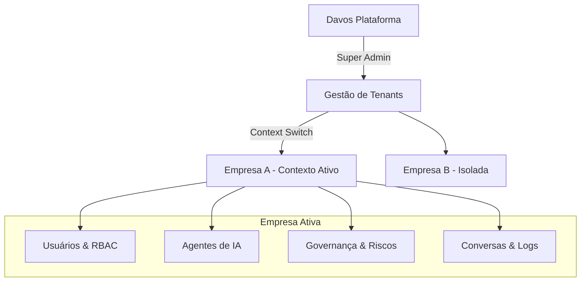
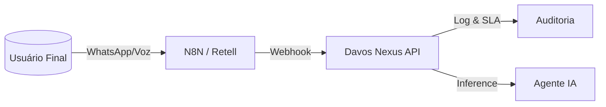

# Agent Nexus Hub - Documentação da Arquitetura da Aplicação

> **DIRETIVA DE MANUTENÇÃO**
> 🔴 **CRÍTICO:** Este documento serve como a única fonte da verdade para o conteúdo e arquitetura da aplicação.
> **REGRA:** A cada nova implementação de funcionalidade, página, componente ou mudança lógica significativa, este documento DEVE ser atualizado para refletir o novo estado.
> Falhar na atualização deste documento resultará em desvio arquitetural e é considerado uma violação de protocolo.

---

## 1. Visão Geral e Propósito do Projeto

**Agent Nexus Hub** é um Dashboard SaaS Enterprise projetado para o orquestramento e gerenciamento de agentes de IA conversacional.

### Propósito do Aplicativo
O sistema atua como uma "Torre de Controle" para operações de Inteligência Artificial, centralizando o gerenciamento de múltiplos agentes em um ambiente multitenant (multi-inquilino). Ele resolve a necessidade crítica de supervisão e configuração de IAs corporativas.

**Objetivos Funcionais Principais:**
1.  **Observabilidade em Tempo Real**: Monitoramento ao vivo de conversas entre agentes e usuários finais.
2.  **Transbordo Humano (Human-in-the-Loop)**: Capacidade de operadores humanos assumirem o controle de conversas quando a IA falha ou quando solicitado.
3.  **Governança e Conformidade (ISO AIMS)**: Gerenciamento centralizado de prompts, configurações de modelos e regras de conformidade (ISO 42001/23894) sem necessidade de deploy de código.
4.  **Controle Financeiro**: Monitoramento detalhado de consumo de tokens, custos por agente/departamento e alertas de limites.
5.  **Segurança e Acesso**: Sistema robusto de RBAC (Controle de Acesso Baseado em Função) para gerenciar quem pode ver ou editar agentes e dados sensíveis.

### Stack Tecnológico

- **Framework**: React (Vite)
- **Linguagem**: TypeScript
- **Estilização**: Tailwind CSS v4 (Mobile-first, Utility-first)
- **Componentes UI**: Shadcn UI (Baseado em Radix Primitives)
- **Gerenciamento de Estado**: 
  - *Servidor*: React Query (TanStack Query) - para cache e sincronização de dados.
  - *Global*: React Context (`AppProvider`) - para estados de UI globais (ex: tema, sidebar).
- **Roteamento**: React Router DOM
- **Ícones**: Lucide React

---

## 2. Princípios Arquiteturais e Contexto do Sistema

Conforme o **SYSTEM CONTEXT** vigente e a implementação realizada, o sistema é uma **Torre de Controle de IA Corporativa Multi-Tenant**. A arquitetura não é apenas conceitual: ela impõe isolamento estrito de dados e comportamento baseado no contexto da organização ativa.

### 2.1 Modelo Mental Obrigatório (Hierarquia & Contexto)

O sistema opera sob um modelo hierárquico rígido onde **o contexto define o dado**.



**Regras Absolutas de Isolamento:**
1.  **Nada é Global:** Exceto o Super Admin e Templates de Sistema.
2.  **Contexto é Rei:** Toda query de dados, visualização ou ação é filtrada pelo `currentTenant`.
3.  **Impersonation (Operar Como):** Super Admins podem "entrar" na visão de uma empresa (`/companies` -> "Acessar Ambiente"). O sistema muda visualmente (Header Âmbar) para indicar que o operador está agindo em nome do cliente.

### 2.2 Entidades Core e Definições

#### A. Empresas (Tenants)
A entidade raiz. Define limites de plano, consumo e configurações globais.
- **Implementação**: `TenantContext` armazena o ID da empresa ativa.
- **Troca de Contexto**: Ação explícita que recarrega a aplicação com novos dados.

#### B. Usuários e RBAC (Role-Based Access Control)
Usuários são estritamente vinculados a **um Tenant** e possuem **um Perfil** dentro dele.
- **Isolamento**: Um usuário da Empresa A não existe no contexto da Empresa B.
- **Perfis Implementados**:
    - **Sistema (Globais)**: Super Admin (Davos).
    - **Tenant (Locais)**: 
        - *Admin*: Gestão total da empresa.
        - *Operador*: Atendimento (`/conversations`), sem gestão.
        - *Visualizador*: Apenas leitura.
- **Mecânica**: A UI se adapta dinamicamente (oculta menus/ações) baseada nas permissões do perfil ativo.

#### C. Governança de IA (Sistema Nervoso)
A governança não é um módulo isolado, é uma camada transversal que dita o comportamento dos agentes.
- **Políticas**: Regras associadas a agentes (ex: "Protocolo de Erro", "Bloqueio de PII").
- **Níveis de Risco**: Cada agente possui um `riskLevel` (Baixo, Médio, Alto) visível na listagem.
- **Logs de Decisão (`/decision-logs`)**: Rastreabilidade completa. Cada ação da IA gera um log ligando:
  `Decisão` -> `Agente` -> `Política Aplicada` -> `Autonomia Usada`.

#### D. Fluxos e Agentes
- **Agentes**: Possuem "crachá" de risco, lista de politicas ativas e estágio de ciclo de vida (ISO 42001).
- **Fluxos**: Jornadas estruturadas que respeitam as mesmas políticas do agente executor.

#### E. Responsáveis (Accountability)
Novas entidades que garantem a conformidade ISO:
- **System Owner**, **Risk Owner**, **Compliance Responsible**.
- Vinculados ao Tenant para garantir que sempre haja um CPF responsável por cada IA operante.

### 2.3 Fluxos Operacionais Chave

1.  **Criação de Contexto**:
    - Super Admin cria Empresa -> Cria Usuário Admin da Empresa.
    - Admin da Empresa loga -> Cria Agentes e Operadores.

2.  **Ciclo de Atendimento**:
    - Conversa Inicia -> Agente atende sob Políticas -> Log de Decisão registrado.
    - Se falha/risco -> Transbordo para Humano (`human_active`).
    - Operador assume -> Resolve -> Devolve para IA ou encerra.

## 16. Governança Multi-Tenant e Modelo de Planos (Etapa 1 & 2)

O sistema trata cada Inquilino (Tenant) como uma unidade contratual e operacional isolada.

### 16.1 Catálogo de Planos e Limites
Existem três modelos de planos que regem o comportamento sistêmico:

1.  **Fixed (Fixado)**: Limites rígidos (`hardLimits`). Se atingido, o consumo é bloqueado conforme a `overage_policy`.
2.  **Flex (Flexível)**: Foco em orçamento mensal (`softLimits`). Não bloqueia automaticamente, mas gera alertas operacionais urgentes.
3.  **Unlimited**: Sem restrições de volume, foco em auditoria e qualidade.

### 16.2 Metadados Funcionais (Tenant Slug)
O `slug` da empresa é utilizado como:
*   **Identificador de Webhook**: Caminho único para recebimento de eventos (ex: `/api/v1/webhook/banco-alpha/whatsapp`).
*   **Namespace de Logs**: Isolamento lógico em ferramentas de log externas.

### 16.3 Gestão do Catálogo de Planos (`/plans`)
O sistema agora possui um Cockpit de Gestão de Planos onde o Super Admin define:
*   **Configuração de Negócio**: Mensalidade base e valores unitários por recurso (Tokens, Mensagens, Minutos STT/TTS). Estes valores são a base para o **Monitoramento de Gastos (Expense Monitoring)**.
*   **Configuração Técnica**: Quotas de provisionamento padrão (limites de agentes, usuários e volume de IA) que são aplicadas automaticamente a novos Tenants.
*   **Tipagem de Faturamento**: Define se o plano é pré-pago (Fixed) ou pós-pago (Flex).

## 17. Contrato de Privacidade e ISO (ISO 42001 / LGPD)

A plataforma exige que cada Tenant defina seu framework de governança antes da operação plena.

### 17.1 Status de Conformidade ISO (Calculado)
O badge de conformidade na UI não é um toggle manual, ele é derivado de:
*   **Conforme**: Responsáveis definidos + Metodologia de Risco ativa + Políticas de Ciclo de Vida configuradas.
*   **Pendente**: Falta de metadados de governança.
*   **Crítico**: Empresa em `active` ou `monitoring` sem governança mínima (Risco Legal).

### 17.2 Payload de Provisionamento (Simulated JSON)
Para integrações Enterprise, o sistema exporta o contrato técnico:
```json
{
  "tenant_id": "uuid",
  "privacy": {
    "retention_days": 365,
    "anonymization": true,
    "ai_disclosure": "active"
  }
}
```

---

## 15. Procedimentos de Manutenção e Auditoria (Refatorado)

### 15.1 Auditoria Estrutural (Traceability)
O `AuditLog` segue o padrão de "Imutabilidade e Contraste":
*   **before / after**: Captura o estado completo do objeto antes e depois da alteração (JSON Diff).
*   **targetType / targetId**: Identifica exatamente qual entidade foi afetada (Agente, Tenant, Política).
*   **actorName**: Nome legível do responsável para auditoria rápida.

### 15.2 Backup e Retenção
Os dados de consumo são retidos por 365 dias em "Hot Storage" e movidos para "Cold Storage" por mais 5 anos para compliance regulatório.

---

## 4. Aderência Normativa ISO de IA (ISO-READY)

Esta seção formaliza como a arquitetura do Davos Nexus suporta nativamente os requisitos de auditoria.

### 4.1 Responsabilidade e Accountability (ISO/IEC 42001)
A plataforma impõe a definição de "donos" para cada sistema de IA. Sem dono, a IA não opera.

- **AI System Owner**: Executivo responsável pelo caso de uso (ex: Diretor de Vendas).
- **AI Risk Owner**: Responsável pela avaliação e mitigação de riscos (ex: CISO/Compliance).
- **AI Compliance Responsible**: Garante que o uso está dentro das leis locais (LGPD/GDPR).

**Evidência Técnica**: Objeto `AIResponsibles` vinculado à entidade `Company`.

### 4.2 Ciclo de Vida do Agente (AI Lifecycle)
Todo agente passa por estágios formais de governança, não apenas "ligado/desligado".

| Estágio | Descrição | Permissões |
|---------|-----------|------------|
| **Development** | Criação de prompts e testes iniciais. | Sandbox apenas. |
| **Validation** | Testes de carga e verificação de red-teaming. | Usuários de teste. |
| **Production** | Operação aberta com monitoramento ativo. | Usuários finais. |
| **Monitoring** | Estado pós-incidente ou revisão periódica. | Limites reduzidos. |
| **Retired** | Desativado, mas mantido para histórico/auditoria. | Nenhuma operação. |

**Evidência Técnica**: Campo `lifecycleStage` no `AgentGovernance`.

### 4.3 Gestão de Risco (ISO/IEC 23894)
A avaliação de risco não é externa; ela é um artefato da plataforma.

- **Metodologia**: Suporte a frameworks padrão (ISO 23894, NIST AI RMF).
- **Pontuação**: Cálculo de Risco Inerente vs Risco Residual após mitigação (Políticas).
- **Revisão**: Agendamento mandatório de reavaliação (ex: Agentes de alto risco a cada 30 dias).

**Evidência Técnica**: Objeto `AIRiskAssessment` vinculado ao Agente.

### 4.4 Trustworthiness & Explicabilidade (ISO/IEC TR 24028)
O sistema garante a propriedade de *Transparency* e *Explainability* através de:

1.  **Logs de Decisão Imutáveis**: Cada resposta da IA grava o "racional" (`reasoning` + `policies_applied`).
2.  **Identificação de IA**: O sistema força o aviso "Você está falando com um assistente virtual" (Configurável por Tenant).
3.  **Contestabilidade**: Todo atendimento pode ser escalado para humano, garantindo o direito de contestação da decisão algorítmica.

---

## 5. Arquitetura de Conformidade LGPD (Brazil Ready)

O sistema implementa nativamente os conceitos da Lei Geral de Proteção de Dados (13.709/2018).

### 5.1 Classificação e Papéis
- **Controlador**: O Cliente (Tenant).
- **Operador**: A Plataforma Davos Nexus.
- **Encarregado (DPO)**: Usuário designado no Tenant (`LGPDSettings`).

### 5.2 Ciclo de Vida do Dado Pessoal
1.  **Coleta**: Classificada na origem (`channel_event`).
2.  **Retenção**: Definida por política do Tenant (ex: 90 dias).
3.  **Direitos (DSAR)**: Suporte a `deletion`, `anonymization` e `export` via API interna.

---

## 6. Camada de Operação e SLA (Enterprise NOC)

Para suportar operações de missão crítica (Bancos, Telcos), o sistema monitora:

### 6.1 Acordos de Nível de Serviço (SLA)
Configuráveis por `Tenant` + `Canal`.
- **First Response Time**: Tempo para IA ou Humano dar o primeiro "ola".
- **Resolution Time**: Tempo até o fechamento do ticket.
- **Human Fallback Rate**: % máxima aceitável de transbordo para humanos.

### 6.2 Auditoria Total (The "Black Box")
Nada acontece sem registro. O sistema mantém trilha de auditoria imutável:
- **Acesso**: Quem logou, de onde (IP), quando.
- **Configuração**: Quem alterou o prompt do agente (diff).
- **Operação**: Quem assumiu a conversa, quem anonimizou dados.
- **Evidência**: Objeto `AuditLog` persistido separadamente.

---

## 7. Arquitetura de Integração (Event-Driven)

O sistema é desenhado para ser "cabeça" de um corpo composto por N8N, WhatsApp e Retell AI.

### 7.1 Ingestão de Eventos (`ChannelEvent`)
Não somos apenas um chatbot, somos um **Processador de Eventos**.
- **Webhooks (N8N)**: `message.received`, `message.sent`.
- **Voz (Retell AI)**: `call.started`, `transcript.generated`.

### 7.2 Fluxo de Dados


---

## 8. Estrutura de Diretórios

O projeto segue uma estrutura moderna e modular de aplicações React:

```mermaid
graph TD
    Root --> .agent[/.agent (Agentes & Skills - Cérebro da IA)]
    Root --> src[/src]
    src --> components[/components (UI & Funcionalidades)]
    src --> contexts[/contexts (Estado Global)]
    src --> hooks[/hooks (React Hooks Customizados)]
    src --> lib[/lib (Utilitários & Tipagem)]
    lib --> agent-logic.ts[agent-logic.ts (Regras Funcionais de IA)]
    src --> pages[/pages (Visualizações de Rota)]
    src --> App.tsx[App.tsx (Configuração de Rotas)]
    src --> main.tsx[main.tsx (Ponto de Entrada)]
```

---

## 9. Conteúdo da Aplicação (Detalhado)

Esta seção mapeia os arquivos e suas responsabilidades funcionais.

### 9.1 Funcionalidades por Rota (Pages)

| Rota | Arquivo Componente | Descrição Funcional |
|------|--------------------|---------------------|
| `/` | `Index.tsx` | **Dashboard Principal**. Visão macro da operação. Exibe métricas de volume de conversas, satisfação, status dos agentes e alertas críticos recentes. |
| `/login` | `Login.tsx` | Tela de autenticação para acesso seguro ao sistema. (Design: Brutalismo Técnico) |
| `/forgot-password` | `ForgotPassword.tsx` | Recuperação de acesso via e-mail. |
| `/conversations` | `Conversations.tsx` | **Inbox Unificado**. Lista todas as conversas ativas e históricas. Permite filtrar por status, agente ou canal. Área crítica para o atendimento humano. |
| `/consumption` | `Consumption.tsx` | **Analytics Financeiro**. Gráficos e tabelas detalhando o uso de recursos (tokens), custos projetados e histórico de faturamento. |
| `/agents` | `Agents.tsx` | **Fábrica de Agentes**. Criação e edição de personas. Configuração de prompts do sistema, ferramentas disponíveis para o agente e modelos de IA conectados. |
| `/alerts` | `Alerts.tsx` | **Central de Notificações**. Histórico de alertas de sistema, erros de integração ou violações de regras de negócio. |
| `/settings` | `Settings.tsx` | Configurações gerais da conta, preferências de notificação e integrações globais (ex: WhatsApp, Slack). |
| `/users` | `Users.tsx` | **Gestão de Equipe**. Convite de novos membros e atribuição de cargos (Admin, Operador, Visualizador). |
| `/profiles` | `Profiles.tsx` | Configurações individuais do usuário logado. |
| `/companies` | `Companies.tsx` | **Gestão de Inquilinos**. (Visão Super-Admin) Gerenciamento das empresas clientes que usam a plataforma. |
| `/plans` | `Plans.tsx` | **Catálogo de Planos**. Definição de precificação e quotas padrão para o provisionamento de novos tenants. |
| `/governance` | `Governance.tsx` | **Compliance e Auditoria**. Gerenciamento de políticas de IA, avaliação de riscos corporativos e **Gestão de Incidentes** com suporte a anexos de evidências. |
| `/flows` | `Flows.tsx` | **Construtor de Fluxos**. (Visual ou Lista) Definição de árvores de decisão determinísticas que os agentes devem seguir. |
| `/decision-logs` | `DecisionLogs.tsx` | **Caixa Preta**. Logs detalhados do "racional" da IA, mostrando por que um agente tomou determinada decisão ou usou uma ferramenta. |
| `*` | `NotFound.tsx` | Página de erro 404 padrão. |

### 9.2 Componentes e Módulos (`src/components`)

A arquitetura de componentes privilegia a separação entre componentes "burros" (UI pura) e componentes de funcionalidade.

#### Bibliotecas de UI (`src/components/ui`)
Baseado em Shadcn/Radix. Componentes reutilizáveis e acessíveis:
- *Exemplos*: `Button`, `Dialog` (Modais), `Sheet` (Painéis laterais), `Table` (Datagrids), `Form` (Inputs validados).

#### Módulos de Funcionalidade
- **`chat/`**: Componentes específicos da interface de chat.
  - `ChatWindow`: Área principal de troca de mensagens.
  - `MessageBubble`: Renderização de mensagens (usuário vs IA).
  - `ChatInput`: Área de digitação com suporte a anexos/comandos.
- **`consumption/`**: Visualizações de dados.
  - `UsageChart`: Gráficos de linha/barra para consumo de tokens.
- **`dashboard/`**: Widgets da tela inicial.
  - `MetricCard`: Cards de resumo (KPIs).
- **`layout/`**: Estrutura macro da aplicação.
  - `Layout`: Wrapper principal que contém a Sidebar e Header.
  - `Sidebar`: Navegação principal responsiva.
- **`panels/`**: Painéis de detalhe (Slide-over).
  - Usados para editar detalhes de um item sem sair da lista (ex: clicar em uma conversa abre um painel lateral com detalhes do usuário).

### 9.3 Dados e Utilitários (`src/lib`)

Nesta fase (frontend-first), a lógica de dados é simulada ou tipada fortemente.

- **`types.ts`**: **Contrato de Dados**. Define as interfaces TypeScript para Agentes, Usuários, Conversas, Mensagens, etc. Essencial para garantir a integridade dos dados entre componentes.
- **`utils.ts`**: Funções auxiliares. Inclui o utilitário `cn()` para fusão condicional de classes Tailwind.
- **`mock-data.ts` / `mock-extended-data.ts`**: **Camada de Mock**. Contém dados estáticos ricos que simulam uma resposta de API real. Permite desenvolvimento da UI e UX sem dependência imediata do backend.

---

### 9.4 Mapa de Navegação e Vínculos

A navegação do sistema é dividida em níveis de acesso e contexto.

#### 1. Fluxo de Autenticação (Público)
*   **Login** (`/login`)
    *   &rarr; Sucesso: Redireciona para **Dashboard** (`/`).
    *   &rarr; Ação: "Esqueci minha senha" leva para **Recuperação** (`/forgot-password`).
*   **Recuperação** (`/forgot-password`)
    *   &rarr; Ação: "Voltar ao Login" retorna para **Login**.

#### 2. Fluxo de Impersonation (Super Admin)
Recurso exclusivo para suporte e auditoria.
*   **Lista de Empresas** (`/companies`)
    *   &rarr; Ação: "Acessar Ambiente" (Login como Admin daquele Tenant).
    *   &rarr; **Resultado**: Redireciona para Dashboard (`/`) com o contexto visual alterado (Header Âmbar).
    *   &rarr; **Saída**: Logout ou troca de contexto.

#### 2. Menu Principal (Sidebar - Autenticado)
A barra lateral é dinâmica baseada nas permissões do usuário (RBAC).

*   **Principal (Todos)**
    *   **Dashboard** (`/`): Visão geral.
    *   **Conversas** (`/conversations`): Lista de atendimentos &rarr; SlideOver (Chat).
    *   **Consumo** (`/consumption`): Métricas de uso de tokens.
    *   **Agentes** (`/agents`): Gerenciamento de personas &rarr; SlideOver (Editor).
    *   **Fluxos** (`/flows`): Editor de fluxos conversacionais &rarr; SlideOver (Detalhes).

*   **Governança (Permissão: `governance.view`)**
    *   **Governança IA** (`/governance`): Cockpit de riscos e incidentes &rarr; SlideOver (Detalhes).
    *   **Logs de Decisão** (`/decision-logs`): Auditoria de IA.

*   **Admin (Tenant Admin)**
    *   **Usuários** (`/users`): Gestão de equipe &rarr; SlideOver (Edição).
    *   **Perfis** (`/profiles`): Gestão de papéis e permissões.
    *   **Configurações** (`/settings`): Ajustes do tenant.

*   **Admin Davos (Super Admin)**
    *   **Empresas** (`/companies`): Gestão multi-tenant.

*   **Rodapé (Global)**
    *   **Alertas** (`/alerts`): Central de notificações.
    *   **Perfil** (Avatar): Abre configurações pessoais (SlideOver).


#### 3. Navegação Contextual (Drill-down)
O sistema prioriza a manutenção do contexto utilizando painéis laterais deslizantes (**SlideOver**) ao invés de aumentar a profundidade da navegação (página dentro de página).

**Princípio de UX**: "O usuário nunca deve perder a lista original de vista ao ver um detalhe."

**Mapeamento de Interações (Dialog vs SlideOver):**
*   **Agentes**:
    *   **Dialog**: Criação e Edição de Propriedades (Nome, Risco).
    *   **SlideOver**: Configuração Avançada (Prompt, Tools) e Detalhes.
*   **Conversas**:
    *   **SlideOver**: Detalhes do Chat e Histórico do Usuário.
*   **Governança**:
    *   **Dialog**: Nova Política, Registrar Incidente, Editar.
    *   **SlideOver**: Detalhes de Incidente, Visualização Completa de Política.
*   **Fluxos**:
    *   **Dialog**: Criar/Editar Fluxo e Metadados.
    *   **SlideOver**: Detalhes de Métricas e Passos.
*   **Usuários**:
    *   **Dialog**: Novo Usuário, Editar Perfil.

---

## 10. Decisões Arquiteturais Chave

1.  **Arquitetura Baseada em Componentes (Atomic Design Adaptado)**:
    - Uso estrito de componentes da biblioteca `@/components/ui` para manter consistência visual.
    - Novas funcionalidades devem compor esses blocos básicos em vez de criar estilos CSS ad-hoc.

2.  **Navegação e Layout**:
    - **Sidebar Persistente**: A navegação lateral permanece visível para facilitar a alternância rápida de contextos (multitarefa).
    - **Painéis Laterais (Sheets) vs Modais**: Preferência por painéis que deslizam da direita para edições complexas, mantendo o contexto da página de fundo visível.

3.  **Estratégia de Estado**:
    - **Estado do Servidor (React Query)**: Toda data que viria de uma API é tratada como estado assíncrono. Mesmo usando mocks, simulamos hooks assíncronos para facilitar a substituição futura pela API real.
    - **Estado Global (Context)**: Usado minimamente, apenas para configurações da aplicação (Tema, Sidebar colapsada/expandida).
    
4.  **Estética e UX**:
    - **Tema Híbrido**:
      - *App Interno*: Bordas sutis e glassmorphism discreto (Shadcn/Radix).
      - *Autenticação*: Visual "Brutalismo Técnico" (Bordas 0px, Monocromático, Acentos Ciano) com logo oficial.
    - **Feedback Imediato**: Todas as ações interativas devem ter estados de hover, active e feedback de carregamento (Skeletons).

---

## 12. Contrato Funcional do Sistema de Agentes

O sistema "Davos Nexus" utiliza uma abordagem de **Frontend como Contrato**. Todo campo na interface de Agentes possui impacto funcional direto no comportamento do sistema e nas integrações futuras (N8N, Retell AI, etc).

### 12.1 Ciclo de Vida do Agente (ISO 42001)

| Estágio | Comportamento do Sistema | Acesso a Ferramentas | Ambiente |
| :--- | :--- | :--- | :--- |
| **Development** | Sandbox isolado | Bloqueado | Teste |
| **Validation** | Usuários de teste/homologação | Permitido em Sandbox | Teste |
| **Production** | Operação plena real | Permitido | Produção |
| **Monitoring** | Alertas de auditoria reforçados | Permitido + Flag | Produção |
| **Retired** | Desativado e inacessível | Bloqueado | Nenhum |

### 12.2 Gerenciamento de Risco (ISO 23894)

O campo **Risk Score (0-100)** e **Risk Level** não são apenas informativos. Eles definem:
*   **Risco Alto**: Exige obrigatoriamente transbordo (fallback) humano e limita a autonomia máxima para Nível 2.
*   **Risco Médio**: Transbordo recomendado e autonomia limitada a Nível 4.
*   **Risco Baixo**: IA pode operar de forma totalmente autônoma.

### 12.3 Níveis de Autonomia

1.  **Assistido**: Toda resposta/ação exige aprovação humana.
2.  **Limitado**: Opera sob regras rígidas; escalona para humano em qualquer dúvida.
3.  **Condicional**: Autônomo, mas realiza transbordo automático em canais críticos.
4.  **Alta supervised**: Opera sozinho; humano apenas monitora dashboards.
5.  **Total**: Autonomia plena sem intervenção humana prevista.

### 12.4 Contrato de Integração (JSON Payload)

As integrações de backend devem esperar o seguinte payload v1:

```json
{
  "id": "agent-unique-id",
  "config": {
    "lifecycle_stage": "production",
    "autonomy_level": 4,
    "max_concurrency": 100,
    "supported_channels": ["whatsapp", "voice"]
  },
  "risk_profile": {
    "score": 45,
    "level": "medium"
  }
}
```
---

## 13. Gestão de Incidentes e Evidências

O Davos Nexus segue padrões rigorosos de registro de incidentes de IA para fins de auditoria e remediação.

### 13.1 Evidências e Anexos
Todo incidente registrado pode conter múltiplas evidências anexadas (capturas de tela de logs, arquivos de transcrição, relatórios externos).
*   **Tipagem**: `IncidentAttachment` (ID, Nome, URL, Tipo, Tamanho, Data).
*   **Armazenamento**: Preparado para integração com S3/GCS. Atualmente utiliza Mock URLs.

### 13.2 Formatação Rica (Markdown)
Para garantir clareza na descrição de falhas complexas de IA, o campo de descrição suporta **Markdown**.
*   **Editor**: Interface com toolbar para Negrito, Itálico e Listas.
*   **Visualização**: Renderização nativa no painel de detalhes (`IncidentDetailsPanel`), transformando sintaxe markdown em elementos HTML formatados.

---

## 18. Integração N8N & Contratos JSON (Functional Contracts)

O sistema opera sob o regime de **Contratos Identificáveis**. Toda entidade (Agente, Fluxo, Empresa) possui um payload canônico para integração via Webhooks.

### 18.1 Contrato de Provisionamento de Agente (POST)
Enviado ou consultado pelo N8N para configurar a inteligência no "Edge".

```json
{
  "event": "agent.provision",
  "agent_id": "agent-uuid",
  "tenant": {
    "id": "tenant-uuid",
    "slug": "empresa-alfa"
  },
  "config": {
    "system_prompt": "...",
    "autonomy_level": 4,
    "risk_level": "medium",
    "channels": ["whatsapp", "voice"],
    "max_concurrency": 100
  },
  "orchestration": {
    "policies": ["policy-1", "policy-2"],
    "flow_id": "flow-xyz"
  }
}
```

### 18.2 Contrato de Execução de Fluxo (POST)
Define a jornada determinística que o N8N deve orquestrar. As etapas (**stages**) são conceituais e guiam a lógica de decisão.

```json
{
  "event": "flow.execute",
  "flow_id": "flow-uuid",
  "tenant_slug": "empresa-alfa",
  "objective": "Restaurar acesso ao App",
  "stages": [
    { "order": 1, "type": "greeting", "actor": "ai" },
    { "order": 2, "type": "qualification", "actor": "ai" },
    { "order": 3, "type": "resolution", "actor": "ai" },
    { "order": 4, "type": "handoff", "actor": "human" }
  ],
  "success_criteria": "Cliente acessou com sucesso",
  "fallback_agent_id": "agent-uuid"
}
```

### 18.3 Webhook Namespace
A URL de destino no N8N/Backend deve seguir o padrão canônico para garantir que o **Agente de Voz** e o **Agente de Texto** operem sob a mesma lógica de roteamento:

`https://n8n.davos.nexus/webhook/{tenant_slug}/{agent_id}/{event_type}`

---

## 20. Arquitetura de Endpoints por Agente (Unique API Links)

O Agent Nexus Hub adota o padrão **One Agent, One Endpoint**. Isso garante isolamento, rastreabilidade e facilidade de integração via N8N.

### 20.1 Padrão de URL (Webhooks N8N)
Cada agente possui endpoints automáticos gerados pelo sistema seguindo o namespace corporativo:

| Canal | URL Sample | Finalidade |
| :--- | :--- | :--- |
| **WhatsApp/Texto** | `.../{tenant_slug}/{agent_id}/message.received` | Receber mensagens de texto. |
| **Voz (Retell)** | `.../{tenant_slug}/{agent_id}/call.started` | Início de chamada de voz. |
| **Status Call** | `.../{tenant_slug}/{agent_id}/call.ended` | Finalização de ciclo de voz. |

### 20.2 Visibilidade na UI
- Localizado na aba "Configurações" do Agente.
- Exibido como Read-Only para garantir integridade do contrato.
- Botão "Copy to Clipboard" disponível para o administrador.

---

## 21. Camada de Orquestração (N8N como Camada Central)

O Nexus Hub **NUNCA** é chamado diretamente pelos provedores de canal (WhatsApp, Retell). O N8N atua como o "Air Traffic Controller".

### 21.1 Ciclo de Comunicação Padrão
1. **Trigger**: Usuário envia mensagem via WhatsApp.
2. **Intermediate**: WhatsApp Webhook -> N8N.
3. **Nexus Request**: N8N chama o Nexus Agent Endpoint.
4. **Nexus Logic**: O Nexus valida o Tenant (Plan/Limit), o Agente (Lifecycle/Risk) e as Políticas.
5. **nexus Context**: O Nexus retorna o prompt, contexto e políticas de decisão.
6. **Execution**: N8N executa a chamada LLM e envia a resposta ao usuário.

### 21.2 Contratos JSON de Integração (Events)

#### message.received (Ingresso)
```json
{
  "tenant_slug": "banco-alpha",
  "agent_id": "agent-uuid",
  "channel": "whatsapp",
  "external_id": "WA_SID_123",
  "content": "Quero falar sobre meu saldo",
  "timestamp": "2026-02-02T16:00:00Z"
}
```

#### voice.call.started (Ingresso Voz)
```json
{
  "tenant_slug": "banco-alpha",
  "agent_id": "agent-uuid",
  "channel": "voice",
  "external_id": "retell_call_id_abc123",
  "metadata": { "caller": "+5511999999999" },
  "timestamp": "2026-02-02T16:00:00Z"
}
```

---

## 22. Framework de Comportamento Funcional (Lifecycle & Risk)

Os campos da UI não são apenas metadados; eles controlam o comportamento do motor de execução.

### 22.1 Restrições por Lifecycle Stage
| Estágio | Comportamento no Nexus | Ambiente |
| :--- | :--- | :--- |
| `development` | Bloqueia chamadas externas. Acesso apenas via Nexus Preview. | Sandbox |
| `validation` | Permite chamadas de IDs autorizados (beta-testing). | Sandbox |
| `production` | Operação plena sem restrições de origem (dentro do SLA). | Production |
| `monitoring` | Operação plena + Coleta agressiva de Logs de Decisão. | Production |
| `retired` | Endpoint retorna 403 (Gera alerta de "Ghost Integration"). | Deactivated |

### 22.2 Matriz de Risco vs Autonomia
| Nível de Risco | Autonomia Máxima Permitida | Exigência de Fallback Humano |
| :--- | :--- | :--- |
| **Baixo** (Informativo) | L5 (Total) | Não |
| **Médio** (Transacional) | L4 (Supervisionada) | Sim (Automático se score < 85%) |
| **Alto** (Crítico) | L2 (Restrito) | Obrigatório (Confirmação Prévia) |

---

## 23. Governança de Consumo e Bloqueio (Tenant Control)

O sistema deve proteger a margem financeira e a capacidade operacional através de 3 modelos de enforcement.

### 23.1 Modelos de Plano
1. **Fixed (Bloqueante)**: Atingiu o limite -> O Nexus retorna erro ao N8N -> Resposta padrão: "Limite operacional atingido".
2. **Flex (Não-Bloqueante)**: Atingiu o limite -> Nexus gera alerta crítico e log de Audit -> Permite continuação com "Special Billing Rate".
3. **Unlimited (Auditoria)**: Sem travas, focado em monitoramento de eficiência e conformidade ISO.

### 23.2 Lógica de Validação (`canInvokeAgent`)
Antes de processar qualquer evento, o Nexus valida:
- `is_tenant_active && is_plan_valid`
- `usage.current < usage.hard_limit` (se modelo = Fixed)
- `agent.risk_level` compatível com `request.action_type`

---

## 24. Procedimentos de Manutenção e Auditoria (Enterprise)

- **Audit Logs**: Devem persistir `before` e `after` para toda mudança em Agentes ou Políticas.
- **Traceability**: Todo evento deve conter o `external_id` (N8N/Retell) para cross-correlation.
- **Compliance Badge**: Calculado dinamicamente: `is_compliant = (has_ai_disclosure && risk_assessment_valid && dpo_assigned)`.

## 19. Procedimentos de Manutenção Final

### Como Atualizar este Documento
1.  **Nova Página**: Adicione uma linha na tabela **9.1**.
2.  **Novos Contratos**: Atualize a Seção **18** se os campos do `types.ts` mudarem.
3.  **Contrato de IA**: Mantenha a Seção **12** em sincronia com o `agent-logic.ts`.
```
---

## 25. O que é um Fluxo Conversacional no Agent Nexus

Um **Fluxo Conversacional** NÃO é um agente, não executa código e não é um workflow do N8N. Ele é um **Contrato de Jornada**.

### 25.1 Definição Canônica
> "Um contrato que define a sequência esperada de etapas, objetivos, critérios de sucesso e regras de escalonamento de uma conversa, servindo como guia para o Agente e contrato de execução para o N8N."

### 25.2 Relação N8N vs Fluxo vs Agente
1. **Fluxo (O Quê)**: Define a estrada (Ex: Saudação -> Troca Senha -> Encerramento).
2. **Agente (Quem)**: Define o motorista (Ex: Atendente de Suporte L1). Ele "veste" o fluxo no início da conversa.
3. **N8N (Como)**: Executa as ordens. Se o Agente diz "estou na etapa Troca de Senha", o N8N consulta o Fluxo para saber quais ações são permitidas.

### 25.3 Diagrama de Relacionamento (m:n)
- **Um Fluxo** pode ser executado por **N Agentes** (Ex: "Fluxo de Vendas" usado pelo Agente "WhatsApp" e Agente "Voz").
- **Um Agente** pode executar **N Fluxos** (Ex: Agente "Atendente" troca de Fluxo conforme a intenção do usuário).
- **Uma Conversa** ativa possui obrigatoriamente: **1 Agente + 1 Fluxo + 1 Etapa por vez**.

### 25.4 Tipos de Etapas (Stages) e Atores
As etapas possuem um **Destaque Semântico** na plataforma para indicar quem tem o controle:
- **🟢 IA (ai)**: Agente atua sozinho via LLM.
- **🟡 IA Supervisionada (both)**: Agente atua, mas gera alertas de supervisão.
- **🔴 Humano Obrigatório (human)**: O fluxo exige transbordo (Handoff) imediato.

---

## 26. Como Fluxos Conversacionais se Integram ao N8N

A integração entre o Agent Nexus e o N8N segue o princípio de **Eventos de Jornada Normalizados**.

### 26.1 A Diferença Fundamental
- **Fluxo (O Contrato)**: Define a intenção estratégica e a ordem das etapas. É passivo (data-only).
- **Workflow N8N (O Executor)**: Contém as chaves de API, credenciais e lógica de branch (if/else). É ativo (logic-driven).

### 26.2 O Modelo "One Agent, One Endpoint"
Diferente de sistemas legados, o Nexus NÃO chama webhooks diferentes por etapa.
1. O administrador configura **UM link N8N único no Agente**.
2. Cada transição de etapa no Fluxo emite um evento para esse link único.

### 26.3 Payload de Evento de Jornada (Canonical)
Sempre que uma conversa avança, o Nexus envia (ou o N8N consulta) este payload:

```json
{
  "event": "journey.stage.executed",
  "tenant_slug": "banco-alpha",
  "agent_id": "agent-uuid",
  "flow_id": "flow-suporte-vendas",
  "conversation": {
    "id": "conv-123",
    "channel": "whatsapp"
  },
  "stage": {
    "id": "st-2",
    "type": "qualification",
    "actor": "ai",
    "expected_outcome": "cpf_confirmado",
    "escalation_rule": "fallback_humano_se_erro_3x"
  }
}
```

### 26.4 Fluxo de Comunicação (Visual)
`Usuário` -> `Agente (Nexus Hub)` -> `Evento (Journey Contract)` -> `N8N (Webhook Único)` -> `Integração Médica/CRM/DB` -> `Resposta ao Usuário`.
