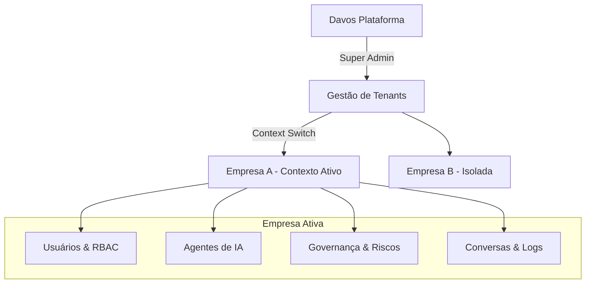
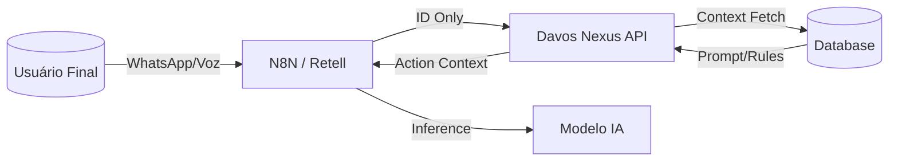

# Agent Nexus Hub - Documentação da Arquitetura da Aplicação

> **DIRETIVA DE MANUTENÇÃO**
> 🔴 **CRÍTICO:** Este documento serve como a única fonte da verdade para o conteúdo e arquitetura da aplicação.
> **REGRA:** A cada nova implementação de funcionalidade, página, componente ou mudança lógica significativa, este documento DEVE ser atualizado para refletir o novo estado.
> Falhar na atualização deste documento resultará em desvio arquitetural e é considerado uma violação de protocolo.

---

## 1. Visão Geral e Propósito do Projeto

**Agent Nexus Hub** é um Dashboard SaaS Enterprise projetado para o orquestramento e gerenciamento de agentes de IA conversacional.

### Propósito do Aplicativo
O sistema atua como uma "Torre de Controle" para operações de Inteligência Artificial, centralizando o gerenciamento de múltiplos agentes em um ambiente multitenant (multi-inquilino). Ele resolve a necessidade crítica de supervisão e configuração de IAs corporativas.

**Objetivos Funcionais Principais:**
1.  **Observabilidade em Tempo Real**: Monitoramento ao vivo de conversas entre agentes e usuários finais.
2.  **Transbordo Humano (Human-in-the-Loop)**: Capacidade de operadores humanos assumirem o controle de conversas quando a IA falha ou quando solicitado.
3.  **Governança e Conformidade (ISO AIMS)**: Gerenciamento centralizado de prompts, configurações de modelos e regras de conformidade (ISO 42001/23894) sem necessidade de deploy de código.
4.  **Controle Financeiro**: Monitoramento detalhado de consumo de tokens, custos por agente/departamento e alertas de limites.
5.  **Segurança e Acesso**: Sistema robusto de RBAC (Controle de Acesso Baseado em Função) para gerenciar quem pode ver ou editar agentes e dados sensíveis.

### Stack Tecnológico

- **Framework**: React (Vite)
- **Linguagem**: TypeScript
- **Estilização**: Tailwind CSS v4 (Mobile-first, Utility-first)
- **Componentes UI**: Shadcn UI (Baseado em Radix Primitives)
- **Gerenciamento de Estado**: 
  - *Servidor*: React Query (TanStack Query) - para cache e sincronização de dados.
  - *Global*: React Context (`AppProvider`) - para estados de UI globais (ex: tema, sidebar).
- **Roteamento**: React Router DOM
- **Ícones**: Lucide React

---

## 2. Princípios Arquiteturais e Contexto do Sistema

Conforme o **SYSTEM CONTEXT** vigente e a implementação realizada, o sistema é uma **Torre de Controle de IA Corporativa Multi-Tenant**. A arquitetura não é apenas conceitual: ela impõe isolamento estrito de dados e comportamento baseado no contexto da organização ativa.

### 2.1 Modelo Mental Obrigatório (Hierarquia & Contexto)

O sistema opera sob um modelo hierárquico rígido onde **o contexto define o dado**.



**Regras Absolutas de Isolamento:**
1.  **Nada é Global:** Exceto o Super Admin e Templates de Sistema.
2.  **Contexto é Rei:** Toda query de dados, visualização ou ação é filtrada pelo `currentTenant`.
3.  **Impersonation (Operar Como):** Super Admins podem "entrar" na visão de uma empresa (`/companies` -> "Acessar Ambiente"). O sistema muda visualmente (Header Âmbar) para indicar que o operador está agindo em nome do cliente.

### 2.2 Entidades Core e Definições

#### A. Empresas (Tenants)
A entidade raiz. Define limites de plano, consumo e configurações globais.
- **Implementação**: `TenantContext` armazena o ID da empresa ativa.
- **Troca de Contexto**: Ação explícita que recarrega a aplicação com novos dados.

#### B. Usuários e RBAC (Role-Based Access Control)
Usuários são estritamente vinculados a **um Tenant** e possuem **um Perfil** dentro dele.
- **Isolamento**: Um usuário da Empresa A não existe no contexto da Empresa B.
- **Perfis Implementados**:
    - **Sistema (Globais)**: Super Admin (Davos).
    - **Tenant (Locais)**: 
        - *Admin*: Gestão total da empresa.
        - *Operador*: Atendimento (`/conversations`), sem gestão.
        - *Visualizador*: Apenas leitura.
- **Mecânica**: A UI se adapta dinamicamente (oculta menus/ações) baseada nas permissões do perfil ativo.

#### C. Governança de IA (Sistema Nervoso)
A governança não é um módulo isolado, é uma camada transversal que dita o comportamento dos agentes.
- **Políticas**: Regras associadas a agentes (ex: "Protocolo de Erro", "Bloqueio de PII").
- **Níveis de Risco**: Cada agente possui um `riskLevel` (Baixo, Médio, Alto) visível na listagem.
- **Logs de Decisão (`/decision-logs`)**: Rastreabilidade completa. Cada ação da IA gera um log ligando:
  `Decisão` -> `Agente` -> `Política Aplicada` -> `Autonomia Usada`.

#### D. Fluxos e Agentes
- **Agentes**: Possuem "crachá" de risco, lista de politicas ativas e estágio de ciclo de vida (ISO 42001).
- **Fluxos**: Jornadas estruturadas que respeitam as mesmas políticas do agente executor.

#### E. Responsáveis (Accountability)
Novas entidades que garantem a conformidade ISO:

### 2.3 Governança de Dados e Persistência (Supabase)

> 🔴 **REGRA DE OURO:** Toda alteração de estrutura de dados deve ser refletida no arquivo de schema canônico.

1.  **Provedor Oficial**: O banco de dados oficial da plataforma é **Supabase** (PostgreSQL).
2.  **Source of Truth do Schema**: O arquivo `database/schema.sql` é a **ÚNICA** fonte da verdade para a estrutura do banco de dados.
    *   **Proibido**: Criar tabelas ou colunas diretamente no dashboard do Supabase sem atualizar este arquivo.
    *   **Obrigatório**: Qualquer PR ou alteração que envolva banco de dados DEVE incluir a atualização correspondente no `database/schema.sql`.
    *   **Propósito**: Garantir que o ambiente de desenvolvimento, staging e produção estejam sempre sincronizados e documentados.
3.  **Fluxo de Migração**:
    *   Desenvolvimento: Altere o `database/schema.sql`.
    *   Aplicação: Aplique as mudanças no Supabase via Migration ou SQL Editor copiando do arquivo.
4.  **Estado Atual da Integração (Fev/2026)**:
    *   **Autenticação**: Integrada (Login via DB).
    *   **Agentes & Stats**: Integrados (Cálculo Real-time via `conversations`).
    *   **Usuários & Perfis**: Integrados (Listagem e Contagem Real).
    *   **Conversas**: Integradas (Chat Real-time).

- **System Owner**, **Risk Owner**, **Compliance Responsible**.
- Vinculados ao Tenant para garantir que sempre haja um CPF responsável por cada IA operante.

---

## 3. Arquitetura de Persistência e Integração (Backend-as-Source-of-Truth)

> 🔴 **PRINCÍPIO FUNDAMENTAL:** O N8N deve operar sempre como executor sem estado próprio. O Banco de Dados do Davos Nexus é a **Única Fonte de Verdade**. Frontend NUNCA envia configurações de negócio para o N8N.

### 3.1 O que DEVE ser persistido (Obrigatório)

Toda configuração que afeta o comportamento, custo ou risco da operação deve residir no banco de dados da plataforma, e não no fluxo do N8N.

| Categoria | Dados Obrigatórios no DB | Proibido no Payload Externo |
| :--- | :--- | :--- |
| **Tenant** | Plano, Limites, Orçamento, Política de Overage, SLA, LGPD Settings, ISO Status | Limites, Flags de Overage |
| **Agente** | System Prompt, Risk Level, Risk Score, Autonomy Level, Lifecycle Stage, Linked Flows, Policies | Prompt, Regras de Autonomia |
| **Fluxo** | Estágios, Objetivos, Critérios de Sucesso, Escalation Rules, Outcomes | Definição de Etapas |
| **Consumo** | Tokens (Agent/Flow/Global), Custos, Saldos | Cálculo de Custo |

### 3.2 Papel do N8N (Stateless Executor)

O N8N atua como um "Air Traffic Controller" burro. Ele não decide, ele executa o que o contexto determina.

1.  **Recebe Evento**: (Message/Call) com IDs mínimos.
2.  **Busca Contexto**: Chama `POST /internal/agents/context` no Davos Nexus.
3.  **Recebe Config**: Recebe o Prompt, Risco, Políticas e Estado atual.
4.  **Executa**: Envia para LLM e devolve output.
5.  **Reporta**: Devolve o Log de Decisão para o Nexus.

### 3.3 Contrato Estrito de Entrada (Input)
A única coisa que o mundo externo (WhatsApp, Retell) pode enviar para o sistema são **IDENTIFICADORES**.

```json
{
  "tenant_slug": "empresa-alfa",
  "agent_slug": "suporte-acesso",
  "conversation_id": "uuid",
  "channel": "whatsapp"
  // Payload técnico (mensagem, áudio) é permitido.
  // Configuração de negócio é PROIBIDA.
}
```

### 3.4 Contrato de Busca de Contexto (Context Fetch)
O N8N deve obrigatoriamente "hidratar" sua execução chamando a plataforma.

**Request (N8N -> Nexus):**
```json
POST /internal/agents/context
{
  "tenant_slug": "empresa-alfa",
  "agent_slug": "suporte-acesso",
  "channel": "whatsapp",
  "user_id": "client-phone-number"
}
```

**Response (Nexus -> N8N):**
```json
{
  "agent_config": {
    "system_prompt": "Você é um assistente...",
    "model_id": "gpt-4o",
    "temperature": 0.5,
    "autonomy_level": 4
  },
  "tenant_config": {
    "plan_tier": "enterprise",
    "privacy": { "anonymization": true }
  },
  "flow_contract": {
    "current_stage": "qualification",
    "expected_outcome": "obter_cpf"
  },
  "governance": {
    "risk_level": "medium",
    "policies": ["block_pii", "no_competitor_mention"]
  }
}
```

---

## 4. Segurança, ISO e LGPD

### 4.1 Princípio da Minimização (LGPD)
- **Requisições Externas**: Carregam apenas IDs opacos sempre que possível.
- **Configuração Sensível**: Prompts do sistema (que podem conter segredos de negócio) e regras de compliance NUNCA transitam em webhooks públicos, apenas na resposta autenticada do `/context`.

### 4.2 Governança ISO 42001 / 23894
A arquitetura garante a separação de deveres:

1.  **Nexus (Governança)**: Define *quem* pode fazer *o quê* e *como*. Mantém o registro imutável.
2.  **N8N (Orquestração)**: Executa a ação técnica.
3.  **Frontend (Interface)**: Apenas reflete o estado do banco. **Não contém lógica de negócio**.

---

## 5. Aderência Normativa ISO de IA (ISO-READY)

Esta seção formaliza como a arquitetura do Davos Nexus suporta nativamente os requisitos de auditoria.

### 5.1 Responsabilidade e Accountability (ISO/IEC 42001)
A plataforma impõe a definição de "donos" para cada sistema de IA. Sem dono, a IA não opera.

- **AI System Owner**: Executivo responsável pelo caso de uso (ex: Diretor de Vendas).
- **AI Risk Owner**: Responsável pela avaliação e mitigação de riscos (ex: CISO/Compliance).
- **AI Compliance Responsible**: Garante que o uso está dentro das leis locais (LGPD/GDPR).

**Evidência Técnica**: Objeto `AIResponsibles` vinculado à entidade `Company`.

### 5.2 Ciclo de Vida do Agente (AI Lifecycle)
Todo agente passa por estágios formais de governança, não apenas "ligado/desligado".

| Estágio | Descrição | Permissões |
|---------|-----------|------------|
| **Development** | Criação de prompts e testes iniciais. | Sandbox apenas. |
| **Validation** | Testes de carga e verificação de red-teaming. | Usuários de teste. |
| **Production** | Operação aberta com monitoramento ativo. | Usuários finais. |
| **Monitoring** | Estado pós-incidente ou revisão periódica. | Limites reduzidos. |
| **Retired** | Desativado, mas mantido para histórico/auditoria. | Nenhuma operação. |

**Evidência Técnica**: Campo `lifecycleStage` no `AgentGovernance`.

---

## 6. Arquitetura de Conformidade LGPD (Brazil Ready)

### 6.1 Classificação e Papéis
- **Controlador**: O Cliente (Tenant).
- **Operador**: A Plataforma Davos Nexus.
- **Encarregado (DPO)**: Usuário designado no Tenant (`LGPDSettings`).

### 6.2 Ciclo de Vida do Dado Pessoal
1.  **Coleta**: Classificada na origem (`channel_event`).
2.  **Retenção**: Definida por política do Tenant (ex: 90 dias).
3.  **Direitos (DSAR)**: Suporte a `deletion`, `anonymization` e `export` via API interna.

---

## 7. Estrutura de Diretórios

O projeto segue uma estrutura moderna e modular de aplicações React:

```mermaid
graph TD
    Root --> .agent[/.agent (Agentes & Skills - Cérebro da IA)]
    Root --> src[/src]
    src --> components[/components (UI & Funcionalidades)]
    src --> contexts[/contexts (Estado Global)]
    src --> hooks[/hooks (React Hooks Customizados)]
    src --> lib[/lib (Utilitários & Tipagem)]
    lib --> agent-logic.ts[agent-logic.ts (Regras Funcionais de IA)]
    src --> pages[/pages (Visualizações de Rota)]
    src --> App.tsx[App.tsx (Configuração de Rotas)]
    src --> main.tsx[main.tsx (Ponto de Entrada)]
```

---

## 20. Arquitetura de Endpoints por Agente (Unique API Links)

O Agent Nexus Hub adota o padrão **One Agent, One Endpoint**. Isso garante isolamento, rastreabilidade e facilidade de integração via N8N.

### 20.1 Padrão de URL (Webhooks N8N)
Cada agente possui endpoints automáticos gerados pelo sistema seguindo o namespace corporativo:

| Canal | URL Sample | Finalidade |
| :--- | :--- | :--- |
| **WhatsApp/Texto** | `.../{tenant_slug}/{agent_id}/message.received` | Receber mensagens de texto. |
| **Voz (Retell)** | `.../{tenant_slug}/{agent_id}/call.started` | Início de chamada de voz. |
| **Status Call** | `.../{tenant_slug}/{agent_id}/call.ended` | Finalização de ciclo de voz. |

---

## 21. Fluxo de Dados e Integração (Event-Driven)


